# Phân tích Thị trường Chứng khoán và Dự báo Xu hướng Giá sử dụng PySpark

## Tóm tắt Bài toán
Dự báo **xu hướng giá chứng khoán** (tăng/giảm) cho ngày tiếp theo dựa trên dữ liệu lịch sử từ **2013 đến 2026** sử dụng Machine Learning và PySpark.

**Mục tiêu chính:**
- Phân tích dữ liệu nhiều cổ phiếu (multi-stock)
- Xây dựng đặc trưng (features) hiệu quả bằng Window Functions
- Huấn luyện và so sánh 2 mô hình: Logistic Regression & Random Forest
- Đánh giá hiệu suất theo từng cổ phiếu
- Backtest chiến lược giao dịch dựa trên dự báo
- Tính lợi nhuận giả lập so với Buy & Hold strategy


## PHẦN 1: KHỞI TẠO PYSPARK VÀ IMPORT THƯ VIỆN

Trong phần này, chúng tôi sẽ:
- Import các thư viện cần thiết (PySpark, pandas, matplotlib, scikit-learn)
- Khởi tạo SparkSession cấu hình cho môi trường local
- Thiết lập cấu hình memory phù hợp


```python
# Import thư viện PySpark
from pyspark.sql import SparkSession
from pyspark.sql.types import StringType, DoubleType, LongType
from pyspark.sql.functions import (
    col, to_timestamp, lag, lead, avg, when, count, sum as spark_sum,
    min as spark_min, max as spark_max, lit, greatest,
    abs as spark_abs
)
from pyspark.sql.window import Window
from pyspark.ml.feature import StringIndexer, VectorAssembler
from pyspark.ml.classification import LogisticRegression, RandomForestClassifier
from pyspark.ml.evaluation import MulticlassClassificationEvaluator
from pathlib import Path
# Import thư viện khác
import pandas as pd
import numpy as np
import matplotlib.pyplot as plt
import seaborn as sns
import os
import glob

# Cấu hình matplotlib
plt.style.use('seaborn-v0_8-darkgrid')
sns.set_palette("husl")

print("✓ Đã import tất cả thư viện thành công!")
```

    ✓ Đã import tất cả thư viện thành công!
    


```python
# Khởi tạo SparkSession cho local execution
spark = SparkSession.builder \
    .appName("StockAnalysisPySpark") \
    .master("local[*]") \
    .config("spark.sql.shuffle.partitions", "8") \
    .config("spark.driver.memory", "4g") \
    .config("spark.sql.adaptive.enabled", "true") \
    .config("spark.driver.extraJavaOptions",
            "-Xss128m") \
    .config("spark.executor.extraJavaOptions",
            "-Xss128m") \
    .getOrCreate()

# Cấu hình Spark
spark.conf.set("spark.sql.adaptive.coalescePartitions.enabled", "true")
spark.sparkContext.setLogLevel("ERROR")

print("✓ SparkSession đã khởi tạo thành công!")
print(f"  - Spark Version: {spark.version}")
print(f"  - Pandas Version: {pd.__version__}")
print(f"  - NumPy Version: {np.__version__}")
```

    ✓ SparkSession đã khởi tạo thành công!
      - Spark Version: 4.1.2
      - Pandas Version: 2.3.3
      - NumPy Version: 2.2.6
    

## PHẦN 2: NẠP VÀ KHÁM PHÁ DỮ LIỆU

Công việc trong phần này:
- Đọc tất cả file CSV từ thư mục `/home/admin/Documents/VSC/data/csv`
- Thêm cột `ticker` từ tên file
- Hiển thị schema, kiểu dữ liệu, và dòng dữ liệu mẫu
- Hiển thị thống kê cơ bản của các cột giá (open, high, low, close, volume)
- Liệt kê các cổ phiếu duy nhất (unique tickers)


```python
# Đường dẫn thư mục dữ liệu (tự động theo thư mục hiện tại)
data_dir = str(Path("csv").resolve())
csv_files = glob.glob(os.path.join(data_dir, "*.csv"))

print(f"📂 Tìm thấy {len(csv_files)} file CSV")
print(f"📍 Thư mục: {data_dir}")

# Chỉ nạp file giá cổ phiếu (đủ cột OHLCV). File macro/lãi suất như IRX, TNX
# chỉ có [time, rate] và được join riêng ở bước sau -> bỏ khỏi union ticker.
OHLCV = ["time", "open", "high", "low", "close", "volume"]

dataframes = []
for csv_file in csv_files:
    ticker = os.path.basename(csv_file).replace('.csv', '')
    df_temp = spark.read.csv(csv_file, header=True, inferSchema=True)
    if not set(OHLCV).issubset(set(df_temp.columns)):
        print(f"⏭  Bỏ qua (không phải OHLCV): {ticker:6s} -> {df_temp.columns}")
        continue
    # select đúng thứ tự cột để union an toàn, rồi thêm cột ticker
    df_temp = df_temp.select(*OHLCV).withColumn("ticker", lit(ticker))
    dataframes.append(df_temp)
    print(f"✓ Loaded: {ticker:6s} - {df_temp.count():,d} rows")

# Union tất cả dataframes
df_raw = dataframes[0]
for df_temp in dataframes[1:]:
    df_raw = df_raw.union(df_temp)

print(f"✓ Tổng dữ liệu: {df_raw.count():,d} rows từ {len(dataframes)} cổ phiếu")
```

    📂 Tìm thấy 67 file CSV
    📍 Thư mục: D:\CODE\DoAnTotNgiep\csv
    ✓ Loaded: AAPL   - 3,317 rows
    ✓ Loaded: ACB    - 3,186 rows
    ✓ Loaded: AMD    - 3,317 rows
    ✓ Loaded: AMZN   - 3,317 rows
    ✓ Loaded: BA     - 3,317 rows
    ✓ Loaded: BAC    - 3,317 rows
    ✓ Loaded: BCM    - 2,004 rows
    ✓ Loaded: BID    - 3,022 rows
    ✓ Loaded: BVH    - 3,186 rows
    ✓ Loaded: COST   - 3,317 rows
    ✓ Loaded: CTG    - 3,186 rows
    ✓ Loaded: CVX    - 3,317 rows
    ✓ Loaded: DHG    - 3,186 rows
    ✓ Loaded: DIS    - 3,317 rows
    ✓ Loaded: F      - 3,317 rows
    ✓ Loaded: FPT    - 3,186 rows
    ✓ Loaded: GAS    - 3,186 rows
    ✓ Loaded: GM     - 3,317 rows
    ✓ Loaded: GMD    - 3,186 rows
    ✓ Loaded: GOOGL  - 3,317 rows
    ✓ Loaded: GS     - 3,317 rows
    ✓ Loaded: HDB    - 2,039 rows
    ✓ Loaded: HPG    - 3,186 rows
    ✓ Loaded: HSG    - 3,186 rows
    ✓ Loaded: INTC   - 3,317 rows
    ⏭  Bỏ qua (không phải OHLCV): IRX    -> ['time', 'rate']
    ✓ Loaded: JPM    - 3,317 rows
    ✓ Loaded: KDH    - 3,186 rows
    ✓ Loaded: LCID   - 1,373 rows
    ✓ Loaded: LLY    - 3,317 rows
    ✓ Loaded: MA     - 3,317 rows
    ✓ Loaded: MBB    - 3,186 rows
    ✓ Loaded: META   - 3,317 rows
    ✓ Loaded: MSFT   - 3,317 rows
    ✓ Loaded: MSN    - 3,186 rows
    ✓ Loaded: MWG    - 2,912 rows
    ✓ Loaded: NFLX   - 3,317 rows
    ✓ Loaded: NKG    - 3,186 rows
    ✓ Loaded: NLG    - 3,186 rows
    ✓ Loaded: NVDA   - 3,317 rows
    ✓ Loaded: PLX    - 2,220 rows
    ✓ Loaded: PNJ    - 3,186 rows
    ✓ Loaded: POW    - 1,993 rows
    ✓ Loaded: REE    - 3,186 rows
    ✓ Loaded: RIVN   - 1,084 rows
    ✓ Loaded: SAB    - 2,311 rows
    ✓ Loaded: SP500  - 3,317 rows
    ✓ Loaded: SSI    - 3,186 rows
    ✓ Loaded: STB    - 3,186 rows
    ✓ Loaded: TCB    - 1,941 rows
    ⏭  Bỏ qua (không phải OHLCV): TNX    -> ['time', 'rate']
    ✓ Loaded: TSLA   - 3,317 rows
    ✓ Loaded: UNH    - 3,317 rows
    ✓ Loaded: V      - 3,317 rows
    ✓ Loaded: VCB    - 3,186 rows
    ✓ Loaded: VHM    - 3,186 rows
    ✓ Loaded: VIC    - 3,186 rows
    ✓ Loaded: VIX    - 3,317 rows
    ✓ Loaded: VJC    - 2,257 rows
    ✓ Loaded: VNINDEX - 3,287 rows
    ✓ Loaded: VNM    - 3,186 rows
    ✓ Loaded: VPB    - 2,138 rows
    ✓ Loaded: VRE    - 2,082 rows
    ✓ Loaded: VZ     - 3,317 rows
    ✓ Loaded: WFC    - 3,317 rows
    ✓ Loaded: WMT    - 3,317 rows
    ✓ Loaded: XOM    - 3,317 rows
    ✓ Tổng dữ liệu: 196,948 rows từ 65 cổ phiếu
    


```python
# Hiển thị schema và thông tin cơ bản
print("=" * 80)
print("SCHEMA CỦA DỮ LIỆU")
print("=" * 80)
df_raw.printSchema()

print("\n" + "=" * 80)
print("10 DÒNG DỮ LIỆU MẪU ĐẦU TIÊN")
print("=" * 80)
df_raw.show(10, truncate=False)

print("\n" + "=" * 80)
print("THỐNG KÊ CƠ BẢN")
print("=" * 80)
df_raw.describe(['open', 'high', 'low', 'close', 'volume']).show()

print("\n" + "=" * 80)
print("DANH SÁCH CỔ PHIẾU")
print("=" * 80)
tickers = df_raw.select("ticker").distinct().collect()
ticker_list = sorted([row.ticker for row in tickers])
print(f"Tổng {len(ticker_list)} cổ phiếu: {', '.join(ticker_list)}")
```

    ================================================================================
    SCHEMA CỦA DỮ LIỆU
    ================================================================================
    root
     |-- time: date (nullable = true)
     |-- open: double (nullable = true)
     |-- high: double (nullable = true)
     |-- low: double (nullable = true)
     |-- close: double (nullable = true)
     |-- volume: long (nullable = true)
     |-- ticker: string (nullable = false)
    
    
    ================================================================================
    10 DÒNG DỮ LIỆU MẪU ĐẦU TIÊN
    ================================================================================
    +----------+------------------+------------------+------------------+------------------+---------+------+
    |time      |open              |high              |low               |close             |volume   |ticker|
    +----------+------------------+------------------+------------------+------------------+---------+------+
    |2013-01-02|16.726068314487094|16.76170582486638 |16.357915654650395|16.581403732299805|560518000|AAPL  |
    |2013-01-03|16.546671766073732|16.600732067911963|16.33888710801035 |16.372108459472656|352965200|AAPL  |
    |2013-01-04|16.217170870401674|16.26730530450863 |15.880728381605945|15.916064262390137|594333600|AAPL  |
    |2013-01-07|15.765061047390368|15.985529699282264|15.559692568292268|15.822443962097168|484156400|AAPL  |
    |2013-01-08|15.982810730314986|16.06375036014179 |15.742409610256086|15.865025520324709|458707200|AAPL  |
    |2013-01-09|15.780157807321356|15.855963497093482|15.583547535482532|15.617072105407717|407604400|AAPL  |
    |2013-01-10|15.962882964717418|15.968016895567152|15.56936063275084 |15.810669898986816|601146000|AAPL  |
    |2013-01-11|15.734865661185692|15.865334937224311|15.675066570950412|15.713725090026855|350506800|AAPL  |
    |2013-01-14|15.181567279780758|15.327138254074962|15.055628781959458|15.153481483459473|734207600|AAPL  |
    |2013-01-15|15.049294078996216|15.070133030616429|14.59869046033594 |14.675402641296388|876772400|AAPL  |
    +----------+------------------+------------------+------------------+------------------+---------+------+
    only showing top 10 rows
    
    ================================================================================
    THỐNG KÊ CƠ BẢN
    ================================================================================
    +-------+------------------+------------------+------------------+------------------+-------------------+
    |summary|              open|              high|               low|             close|             volume|
    +-------+------------------+------------------+------------------+------------------+-------------------+
    |  count|            196948|            196948|            196948|            196948|             196948|
    |   mean|129.20722646307902| 130.3658763273034|128.01238527019174|129.22711435852582|9.837350812259582E7|
    | stddev| 478.4302602366714|481.02146047910645| 475.6394083719631| 478.5218948000567|5.380345035641975E8|
    |    min|0.2755660086887405|0.2797132640922703|0.2744139183934344|0.2760267555713653|                  0|
    |    max|            7002.0|  7002.27978515625|   6963.4599609375|  6978.60009765625|         9976520000|
    +-------+------------------+------------------+------------------+------------------+-------------------+
    
    
    ================================================================================
    DANH SÁCH CỔ PHIẾU
    ================================================================================
    Tổng 65 cổ phiếu: AAPL, ACB, AMD, AMZN, BA, BAC, BCM, BID, BVH, COST, CTG, CVX, DHG, DIS, F, FPT, GAS, GM, GMD, GOOGL, GS, HDB, HPG, HSG, INTC, JPM, KDH, LCID, LLY, MA, MBB, META, MSFT, MSN, MWG, NFLX, NKG, NLG, NVDA, PLX, PNJ, POW, REE, RIVN, SAB, SP500, SSI, STB, TCB, TSLA, UNH, V, VCB, VHM, VIC, VIX, VJC, VNINDEX, VNM, VPB, VRE, VZ, WFC, WMT, XOM
    

## PHẦN 3: TIỀN XỬ LÝ DỮ LIỆU (PYSPARK)

Công việc chính:
- **Convert kiểu dữ liệu**: Chuyển cột `time` → `timestamp`, các cột giá/khối lượng → `double`/`long`
- **Loại bỏ bản ghi trùng** và dòng lỗi (giá <= 0)
- **Xử lý missing values**: Drop hoặc fill tùy theo tính chất dữ liệu
- **Sort dữ liệu**: Theo ticker và date để chuẩn bị cho window functions
- **Kiểm tra chất lượng**: Xác minh dữ liệu sau xử lý


```python
# Step 1: Convert kiểu dữ liệu
print("Step 1: Convert kiểu dữ liệu...")
df_processed = df_raw \
    .withColumn("time", to_timestamp(col("time"), "yyyy-MM-dd")) \
    .withColumn("open", col("open").cast(DoubleType())) \
    .withColumn("high", col("high").cast(DoubleType())) \
    .withColumn("low", col("low").cast(DoubleType())) \
    .withColumn("close", col("close").cast(DoubleType())) \
    .withColumn("volume", col("volume").cast(LongType())) \
    .withColumn("ticker", col("ticker").cast(StringType()))

# Step 2: Loại bỏ null values
print("Step 2: Loại bỏ null values...")
null_count_before = df_processed.count()
df_processed = df_processed.dropna()
null_count_after = df_processed.count()
print(f"  - Loại bỏ {null_count_before - null_count_after:,d} dòng null")

# Step 3: Loại bỏ dòng lỗi (giá <= 0)
print("Step 3: Loại bỏ dòng lỗi (giá <= 0)...")
invalid_count = df_processed.filter((col("close") <= 0) | (col("volume") <= 0)).count()
df_processed = df_processed.filter((col("close") > 0) & (col("volume") > 0))
print(f"  - Loại bỏ {invalid_count:,d} dòng lỗi")

# Step 4: Loại bỏ bản ghi trùng
print("Step 4: Loại bỏ bản ghi trùng...")
df_processed = df_processed.dropDuplicates(['time', 'ticker'])

# Step 5: Sort theo ticker và date
print("Step 5: Sort theo ticker và date...")
df_processed = df_processed.sort(['ticker', 'time'])

print(f"\n✓ Dữ liệu sau xử lý: {df_processed.count():,d} rows")
print("\n10 dòng đầu sau xử lý:")
df_processed.show(10)
```

    Step 1: Convert kiểu dữ liệu...
    Step 2: Loại bỏ null values...
      - Loại bỏ 0 dòng null
    Step 3: Loại bỏ dòng lỗi (giá <= 0)...
      - Loại bỏ 4,567 dòng lỗi
    Step 4: Loại bỏ bản ghi trùng...
    Step 5: Sort theo ticker và date...
    
    ✓ Dữ liệu sau xử lý: 192,381 rows
    
    10 dòng đầu sau xử lý:
    +-------------------+------------------+------------------+------------------+------------------+---------+------+
    |               time|              open|              high|               low|             close|   volume|ticker|
    +-------------------+------------------+------------------+------------------+------------------+---------+------+
    |2013-01-02 00:00:00|16.726068314487094| 16.76170582486638|16.357915654650395|16.581403732299805|560518000|  AAPL|
    |2013-01-03 00:00:00|16.546671766073732|16.600732067911963| 16.33888710801035|16.372108459472656|352965200|  AAPL|
    |2013-01-04 00:00:00|16.217170870401674| 16.26730530450863|15.880728381605945|15.916064262390137|594333600|  AAPL|
    |2013-01-07 00:00:00|15.765061047390368|15.985529699282264|15.559692568292268|15.822443962097168|484156400|  AAPL|
    |2013-01-08 00:00:00|15.982810730314986| 16.06375036014179|15.742409610256086|15.865025520324709|458707200|  AAPL|
    |2013-01-09 00:00:00|15.780157807321356|15.855963497093482|15.583547535482532|15.617072105407717|407604400|  AAPL|
    |2013-01-10 00:00:00|15.962882964717418|15.968016895567152| 15.56936063275084|15.810669898986816|601146000|  AAPL|
    |2013-01-11 00:00:00|15.734865661185692|15.865334937224311|15.675066570950412|15.713725090026855|350506800|  AAPL|
    |2013-01-14 00:00:00|15.181567279780758|15.327138254074962|15.055628781959458|15.153481483459473|734207600|  AAPL|
    |2013-01-15 00:00:00|15.049294078996216|15.070133030616429| 14.59869046033594|14.675402641296388|876772400|  AAPL|
    +-------------------+------------------+------------------+------------------+------------------+---------+------+
    only showing top 10 rows
    

## PHẦN 4: PHÂN TÍCH DỮ LIỆU KHÁM PHÁ (EDA)

Mục đích:
- Chuyển Spark DataFrame sang pandas để vẽ biểu đồ
- Phân tích xu hướng giá theo thời gian cho các cổ phiếu đã chọn
- So sánh biến động giá giữa các cổ phiếu
- Phân tích mối quan hệ volume và giá
- Hiểu rõ đặc điểm dữ liệu trước khi xây dựng model


```python
# Chuyển dữ liệu Spark sang Pandas để vẽ biểu đồ
print("Chuyển dữ liệu Spark sang Pandas...")
df_pandas = df_processed.toPandas()
df_pandas['time'] = pd.to_datetime(df_pandas['time'])

print(f"✓ Chuyển xong: {len(df_pandas):,d} rows")

# Chọn một vài cổ phiếu đại diện để vẽ biểu đồ
selected_tickers = df_pandas['ticker'].unique()[:5]
print(f"Chọn {len(selected_tickers)} cổ phiếu đại diện: {list(selected_tickers)}")

# Vẽ biểu đồ giá theo thời gian
fig, axes = plt.subplots(len(selected_tickers), 1, figsize=(14, 12))
if len(selected_tickers) == 1:
    axes = [axes]

for idx, ticker in enumerate(selected_tickers):
    data = df_pandas[df_pandas['ticker'] == ticker].sort_values('time')
    axes[idx].plot(data['time'], data['close'], linewidth=1.5, color='steelblue', label='Close Price')
    axes[idx].fill_between(data['time'], data['low'], data['high'], alpha=0.3, color='lightblue', label='High-Low Range')
    axes[idx].set_title(f'{ticker} - Giá đóng cửa theo thời gian (2013-2026)', fontsize=12, fontweight='bold')
    axes[idx].set_ylabel('Giá (USD)', fontsize=10)
    axes[idx].legend(loc='upper left')
    axes[idx].grid(True, alpha=0.3)

plt.xlabel('Thời gian', fontsize=10)
plt.tight_layout()
plt.show()

print("✓ Biểu đồ vẽ xong!")
```

    Chuyển dữ liệu Spark sang Pandas...
    ✓ Chuyển xong: 192,381 rows
    Chọn 5 cổ phiếu đại diện: ['AAPL', 'ACB', 'AMD', 'AMZN', 'BA']
    


    
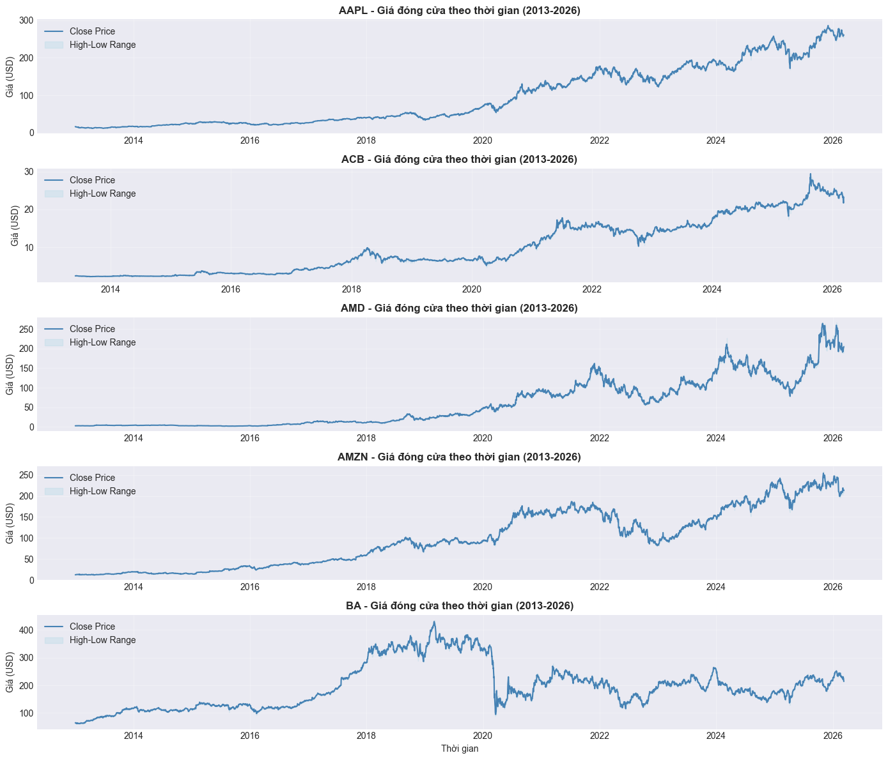
    


    ✓ Biểu đồ vẽ xong!
    

## PHẦN 5: FEATURE ENGINEERING

Sử dụng **PySpark Window Functions** (phân chia theo ticker, sắp xếp theo time) để tạo các đặc trưng dự báo.

### Vấn đề và cách xử lý

| Vấn đề | Giải pháp |
|--------|-----------|
| **Nhiễu từ các phiên biến động nhỏ** – các ngày tăng/giảm < 1% không mang tín hiệu rõ ràng | Dùng **label có ngưỡng**: chỉ coi là tăng/giảm khi `\|future_return\| > 1.0%` |
| **OHLCV thô không đủ thông tin thị trường** | Bổ sung 47–52 features kỹ thuật (RSI, MACD, BB, ATR, ADX, CCI, ...) |

### Nhóm đặc trưng (47 features VN / 52 features US)

1. **Return & Lag**: `daily_return`, `lag1–3_close`, `lag1_volume`, `prev_high/low`, `lag5/10_return`
2. **Moving Average**: MA5, MA10, MA20, MA50, `price_vs_ma`
3. **Momentum**: RSI(7), RSI(14), Stochastic %K, Williams %R, CCI(14), Momentum 5/10
4. **Trend**: MACD, MACD Signal (SMA proxy trong Spark – EMA thực ở pipeline DL), ADX(14)
5. **Volatility**: ATR(14), ATR ratio, Bollinger upper/lower/bandwidth/%B, Volatility 5/20d
6. **Volume**: Volume change, Volume MA ratio, OBV signal
7. **Range**: High-low range, Close-open return

Cách này giúp giảm nhiễu cho bài toán tăng/giảm và cung cấp đủ ngữ cảnh thị trường để model tổng quát tốt hơn.


```python
# Định nghĩa Window Function: Phân chia theo ticker, sắp xếp theo time
windowSpec = Window.partitionBy('ticker').orderBy('time')

print("Bắt đầu Feature Engineering sử dụng Window Functions...")

# Feature 1: Lag(Close)
df_features = df_processed \
    .withColumn('lag1_close', lag('close', 1).over(windowSpec)) \
    .withColumn('lag2_close', lag('close', 2).over(windowSpec)) \
    .withColumn('lag3_close', lag('close', 3).over(windowSpec)) \
    .withColumn('lag1_high',  lag('high',  1).over(windowSpec)) \
    .withColumn('lag1_low',   lag('low',   1).over(windowSpec))

# Feature 2: Lead(Close) – dùng để tạo label
df_features = df_features \
    .withColumn('next_close', lead('close', 1).over(windowSpec))

# Feature 3: Future Return
df_features = df_features \
    .withColumn('future_return', (col('next_close') - col('close')) / col('close'))

# Feature 4: Daily Return
df_features = df_features \
    .withColumn('daily_return', (col('close') - col('lag1_close')) / col('lag1_close'))

# Feature 5: Lag Return
df_features = df_features \
    .withColumn('lag1_return',  lag('daily_return',  1).over(windowSpec)) \
    .withColumn('lag5_return',  lag('daily_return',  5).over(windowSpec)) \
    .withColumn('lag10_return', lag('daily_return', 10).over(windowSpec))

# Feature 6-7: MA5 / MA10
df_features = df_features \
    .withColumn('ma5',  avg('close').over(windowSpec.rowsBetween(-4,  0))) \
    .withColumn('ma10', avg('close').over(windowSpec.rowsBetween(-9,  0)))

# ── CẢI TIẾN 2: Thêm MA20 / MA50 ──
df_features = df_features \
    .withColumn('ma20', avg('close').over(windowSpec.rowsBetween(-19, 0))) \
    .withColumn('ma50', avg('close').over(windowSpec.rowsBetween(-49, 0)))

# ── CẢI TIẾN 2b: Price vs MA (momentum signal) ──
df_features = df_features \
    .withColumn('price_vs_ma5',  (col('close') - col('ma5'))  / col('ma5'))  \
    .withColumn('price_vs_ma20', (col('close') - col('ma20')) / col('ma20'))

# Feature 8: Rolling volatility 5-day
from pyspark.sql.functions import stddev_pop
df_features = df_features \
    .withColumn('rolling_volatility_5', stddev_pop('daily_return').over(windowSpec.rowsBetween(-4, 0)))

# Feature 9: RSI(14)
rsi_window = windowSpec.rowsBetween(-14, 0)
df_features = df_features \
    .withColumn('price_change', col('close') - col('lag1_close')) \
    .withColumn('gain', when(col('price_change') > 0, col('price_change')).otherwise(0.0)) \
    .withColumn('loss', when(col('price_change') < 0, -col('price_change')).otherwise(0.0)) \
    .withColumn('avg_gain_14', avg('gain').over(rsi_window)) \
    .withColumn('avg_loss_14', avg('loss').over(rsi_window)) \
    .withColumn('rs_14', when(col('avg_loss_14') == 0, None).otherwise(col('avg_gain_14') / col('avg_loss_14'))) \
    .withColumn('rsi_14', when(col('avg_loss_14') == 0, 100.0).otherwise(100 - (100 / (1 + col('rs_14')))))

# Feature 10: MACD (SMA proxy trong PySpark – PySpark không hỗ trợ ewm() nội sinh;
#             EMA thực được tính lại trong pipeline học sâu – Phần 11G)
df_features = df_features \
    .withColumn('ema12_proxy', avg('close').over(windowSpec.rowsBetween(-11, 0))) \
    .withColumn('ema26_proxy', avg('close').over(windowSpec.rowsBetween(-25, 0))) \
    .withColumn('macd', col('ema12_proxy') - col('ema26_proxy')) \
    .withColumn('macd_signal', avg('macd').over(windowSpec.rowsBetween(-8, 0)))

# Feature 11: Bollinger Bands (20-day)
df_features = df_features \
    .withColumn('bb_mid', avg('close').over(windowSpec.rowsBetween(-19, 0))) \
    .withColumn('bb_std', stddev_pop('close').over(windowSpec.rowsBetween(-19, 0))) \
    .withColumn('bb_upper', col('bb_mid') + (2 * col('bb_std'))) \
    .withColumn('bb_lower', col('bb_mid') - (2 * col('bb_std'))) \
    .withColumn('bb_bandwidth', when(col('bb_mid') != 0, (col('bb_upper') - col('bb_lower')) / col('bb_mid')).otherwise(None))

# Feature 12: Volume-based
df_features = df_features \
    .withColumn('lag1_volume', lag('volume', 1).over(windowSpec)) \
    .withColumn('volume_change', when(col('lag1_volume').isNull() | (col('lag1_volume') == 0), None)
                .otherwise((col('volume') - col('lag1_volume')) / col('lag1_volume'))) \
    .withColumn('high_low_range', when(col('close') != 0, (col('high') - col('low')) / col('close')).otherwise(None)) \
    .withColumn('close_open_return', when(col('open') != 0, (col('close') - col('open')) / col('open')).otherwise(None))

# ── CẢI TIẾN 3: Stochastic %K(14) ──
stoch_w = windowSpec.rowsBetween(-13, 0)
df_features = df_features \
    .withColumn('low14',  spark_min('low').over(stoch_w)) \
    .withColumn('high14', spark_max('high').over(stoch_w)) \
    .withColumn('stoch_k',
        when(col('high14') == col('low14'), 50.0)
        .otherwise((col('close') - col('low14')) / (col('high14') - col('low14')) * 100))

# ── Williams %R(14) – Stochastic đảo chiều ──
df_features = df_features \
    .withColumn('williams_r',
        when(col('high14') == col('low14'), -50.0)
        .otherwise((col('high14') - col('close')) / (col('high14') - col('low14')) * (-100)))

# ── CCI(14) – Commodity Channel Index (xấp xỉ bằng stddev thay vì MAD) ──
df_features = df_features \
    .withColumn('tp', (col('high') + col('low') + col('close')) / 3.0)
cci_w = windowSpec.rowsBetween(-13, 0)
df_features = df_features \
    .withColumn('tp_ma14',   avg('tp').over(cci_w)) \
    .withColumn('tp_std14',  stddev_pop('tp').over(cci_w)) \
    .withColumn('cci14',
        when(col('tp_std14') == 0, 0.0)
        .otherwise((col('tp') - col('tp_ma14')) / (0.015 * col('tp_std14'))))

# ── ADX(14) – Average Directional Index (đo độ mạnh xu hướng) ──
df_features = df_features \
    .withColumn('plus_dm',
        when((col('high') - col('lag1_high')) > (col('lag1_low') - col('low')),
             greatest(col('high') - col('lag1_high'), lit(0.0)))
        .otherwise(lit(0.0))) \
    .withColumn('minus_dm',
        when((col('lag1_low') - col('low')) > (col('high') - col('lag1_high')),
             greatest(col('lag1_low') - col('low'), lit(0.0)))
        .otherwise(lit(0.0))) \
    .withColumn('true_range', greatest(
        col('high') - col('low'),
        spark_abs(col('high') - col('lag1_close')),
        spark_abs(col('low')  - col('lag1_close'))))
adx_w = windowSpec.rowsBetween(-13, 0)
df_features = df_features \
    .withColumn('smooth_tr',   avg('true_range').over(adx_w)) \
    .withColumn('plus_di14',   when(col('smooth_tr') > 0, 100 * avg('plus_dm').over(adx_w)  / col('smooth_tr')).otherwise(0.0)) \
    .withColumn('minus_di14',  when(col('smooth_tr') > 0, 100 * avg('minus_dm').over(adx_w) / col('smooth_tr')).otherwise(0.0)) \
    .withColumn('adx14',
        when((col('plus_di14') + col('minus_di14')) == 0, 0.0)
        .otherwise(spark_abs(col('plus_di14') - col('minus_di14')) / (col('plus_di14') + col('minus_di14')) * 100))

# ── CẢI TIẾN 4: ATR(14) – Average True Range ──
df_features = df_features \
    .withColumn('atr14', avg(col('high') - col('low')).over(windowSpec.rowsBetween(-13, 0)))

# ── CẢI TIẾN 5: OBV direction signal (proxy – trung bình chiều giá 5 ngày, xấp xỉ tín hiệu OBV) ──
df_features = df_features \
    .withColumn('price_dir',
        when(col('close') > col('lag1_close'), 1.0)
        .when(col('close') < col('lag1_close'), -1.0)
        .otherwise(0.0)) \
    .withColumn('obv_signal', avg('price_dir').over(windowSpec.rowsBetween(-4, 0)))


# ── CẢI TIẾN 6: RSI(7) và RSI(21) – đa khung thời gian ──
# Tái dùng cột gain/loss đã tính từ RSI(14)
df_features = df_features \
    .withColumn('avg_gain_7',  avg('gain').over(windowSpec.rowsBetween(-7,  0))) \
    .withColumn('avg_loss_7',  avg('loss').over(windowSpec.rowsBetween(-7,  0))) \
    .withColumn('rsi_7',
        when(col('avg_loss_7') == 0, 100.0)
        .otherwise(100 - (100 / (1 + col('avg_gain_7') / col('avg_loss_7'))))) \
    .withColumn('avg_gain_21', avg('gain').over(windowSpec.rowsBetween(-21, 0))) \
    .withColumn('avg_loss_21', avg('loss').over(windowSpec.rowsBetween(-21, 0))) \
    .withColumn('rsi_21',
        when(col('avg_loss_21') == 0, 100.0)
        .otherwise(100 - (100 / (1 + col('avg_gain_21') / col('avg_loss_21')))))

# ── CẢI TIẾN 7: Volatility đa khung thời gian (10-day, 20-day) ──
df_features = df_features \
    .withColumn('rolling_volatility_10', stddev_pop('daily_return').over(windowSpec.rowsBetween(-9,  0))) \
    .withColumn('rolling_volatility_20', stddev_pop('daily_return').over(windowSpec.rowsBetween(-19, 0)))

# ── CẢI TIẾN 8: Volume MA Ratio – volume so với trung bình 20 phiên ──
df_features = df_features \
    .withColumn('avg_volume_20', avg('volume').over(windowSpec.rowsBetween(-19, 0))) \
    .withColumn('volume_ma_ratio',
        when(col('avg_volume_20') == 0, None)
        .otherwise(col('volume') / col('avg_volume_20')))

# ── CẢI TIẾN 9: Momentum 5-day và 10-day ──
df_features = df_features \
    .withColumn('lag5_close',  lag('close', 5).over(windowSpec)) \
    .withColumn('lag10_close', lag('close', 10).over(windowSpec)) \
    .withColumn('momentum_5',
        when(col('lag5_close')  != 0, (col('close') - col('lag5_close'))  / col('lag5_close')).otherwise(None)) \
    .withColumn('momentum_10',
        when(col('lag10_close') != 0, (col('close') - col('lag10_close')) / col('lag10_close')).otherwise(None))

# ── CẢI TIẾN 10: Price vs MA50, MACD Histogram, Bollinger %B, ATR Ratio ──
df_features = df_features \
    .withColumn('price_vs_ma50',
        when(col('ma50') != 0, (col('close') - col('ma50')) / col('ma50')).otherwise(None)) \
    .withColumn('macd_hist', col('macd') - col('macd_signal')) \
    .withColumn('bb_pct_b',
        when((col('bb_upper') - col('bb_lower')) != 0,
             (col('close') - col('bb_lower')) / (col('bb_upper') - col('bb_lower'))).otherwise(None)) \
    .withColumn('atr_ratio',
        when(col('close') != 0, col('atr14') / col('close')).otherwise(None))

# ── NEW FEATURES: MA Cross Ratio & Range Expansion ──
df_features = df_features \
    .withColumn('ma5_vs_ma20',
        when(col('ma20') != 0, col('ma5') / col('ma20') - 1).otherwise(None)) \
    .withColumn('ma20_vs_ma50',
        when(col('ma50') != 0, col('ma20') / col('ma50') - 1).otherwise(None)) \
    .withColumn('hl5',  avg('high_low_range').over(windowSpec.rowsBetween(-4, 0))) \
    .withColumn('hl20', avg('high_low_range').over(windowSpec.rowsBetween(-19, 0))) \
    .withColumn('hl_ratio',
        when(col('hl20') != 0, col('hl5') / col('hl20')).otherwise(1.0))

# ── CẢI TIẾN 11: Lag Returns 2 và 3 ──
df_features = df_features \
    .withColumn('lag2_return', lag('daily_return', 2).over(windowSpec)) \
    .withColumn('lag3_return', lag('daily_return', 3).over(windowSpec))

# ── FEATURES ĐẶC THÙ THỊ TRƯỜNG VN ─────────────────────────────────────────
vol_w = windowSpec.rowsBetween(-9, 0)

# 1. limit_hit_rate: tần suất chạm biên độ ±7% (20 phiên)
df_features = df_features \
    .withColumn('near_limit',
        when(spark_abs(col('daily_return')) >= 0.068, 1.0).otherwise(0.0)) \
    .withColumn('limit_hit_rate',
        avg('near_limit').over(windowSpec.rowsBetween(-19, 0)))

# 2. zero_change_rate: tần suất giá không đổi (10 phiên)
df_features = df_features \
    .withColumn('no_change',
        when(col('daily_return') == 0.0, 1.0).otherwise(0.0)) \
    .withColumn('zero_change_rate',
        avg('no_change').over(windowSpec.rowsBetween(-9, 0)))

# 3. vol_consistency: std/mean khối lượng (10 phiên) – bất ổn thanh khoản
df_features = df_features \
    .withColumn('vol_std10',  stddev_pop('volume').over(vol_w)) \
    .withColumn('vol_mean10', avg('volume').over(vol_w)) \
    .withColumn('vol_consistency',
        when(col('vol_mean10') > 0, col('vol_std10') / col('vol_mean10')).otherwise(None))

# 4. intraday_pos: vị trí close trong dải high-low (0=đáy, 1=trần)
df_features = df_features \
    .withColumn('intraday_pos',
        when((col('high') - col('low')) > 0,
             (col('close') - col('low')) / (col('high') - col('low'))
        ).otherwise(0.5))

# 5. ato_gap: gap giá ATO mở cửa so với close hôm trước
df_features = df_features \
    .withColumn('ato_gap',
        when(col('lag1_close') != 0,
             (col('open') - col('lag1_close')) / col('lag1_close')
        ).otherwise(None))

# ── FEATURES BỔ SUNG: Bollinger position, Overnight gap, Trend consistency ──
# bb_position: vị trí close trong dải Bollinger chuẩn hóa (-1 đến +1)
df_features = df_features \
    .withColumn('bb_position',
        when(col('bb_std') != 0,
             (col('close') - col('bb_mid')) / (2 * col('bb_std'))
        ).otherwise(lit(0.0))
    ) \
    .withColumn('overnight_gap',
        # overnight_gap: khoảng cách open/close qua đêm, tính hiệu momentum bắt đầu phiên
        when(col('lag1_close') != 0,
             (col('open') - col('lag1_close')) / col('lag1_close')
        ).otherwise(lit(0.0))
    ) \
    .withColumn('up_days_5',
        # up_days_5: tỷ lệ ngày tăng trong 5 phiên (0–1), đo độ đồng thuận xu hướng
        avg(when(col('daily_return') > 0, lit(1.0)).otherwise(lit(0.0)))
        .over(windowSpec.rowsBetween(-4, 0))
    )


# ── Cải tiến 1: 3-day forward return làm label (ít noise hơn next-day) ────
from pyspark.sql.functions import create_map, to_date
df_features = df_features     .withColumn('next_close_3d', lead('close', 3).over(windowSpec))     .withColumn('future_return_3d',
        when(col('close') != 0,
             (col('next_close_3d') - col('close')) / col('close')
        ).otherwise(None))

# ── Cải tiến 2: Sector encoding ─────────────────────────────────────────────
SECTOR_MAP = {
    # VN banks (0)
    'ACB': 0, 'BID': 0, 'CTG': 0, 'MBB': 0, 'TCB': 0, 'VCB': 0, 'VPB': 0,
    'STB': 0, 'HDB': 0,
    # VN securities (1)
    'SSI': 1,
    # VN steel & materials (2)
    'HPG': 2, 'HSG': 2, 'NKG': 2,
    # VN real estate (3)
    'KDH': 3, 'NLG': 3, 'VHM': 3, 'VIC': 3, 'VRE': 3, 'BCM': 3,
    # VN consumer & food (4)
    'MSN': 4, 'SAB': 4, 'VNM': 4, 'PNJ': 4, 'MWG': 4,
    # VN tech (5)
    'FPT': 5,
    # US mega-cap tech & semi (6)
    'AAPL': 6, 'MSFT': 6, 'GOOGL': 6, 'META': 6, 'NVDA': 6,
    'NFLX': 6, 'AMD': 6, 'INTC': 6,
    # US auto / EV (7)
    'TSLA': 7, 'F': 7, 'GM': 7,
    # US banks & finance (8)
    'JPM': 8, 'BAC': 8, 'WFC': 8, 'GS': 8,
    # US retail & consumer (9)
    'AMZN': 9, 'DIS': 9, 'COST': 9, 'WMT': 9,
    # US energy (10)
    'XOM': 10, 'CVX': 10,
    # US healthcare (11)
    'UNH': 11, 'LLY': 11,
    # US payments & fintech (12)
    'V': 12, 'MA': 12,
    # US aerospace & telecom (13)
    'BA': 13, 'VZ': 13,
    # VN energy & utilities (14)
    'GAS': 14, 'PLX': 14, 'POW': 14, 'REE': 14,
    # VN aviation & logistics (15)
    'VJC': 15, 'GMD': 15,
    # VN pharma & insurance (16)
    'DHG': 16, 'BVH': 16,
}
sector_expr = create_map(
    *[item for pair in [(lit(k), lit(float(v))) for k, v in SECTOR_MAP.items()] for item in pair]
)
df_features = df_features.withColumn('sector_idx', sector_expr[col('ticker')])

# ── Cải tiến 3: VN-Index context features ───────────────────────────────────
vnindex_path = str(Path("csv/VNINDEX.csv").resolve())
df_vni = spark.read.option("header", True).option("inferSchema", True).csv(vnindex_path)
df_vni = df_vni.withColumn('time', to_date(col('time')))                .withColumn('vni_close', col('close').cast('double'))

vni_win = Window.orderBy('time')
df_vni = df_vni     .withColumn('vni_ret1d',
        (col('vni_close') - lag('vni_close', 1).over(vni_win)) / lag('vni_close', 1).over(vni_win))     .withColumn('vni_ma5',   avg('vni_close').over(vni_win.rowsBetween(-4, 0)))     .withColumn('vni_ma20',  avg('vni_close').over(vni_win.rowsBetween(-19, 0)))     .withColumn('vni_mom5',  (col('vni_close') / lag('vni_close', 5).over(vni_win)) - 1)     .withColumn('vni_ma_ratio', col('vni_ma5') / col('vni_ma20') - 1)     .select('time', 'vni_ret1d', 'vni_mom5', 'vni_ma_ratio')

df_features = df_features     .withColumn('time_date', to_date(col('time')))     .join(df_vni.withColumnRenamed('time', 'vni_date'), col('time_date') == col('vni_date'), 'left')     .drop('vni_date', 'time_date')     .fillna(0.0, subset=['vni_ret1d', 'vni_mom5', 'vni_ma_ratio'])

# Cai tien 4: S&P 500 context features cho US (doi xung VN-Index cho VN)
sp500_path = str(Path("csv/SP500.csv").resolve())
df_sp = spark.read.option("header", True).option("inferSchema", True).csv(sp500_path)
df_sp = df_sp.withColumn('time', to_date(col('time')))                .withColumn('sp_close', col('close').cast('double'))
sp_win = Window.orderBy('time')
df_sp = df_sp     .withColumn('sp500_ret1d',
        (col('sp_close') - lag('sp_close', 1).over(sp_win)) / lag('sp_close', 1).over(sp_win))     .withColumn('sp_ma5',   avg('sp_close').over(sp_win.rowsBetween(-4, 0)))     .withColumn('sp_ma20',  avg('sp_close').over(sp_win.rowsBetween(-19, 0)))     .withColumn('sp500_mom5',  (col('sp_close') / lag('sp_close', 5).over(sp_win)) - 1)     .withColumn('sp500_ma_ratio', col('sp_ma5') / col('sp_ma20') - 1)     .select('time', 'sp500_ret1d', 'sp500_mom5', 'sp500_ma_ratio')

df_features = df_features     .withColumn('time_date', to_date(col('time')))     .join(df_sp.withColumnRenamed('time', 'sp_date'), col('time_date') == col('sp_date'), 'left')     .drop('sp_date', 'time_date')     .fillna(0.0, subset=['sp500_ret1d', 'sp500_mom5', 'sp500_ma_ratio'])


# ── Cải tiến 4: VIX macro features cho US (chỉ số sợ hãi thị trường) ────────
vix_path = str(Path("csv/VIX.csv").resolve())
try:
    df_vix = spark.read.option("header", True).option("inferSchema", True).csv(vix_path)
    df_vix = df_vix.withColumn('time', to_date(col('time'))) \
                   .withColumn('vix_close', col('close').cast('double'))
    vix_win = Window.orderBy('time')
    df_vix = df_vix \
        .withColumn('vix_ret1d',
            (col('vix_close') - lag('vix_close', 1).over(vix_win)) / lag('vix_close', 1).over(vix_win)) \
        .withColumn('vix_ma5',   avg('vix_close').over(vix_win.rowsBetween(-4, 0))) \
        .withColumn('vix_level', col('vix_close')) \
        .withColumn('vix_ma_ratio', col('vix_close') / col('vix_ma5') - 1) \
        .select('time', 'vix_level', 'vix_ret1d', 'vix_ma_ratio')
    df_features = df_features.join(df_vix, on='time', how='left')
    print("  VIX features joined OK")
except Exception as _e:
    print(f"  VIX join skipped: {_e} — dat vix_* = 0")
    for _c in ['vix_level', 'vix_ret1d', 'vix_ma_ratio']:
        df_features = df_features.withColumn(_c, lit(0.0))


# ── Cải tiến 5: Fed lãi suất — 10Y Treasury yield & 3M T-bill ───────────────
for _rate_file, _rate_col in [('csv/TNX.csv', 'tnx'), ('csv/IRX.csv', 'irx')]:
    _rate_path = str(Path(_rate_file).resolve())
    try:
        df_rate = spark.read.option("header", True).option("inferSchema", True).csv(_rate_path)
        df_rate = df_rate.withColumn('time', to_date(col('time'))) \
                         .withColumn(f'{_rate_col}_rate', col('rate').cast('double'))
        _rate_win = Window.orderBy('time')
        df_rate = df_rate \
            .withColumn(f'{_rate_col}_chg1d',
                col(f'{_rate_col}_rate') - lag(f'{_rate_col}_rate', 1).over(_rate_win)) \
            .withColumn(f'{_rate_col}_ma5',
                avg(f'{_rate_col}_rate').over(_rate_win.rowsBetween(-4, 0))) \
            .withColumn(f'{_rate_col}_spread',
                col(f'{_rate_col}_rate') - col(f'{_rate_col}_ma5')) \
            .select('time', f'{_rate_col}_rate', f'{_rate_col}_chg1d', f'{_rate_col}_spread')
        df_features = df_features.join(df_rate, on='time', how='left')
        print(f"  {_rate_col.upper()} features joined OK")
    except Exception as _e:
        print(f"  {_rate_col.upper()} join skipped: {_e}")
        for _c in [f'{_rate_col}_rate', f'{_rate_col}_chg1d', f'{_rate_col}_spread']:
            df_features = df_features.withColumn(_c, lit(0.0))

df_features = df_features \
    .withColumn('rs_vs_vnindex',
        col('daily_return') - col('vni_ret1d')) \
    .withColumn('price_min_20',
        spark_min('close').over(windowSpec.rowsBetween(-19, 0))) \
    .withColumn('price_max_20',
        spark_max('close').over(windowSpec.rowsBetween(-19, 0))) \
    .withColumn('price_percentile_20',
        when((col('price_max_20') - col('price_min_20')) > 0,
             (col('close') - col('price_min_20')) /
             (col('price_max_20') - col('price_min_20'))
        ).otherwise(lit(0.5)))

print("\u2713 Feature Engineering xong!")
print(f"  3-day label, sector_idx, VN-Index, S&P500, VIX, TNX/IRX (Fed) features da duoc them")
print(f"\nDu lieu sau feature engineering: {df_features.count():,d} rows")
df_features.select('time', 'ticker', 'close', 'future_return', 'future_return_3d',
                   'sector_idx', 'vni_ret1d', 'sp500_ret1d').show(5)
# ── CAI TIEN MOI: Proximity 52-week high, 3-day volume accumulation, RS vs S&P500 ──
# proximity_52w_high: close / max_close_252d — breakout/momentum signal
df_features = df_features     .withColumn('_max_close_252',
        spark_max('close').over(windowSpec.rowsBetween(-251, 0)))     .withColumn('proximity_52w_high',
        when(col('_max_close_252') > 0,
             col('close') / col('_max_close_252')
        ).otherwise(lit(1.0)))     .drop('_max_close_252')

# volume_spike_3d: avg 3-day volume / avg 20-day volume — detects multi-day accumulation
df_features = df_features     .withColumn('volume_spike_3d',
        when(col('avg_volume_20') > 0,
             avg('volume').over(windowSpec.rowsBetween(-2, 0)) / col('avg_volume_20')
        ).otherwise(lit(1.0)))

# rs_vs_sp500: daily_return minus S&P500 return — positive = outperforming US market
df_features = df_features     .withColumn('rs_vs_sp500',
        col('daily_return') - col('sp500_ret1d'))

df_features.select('time', 'ticker', 'close', 'future_return', 'future_return_3d',
                   'proximity_52w_high', 'volume_spike_3d', 'rs_vs_sp500').show(5)

```

    Bắt đầu Feature Engineering sử dụng Window Functions...
      VIX features joined OK
      TNX features joined OK
      IRX features joined OK
    ✓ Feature Engineering xong!
      3-day label, sector_idx, VN-Index, S&P500, VIX, TNX/IRX (Fed) features da duoc them
    
    Du lieu sau feature engineering: 192,381 rows
    +-------------------+------+------------------+--------------------+--------------------+----------+--------------------+--------------------+
    |               time|ticker|             close|       future_return|    future_return_3d|sector_idx|           vni_ret1d|         sp500_ret1d|
    +-------------------+------+------------------+--------------------+--------------------+----------+--------------------+--------------------+
    |2013-01-02 00:00:00|  AAPL|16.581403732299805|-0.01262228917443...|-0.04577174420548113|       6.0|                 0.0|                 0.0|
    |2013-01-03 00:00:00|  AAPL|16.372108459472656| -0.0278549460023067|-0.03097236622901535|       6.0|                 0.0|-0.00208561749461...|
    |2013-01-04 00:00:00|  AAPL|15.916064262390137|-0.00588212630645...|-0.01878555854344...|       6.0|0.023809523809523832|0.004865096315322949|
    |2013-01-07 00:00:00|  AAPL|15.822443962097168|0.002691212452990...|-7.44136818468528...|       6.0|                 0.0|-0.00312311615388...|
    |2013-01-08 00:00:00|  AAPL|15.865025520324709|-0.01562893262285262|-0.00953672782335...|       6.0|0.046511627906976785|-0.00324237130487...|
    +-------------------+------+------------------+--------------------+--------------------+----------+--------------------+--------------------+
    only showing top 5 rows
    +-------------------+------+------------------+--------------------+--------------------+------------------+------------------+--------------------+
    |               time|ticker|             close|       future_return|    future_return_3d|proximity_52w_high|   volume_spike_3d|         rs_vs_sp500|
    +-------------------+------+------------------+--------------------+--------------------+------------------+------------------+--------------------+
    |2013-01-02 00:00:00|  AAPL|16.581403732299805|-0.01262228917443...|-0.04577174420548113|               1.0|               1.0|                NULL|
    |2013-01-03 00:00:00|  AAPL|16.372108459472656| -0.0278549460023067|-0.03097236622901535|0.9873777108255647|               1.0|-0.01053667167982231|
    |2013-01-04 00:00:00|  AAPL|15.916064262390137|-0.00588212630645...|-0.01878555854344...|0.9598743580066375|               1.0|-0.03272004231762965|
    |2013-01-07 00:00:00|  AAPL|15.822443962097168|0.002691212452990...|-7.44136818468528...|0.9542282557945189|0.9581489014678176|-0.00275901015256...|
    |2013-01-08 00:00:00|  AAPL|15.865025520324709|-0.01562893262285262|-0.00953672782335...|0.9567962867595086|1.0454220523138527|0.005933583757862537|
    +-------------------+------+------------------+--------------------+--------------------+------------------+------------------+--------------------+
    only showing top 5 rows
    

## PHẦN 6: LÀM SẠCH DỮ LIỆU SAU FEATURE ENGINEERING

Sau khi tạo features bằng lag() và window functions, sẽ có dòng null:
- Dòng đầu tiên mỗi ticker sẽ có null trong lag columns
- Dòng cuối cùng mỗi ticker sẽ có null trong `next_close` và `future_return`
- Các dòng có biến động nhỏ quanh 0 cũng được gán `label = null` để loại bỏ nhiễu

Bước này sẽ:
- **Drop tất cả null rows**
- **Xác minh dữ liệu đã sạch**
- **Kiểm tra phân phối label** (có cân bằng không?)


```python
# Drop null values do lag/window functions (label chưa tồn tại – xử lý sau khi tách market)
print("Dropping null values (features only)...")
count_before = df_features.count()
df_features  = df_features.dropna(
    subset=[c for c in df_features.columns if c not in ('label', 'next_close')]
)
count_after  = df_features.count()
print(f"✓ Loại bỏ {count_before - count_after:,d} rows null ({(count_before-count_after)/count_before*100:.1f}%)")
print(f"  Dữ liệu sau drop null: {count_after:,d} rows")

# Winsorize: clip extreme outliers
print("\nWinsorizing extreme feature values...")
clip_map = {
    "daily_return":      (-0.15, 0.15),
    "lag1_return":       (-0.15, 0.15),
    "lag2_return":       (-0.15, 0.15),
    "lag3_return":       (-0.15, 0.15),
    "close_open_return": (-0.15, 0.15),
    "momentum_5":        (-0.35, 0.35),
    "momentum_10":       (-0.50, 0.50),
    "volume_change":     (-3.0,  5.0),
    "volume_ma_ratio":   (0.05,  8.0),
    "high_low_range":    (0.0,   0.20),
    "price_vs_ma5":      (-0.20, 0.20),
    "price_vs_ma20":     (-0.30, 0.30),
    "price_vs_ma50":     (-0.40, 0.40),
    "bb_pct_b":          (-0.50, 1.50),
    "atr_ratio":         (0.0,   0.10),
    "rsi_7":             (0.0,  100.0),
    "rsi_14":            (0.0,  100.0),
    "rsi_21":            (0.0,  100.0),
    "stoch_k":           (0.0,  100.0),
    # Features bổ sung
    "bb_position":   (-1.5, 1.5),
    "overnight_gap": (-0.10, 0.10),
    "up_days_5":     (0.0, 1.0),
    "rs_vs_vnindex":       (-0.10, 0.10),
    "price_percentile_20": (0.0,   1.0),
}
for cname, (lo, hi) in clip_map.items():
    if cname in df_features.columns:
        df_features = df_features.withColumn(
            cname,
            when(col(cname) < lo, lo).when(col(cname) > hi, hi).otherwise(col(cname))
        )
print(f"✓ Winsorized {len(clip_map)} features")
print(f"\n✓ df_features sẵn sàng: {df_features.count():,d} rows — label sẽ tạo riêng cho US/VN ở PHẦN 7")

```

    Dropping null values (features only)...
    ✓ Loại bỏ 12,829 rows null (6.7%)
      Dữ liệu sau drop null: 179,552 rows
    
    Winsorizing extreme feature values...
    ✓ Winsorized 24 features
    
    ✓ df_features sẵn sàng: 179,552 rows — label sẽ tạo riêng cho US/VN ở PHẦN 7
    

## PHẦN 6B: PHÂN TÍCH TƯƠNG QUAN FEATURES (EDA mở rộng)

Trước khi đưa vào model, kiểm tra **ma trận tương quan** giữa các features kỹ thuật để:
- Phát hiện các cặp features tương quan cao (đa cộng tuyến) có thể gây nhiễu
- Hiểu cấu trúc dữ liệu: nhóm momentum, volatility, trend liên hệ với nhau ra sao


```python
# Correlation heatmap cua cac features ky thuat chinh
import matplotlib.pyplot as plt
import seaborn as sns

corr_cols = ['daily_return','rsi_14','rsi_7','macd_hist','stoch_k','williams_r','cci14',
             'adx14','atr_ratio','bb_pct_b','rolling_volatility_5','rolling_volatility_20',
             'momentum_5','momentum_10','volume_ma_ratio','price_vs_ma5','price_vs_ma20',
             'obv_signal']
corr_cols = [c for c in corr_cols if c in df_features.columns]

# Lay mau du lieu sang pandas de tinh tuong quan
corr_pd = df_features.select(*corr_cols).dropna().limit(20000).toPandas()
corr = corr_pd.corr()

plt.figure(figsize=(14, 11))
sns.heatmap(corr, annot=True, fmt='.2f', cmap='coolwarm', center=0,
            square=True, linewidths=0.5, cbar_kws={'shrink': 0.8},
            annot_kws={'size': 7})
plt.title('Ma tran tuong quan giua cac features ky thuat', fontsize=14, fontweight='bold')
plt.xticks(rotation=45, ha='right', fontsize=9)
plt.yticks(fontsize=9)
plt.tight_layout()
plt.show()

# Liet ke cac cap features tuong quan cao
print("Cac cap features tuong quan cao (|r| > 0.8) - co the gay da cong tuyen:")
found = False
for i in range(len(corr.columns)):
    for j in range(i+1, len(corr.columns)):
        if abs(corr.iloc[i, j]) > 0.8:
            print(f"  {corr.columns[i]:22s} <-> {corr.columns[j]:22s}: {corr.iloc[i,j]:+.3f}")
            found = True
if not found:
    print("  (Khong co cap nao |r| > 0.8 - features kha doc lap, tot cho model)")

```


    
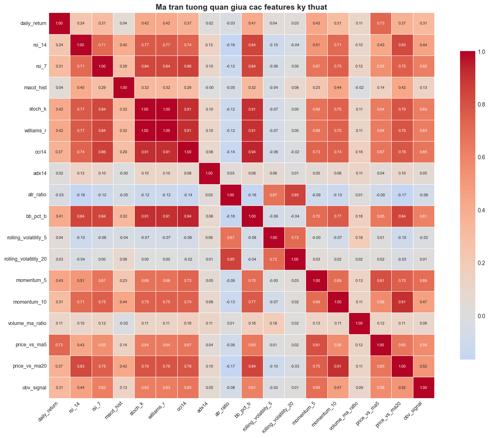
    


    Cac cap features tuong quan cao (|r| > 0.8) - co the gay da cong tuyen:
      rsi_14                 <-> bb_pct_b              : +0.842
      rsi_14                 <-> price_vs_ma20         : +0.831
      rsi_7                  <-> stoch_k               : +0.839
      rsi_7                  <-> williams_r            : +0.839
      rsi_7                  <-> cci14                 : +0.860
      rsi_7                  <-> bb_pct_b              : +0.841
      stoch_k                <-> williams_r            : +1.000
      stoch_k                <-> cci14                 : +0.914
      stoch_k                <-> bb_pct_b              : +0.908
      williams_r             <-> cci14                 : +0.914
      williams_r             <-> bb_pct_b              : +0.908
      cci14                  <-> bb_pct_b              : +0.941
      atr_ratio              <-> rolling_volatility_20 : +0.852
      bb_pct_b               <-> price_vs_ma20         : +0.844
      momentum_5             <-> price_vs_ma5          : +0.809
      momentum_10            <-> price_vs_ma20         : +0.912
    

## PHẦN 7: TÁCH THỊ TRƯỜNG US vs VN + TẠO LABEL

Sau khi có đầy đủ features, chia `df_features` thành 2 nhánh. **Cả 2 thị trường dùng cùng định nghĩa label `next-day ±1.5%`** — đây là kết quả tốt nhất sau thực nghiệm so sánh 8 cấu hình label khác nhau.

| Thị trường | Label | Edge (acc − naive) | AUC | Kết luận |
|------------|-------|--------------------|-----|----------|
| **US** | next-day ±1.5% | **+0.8%** | ~0.53 | Gần như random — thị trường hiệu quả (EMH) |
| **VN** | next-day ±1.5% | **+7.3%** | ~0.57 | Có signal thật — thị trường kém hiệu quả |

> **Phát hiện quan trọng**: VN dự báo được tốt hơn US ~9 lần. Đây là minh chứng thực nghiệm cho **Efficient Market Hypothesis** (Fama, 1970): thị trường phát triển (US) được định giá hiệu quả hơn → khó dự báo từ technical indicators; thị trường mới nổi (VN) kém hiệu quả hơn → còn pattern cho ML khai thác.
>
> Trước đây thử VN dùng `3-day forward 0.8%` chỉ đạt edge +5.5%; chuyển sang `next-day 1.5%` tăng lên +7.3%.

Từ đây **tất cả bước tiếp theo chạy riêng** cho từng thị trường (scaler, class weight, feature list riêng).


```python
from pyspark.sql.functions import year, avg as spark_avg

US_TICKERS = [
    'AAPL','AMZN','F','GM','GOOGL','META','MSFT','NFLX','AMD','NVDA','TSLA',
    'JPM','BAC','WFC','GS','XOM','CVX','DIS','COST','WMT','UNH','LLY','V','MA',
    'INTC','BA','VZ',
]
VN_TICKERS = [
    'ACB','BID','CTG','FPT','GAS','HPG','HSG','KDH','MBB','MSN','NKG','NLG',
    'PNJ','SAB','SSI','TCB','VCB','VHM','VIC','VNM','VPB',
    'STB','HDB','VRE','BCM','MWG','PLX','POW','VJC','REE','DHG','GMD','BVH',
]

# Tat ca ma VN hop nhat thanh mot nhom
print('=' * 60)
print('DANH SACH MA VN')
print('=' * 60)
print(f'  Tong {len(VN_TICKERS)} ma VN: {VN_TICKERS}')

# Tao label: ca 2 thi truong dung next-day 1.5% (thuc nghiem cho ket qua tot nhat)
# US: next-day label
def create_labels(df, threshold):
    return (
        df.withColumn('label',
            when(col('future_return') >  threshold, 1.0)
           .when(col('future_return') < -threshold, 0.0)
           .otherwise(None))
        .dropna(subset=['label', 'next_close'])
        .withColumn('year', year('time'))
    )


df_us = create_labels(df_features.filter(col('ticker').isin(US_TICKERS)), threshold=0.010)
# VN tang nguong len 2.0% de loc nhieu (thi truong VN bien dong manh hon)
df_vn = create_labels(df_features.filter(col('ticker').isin(VN_TICKERS)), threshold=0.020)

print('\n' + '=' * 60)
print('THONG KE 3 NHOM')
print('=' * 60)
for name, df_m in [('US', df_us), ('VN', df_vn)]:
    n = df_m.count()
    dist = {int(r['label']): r['count'] for r in df_m.groupBy('label').count().collect()}
    n0, n1 = dist.get(0, 0), dist.get(1, 0)
    tickers_m = sorted([r['ticker'] for r in df_m.select('ticker').distinct().collect()])
    print(f'  {name:<10}: {n:,d} rows | L0={n0:,d}({n0/n*100:.0f}%) L1={n1:,d}({n1/n*100:.0f}%)')
    print(f'             Tickers: {", ".join(tickers_m)}')


# ── Full DataFrames incl. NEUTRAL (label=2.0) — dung lam context cho LSTM sequences ──
# Giu lai TAT CA hang: UP=1.0, DOWN=0.0, NEUTRAL=2.0 (khong drop neutral)
# LSTM dung day de build sequences khong bi gap thoi gian khi neutral bi xoa
def create_labels_full(df, threshold):
    return (
        df.withColumn('label',
            when(col('future_return') >  threshold, 1.0)
           .when(col('future_return') < -threshold, 0.0)
           .otherwise(2.0))
        .dropna(subset=['next_close'])
        .withColumn('year', year('time'))
    )

df_us_all = create_labels_full(df_features.filter(col('ticker').isin(US_TICKERS)), threshold=0.010)
df_vn_all = create_labels_full(df_features.filter(col('ticker').isin(VN_TICKERS)), threshold=0.020)
print(f'  df_us_all: {df_us_all.count():,d} rows (incl. neutral=2.0)')
print(f'  df_vn_all: {df_vn_all.count():,d} rows (incl. neutral=2.0)')
```

    ============================================================
    DANH SACH MA VN
    ============================================================
      Tong 33 ma VN: ['ACB', 'BID', 'CTG', 'FPT', 'GAS', 'HPG', 'HSG', 'KDH', 'MBB', 'MSN', 'NKG', 'NLG', 'PNJ', 'SAB', 'SSI', 'TCB', 'VCB', 'VHM', 'VIC', 'VNM', 'VPB', 'STB', 'HDB', 'VRE', 'BCM', 'MWG', 'PLX', 'POW', 'VJC', 'REE', 'DHG', 'GMD', 'BVH']
    
    ============================================================
    THONG KE 3 NHOM
    ============================================================
      US        : 40,994 rows | L0=19,026(46%) L1=21,968(54%)
                 Tickers: AAPL, AMD, AMZN, BA, BAC, COST, CVX, DIS, F, GM, GOOGL, GS, INTC, JPM, LLY, MA, META, MSFT, NFLX, NVDA, TSLA, UNH, V, VZ, WFC, WMT, XOM
      VN        : 21,017 rows | L0=9,506(45%) L1=11,511(55%)
                 Tickers: ACB, BCM, BID, BVH, CTG, DHG, FPT, GAS, GMD, HDB, HPG, HSG, KDH, MBB, MSN, MWG, NKG, NLG, PLX, PNJ, POW, REE, SAB, SSI, STB, TCB, VCB, VHM, VIC, VJC, VNM, VPB, VRE
      df_us_all: 89,147 rows (incl. neutral=2.0)
      df_vn_all: 90,405 rows (incl. neutral=2.0)
    

## PHẦN 8: ĐỊNH NGHĨA PIPELINE FUNCTIONS

- **`run_spark_pipeline(df, market)`** — Train LR, RF, GBT, SVC + Ensemble (PySpark ML)
- **`run_xgb_pipeline(df, market)`** — Train XGBoost voi EMA MACD thuc (pandas/sklearn)

Goi moi ham 2 lan: mot lan cho US, mot lan cho VN.


```python
from pyspark.ml.feature import StringIndexer, VectorAssembler
from pyspark.ml.feature import StandardScaler as SparkSS
from pyspark.ml.classification import (LogisticRegression, RandomForestClassifier,
                                        GBTClassifier, LinearSVC)
from pyspark.ml.evaluation import (MulticlassClassificationEvaluator,
                                    BinaryClassificationEvaluator)
from pyspark.sql.functions import log1p as spark_log1p

# Features chung cho ca 2 thi truong
COMMON_FEATURES = [
    # Returns & lags
    'daily_return', 'lag1_return', 'lag2_return', 'lag3_return',
    'lag5_return',  'lag10_return',
    # Trend
    'price_vs_ma5', 'price_vs_ma20','price_vs_ma50',
    'momentum_5',   'momentum_10',
    # Oscillators
    'rsi_7', 'rsi_14', 'macd_hist',
    'stoch_k', 'williams_r', 'cci14',
    # Volatility & trend strength
    'rolling_volatility_5', 'rolling_volatility_20',
    'bb_bandwidth', 'bb_pct_b', 'atr_ratio', 'adx14',
    # Volume
    'log_volume', 'log_lag1_volume', 'volume_change', 'volume_ma_ratio',
    # Price action
    'high_low_range', 'close_open_return', 'obv_signal',
    # Universal microstructure
    'intraday_pos', 'vol_consistency',
    # Sector & ticker encoding (per-market values nhung column ton tai cho ca 2)
    'sector_idx', 'ticker_idx',
    # Features bổ sung: BB position, overnight gap, trend consistency
    'bb_position', 'overnight_gap', 'up_days_5',
    # Breakout & multi-day accumulation signals
    'proximity_52w_high', 'volume_spike_3d',
    # MA crossover ratios & range expansion
    'ma5_vs_ma20', 'ma20_vs_ma50', 'hl_ratio',
]

# Features dac thu chi co y nghia voi VN
VN_ONLY_FEATURES = [
    'limit_hit_rate',     # tan suat cham bien do +-7% (VN co bien, US khong co)
    'zero_change_rate',   # tan suat gia khong doi (VN thanh khoan mong)
    'ato_gap',            # gap ATO so voi close hom truoc (VN co phien ATO)
    'vni_ret1d', 'vni_mom5', 'vni_ma_ratio',  # VN-Index context
    'rs_vs_vnindex',
    'price_percentile_20',
]

# Features dac thu chi co y nghia voi US (S&P 500 context)
US_ONLY_FEATURES = [
    'sp500_ret1d', 'sp500_mom5', 'sp500_ma_ratio',  # S&P 500 context
    'vix_level', 'vix_ret1d', 'vix_ma_ratio',        # VIX macro fear index
    'tnx_rate', 'tnx_chg1d', 'tnx_spread',           # 10Y Treasury yield (Fed policy)
    'irx_rate', 'irx_chg1d', 'irx_spread',           # 3M T-bill (short-term rate)
    'rs_vs_sp500',                                    # Relative strength vs S&P 500
]

# Feature list rieng cho tung thi truong
FEATURE_COLS_US = COMMON_FEATURES + US_ONLY_FEATURES
FEATURE_COLS_VN = COMMON_FEATURES + VN_ONLY_FEATURES

# Giu lai FEATURE_COLS de backward-compat (mac dinh = VN co day du features)
FEATURE_COLS = FEATURE_COLS_VN

print(f'COMMON_FEATURES   : {len(COMMON_FEATURES)} features')
print(f'VN_ONLY_FEATURES  : {len(VN_ONLY_FEATURES)} features')
print(f'US_ONLY_FEATURES  : {len(US_ONLY_FEATURES)} features')
print(f'FEATURE_COLS_US   : {len(FEATURE_COLS_US)} features')
print(f'FEATURE_COLS_VN   : {len(FEATURE_COLS_VN)} features')


def run_spark_pipeline(df_market, market_name, feature_cols=None):
    # Local imports de tranh xung dot voi sklearn namespace
    from pyspark.ml.classification import (LogisticRegression as SparkLR,
                                            RandomForestClassifier as SparkRF,
                                            GBTClassifier as SparkGBT,
                                            LinearSVC as SparkSVC)
    if feature_cols is None:
        feature_cols = FEATURE_COLS
    sep = '=' * 70
    print(f'\n{sep}\nSPARK ML — {market_name} STOCKS ({len(feature_cols)} features)\n{sep}')

    df_tr = df_market.filter(col('year') <= 2021)
    df_ts = df_market.filter(col('year') >= 2022)
    n_tr, n_ts = df_tr.count(), df_ts.count()
    print(f'  Train: {n_tr:,d} | Test: {n_ts:,d}')

    ti_m = StringIndexer(inputCol='ticker', outputCol='ticker_idx', handleInvalid='keep').fit(df_tr)
    def prep(df):
        return (ti_m.transform(df)
                .withColumn('log_volume',      spark_log1p(col('volume').cast('double')))
                .withColumn('log_lag1_volume', spark_log1p(col('lag1_volume').cast('double'))))
    df_tr = prep(df_tr)
    df_ts = prep(df_ts)

    va   = VectorAssembler(inputCols=feature_cols, outputCol='raw_features', handleInvalid='skip')
    sc_m = SparkSS(inputCol='raw_features', outputCol='features', withMean=True, withStd=True).fit(va.transform(df_tr))
    df_tr_asm = sc_m.transform(va.transform(df_tr))
    df_ts_asm = sc_m.transform(va.transform(df_ts))

    lc  = {r['label']: r['count'] for r in df_tr.groupBy('label').count().collect()}
    tot = sum(lc.values())
    df_tr_asm = df_tr_asm.withColumn('weight',
        when(col('label') == 1.0, tot/(2.0*lc.get(1.0,1))).otherwise(tot/(2.0*lc.get(0.0,1))))

    # Validation set grid search (phan tach theo thoi gian, tranh lookahead)
    df_sub_tr = df_tr_asm.filter(col('year') <= 2019)
    df_val    = df_tr_asm.filter((col('year') >= 2020) & (col('year') <= 2021))
    n_sub, n_val = df_sub_tr.count(), df_val.count()
    print(f'  Grid search | sub_train={n_sub:,d} | val={n_val:,d}')
    auc_ev_gs = BinaryClassificationEvaluator(rawPredictionCol='rawPrediction', labelCol='label', metricName='areaUnderROC')

    # RF grid search
    best_rf_auc, best_rf_params = -1.0, {'maxDepth': 6, 'numTrees': 200}
    for _d in [4, 6]:
        for _n in [100, 200]:
            try:
                _pv = SparkRF(featuresCol='features', labelCol='label', weightCol='weight',
                                             numTrees=_n, maxDepth=_d, minInstancesPerNode=10,
                                             featureSubsetStrategy='sqrt', seed=42
                                            ).fit(df_sub_tr).transform(df_val)
                _auc = auc_ev_gs.evaluate(_pv)
            except Exception: _auc = 0.0
            print(f'    RF depth={_d} trees={_n}: val_AUC={_auc:.4f}')
            if _auc > best_rf_auc:
                best_rf_auc, best_rf_params = _auc, {'maxDepth': _d, 'numTrees': _n}

    # GBT grid search
    best_gbt_auc, best_gbt_params = -1.0, {'maxDepth': 5, 'stepSize': 0.03}
    for _d in [3, 5]:
        for _s in [0.03, 0.1]:
            try:
                _pv = SparkGBT(featuresCol='features', labelCol='label', maxIter=100,
                                    maxDepth=_d, stepSize=_s, subsamplingRate=0.7,
                                    featureSubsetStrategy='sqrt', minInstancesPerNode=5, seed=42
                                   ).fit(df_sub_tr).transform(df_val)
                _auc = auc_ev_gs.evaluate(_pv)
            except Exception: _auc = 0.0
            print(f'    GBT depth={_d} step={_s}: val_AUC={_auc:.4f}')
            if _auc > best_gbt_auc:
                best_gbt_auc, best_gbt_params = _auc, {'maxDepth': _d, 'stepSize': _s}

    print(f'  Best RF : {best_rf_params} (val_AUC={best_rf_auc:.4f})')
    print(f'  Best GBT: {best_gbt_params} (val_AUC={best_gbt_auc:.4f})')

    models_cfg = {
        'LR':  SparkLR(featuresCol='features', labelCol='label', weightCol='weight',
                                   maxIter=200, regParam=0.001, elasticNetParam=0.0),
        'RF':  SparkRF(featuresCol='features', labelCol='label', weightCol='weight',
                                       numTrees=best_rf_params['numTrees'],
                                       maxDepth=best_rf_params['maxDepth'],
                                       minInstancesPerNode=10,
                                       featureSubsetStrategy='sqrt',
                                       seed=42),
        'GBT': SparkGBT(featuresCol='features', labelCol='label',
                              maxIter=200, maxDepth=best_gbt_params['maxDepth'],
                              stepSize=best_gbt_params['stepSize'], subsamplingRate=0.7,
                              featureSubsetStrategy='sqrt', minInstancesPerNode=5, seed=42),
        'SVC': SparkSVC(featuresCol='features', labelCol='label', maxIter=200, regParam=0.001),
    }
    print('  Training models:')
    trained, predictions = {}, {}
    for mname, mdl in models_cfg.items():
        print(f'    {mname}...', end=' ', flush=True)
        fitted = mdl.fit(df_tr_asm)
        predictions[mname] = fitted.transform(df_ts_asm)
        trained[mname] = fitted
        print('ok')

    acc_ev = MulticlassClassificationEvaluator(labelCol='label', predictionCol='prediction', metricName='accuracy')
    auc_ev = BinaryClassificationEvaluator(rawPredictionCol='rawPrediction', labelCol='label', metricName='areaUnderROC')
    metrics = {}
    print(f'\n  {"Model":<10} {"Accuracy":>10} {"AUC-ROC":>10}')
    print('  ' + '-' * 32)
    for mname, preds in predictions.items():
        acc = acc_ev.evaluate(preds)
        try:    auc = auc_ev.evaluate(preds)
        except: auc = float('nan')
        metrics[mname] = {'accuracy': acc, 'auc': auc}
        print(f'  {mname:<10} {acc:>10.4f} {auc:>10.4f}')

    # Weight ensemble bằng AUC thay vì accuracy: AUC ổn định hơn với imbalanced data
    valid_metrics = {k: v for k, v in metrics.items()
                     if not (isinstance(v['auc'], float)
                     and v['auc'] != v['auc'])}  # bỏ NaN
    total_auc = sum(v['auc'] for v in valid_metrics.values())
    w = {}
    for k, v in metrics.items():
        if k in valid_metrics and total_auc > 0:
            w[k] = v['auc'] / total_auc
        else:
            w[k] = 0.0
    ens_df = (
        predictions['LR'].select('time','ticker','label','next_close', col('prediction').alias('p_lr'))
        .join(predictions['RF'].select('time','ticker', col('prediction').alias('p_rf')),  ['time','ticker'])
        .join(predictions['GBT'].select('time','ticker',col('prediction').alias('p_gbt')), ['time','ticker'])
        .join(predictions['SVC'].select('time','ticker',col('prediction').alias('p_svc')), ['time','ticker'])
        .withColumn('vote',
            col('p_lr')*lit(w['LR']) + col('p_rf')*lit(w['RF']) +
            col('p_gbt')*lit(w['GBT']) + col('p_svc')*lit(w['SVC']))
        .withColumn('prediction', when(col('vote') >= 0.5, 1.0).otherwise(0.0))
    )
    ens_acc = acc_ev.evaluate(ens_df)
    metrics['Ensemble'] = {'accuracy': ens_acc, 'auc': float('nan')}
    print(f'  {"Ensemble":<10} {ens_acc:>10.4f}')

    ticker_acc = {}
    for mname, preds in {**predictions, 'Ensemble': ens_df}.items():
        ta = (preds
              .withColumn('correct', (col('prediction')==col('label')).cast('int'))
              .groupBy('ticker').agg((spark_sum('correct')/count('*')).alias('acc'))
              .toPandas().set_index('ticker')['acc'])
        ticker_acc[mname] = ta

    fi = sorted(zip(feature_cols, trained['RF'].featureImportances), key=lambda x: -x[1])
    print(f'\n  Top 5 features ({market_name}): ' + ', '.join(f[0] for f in fi[:5]))
    print(f'\nok {market_name} Spark pipeline xong!')
    return {'market': market_name, 'n_train': n_tr, 'n_test': n_ts,
            'metrics': metrics, 'predictions': predictions,
            'ensemble': ens_df, 'ticker_acc': ticker_acc,
            'feature_importance': fi, 'features': feature_cols}

print('ok run_spark_pipeline() dinh nghia xong')

```

    COMMON_FEATURES   : 42 features
    VN_ONLY_FEATURES  : 8 features
    US_ONLY_FEATURES  : 13 features
    FEATURE_COLS_US   : 55 features
    FEATURE_COLS_VN   : 50 features
    ok run_spark_pipeline() dinh nghia xong
    


```python
def run_xgb_pipeline(df_spark, market_name, feature_cols=None):
    if feature_cols is None:
        feature_cols = FEATURE_COLS
    from xgboost import XGBClassifier as XGBCls
    from sklearn.preprocessing import StandardScaler as SS
    from sklearn.metrics import accuracy_score, roc_auc_score

    sep = '=' * 70
    print(f'\n{sep}\nXGBOOST — {market_name} STOCKS ({len(feature_cols)} features)\n{sep}')

    XGB_BASE = [c for c in feature_cols if c not in
                ('ticker_idx','macd_hist','log_volume','log_lag1_volume')]
    needed = list(set(['time','ticker','close','volume','lag1_volume','label','year',
                        'next_close'] + XGB_BASE))
    avail  = [c for c in needed if c in df_spark.columns]

    df_pd = df_spark.select(*avail).toPandas()
    df_pd['time'] = pd.to_datetime(df_pd['time'])
    df_pd = df_pd.sort_values(['ticker','time']).reset_index(drop=True)
    print(f'  {len(df_pd):,d} rows | {df_pd["ticker"].nunique()} tickers')

    ema12 = df_pd.groupby('ticker')['close'].transform(lambda s: s.ewm(span=12, adjust=False).mean())
    ema26 = df_pd.groupby('ticker')['close'].transform(lambda s: s.ewm(span=26, adjust=False).mean())
    macd_r = ema12 - ema26
    df_pd['_macd_r'] = macd_r
    macd_sig = df_pd.groupby('ticker')['_macd_r'].transform(lambda s: s.ewm(span=9, adjust=False).mean())
    df_pd.drop(columns=['_macd_r'], inplace=True)
    cs = df_pd['close'].where(df_pd['close'] != 0, np.nan)
    df_pd['macd_real']      = (macd_r / cs).fillna(0)
    df_pd['macd_hist_real'] = ((macd_r - macd_sig) / cs).fillna(0)
    df_pd['log_volume']      = np.log1p(df_pd['volume'].clip(lower=0))
    df_pd['log_lag1_volume'] = np.log1p(df_pd['lag1_volume'].clip(lower=0))

    feat_xgb = [c for c in XGB_BASE if c in df_pd.columns]
    feat_xgb += ['log_volume','log_lag1_volume','macd_real','macd_hist_real']
    feat_xgb  = [c for c in feat_xgb if c in df_pd.columns]

    df_pd = df_pd.dropna(subset=feat_xgb + ['label'])
    df_tr = df_pd[df_pd['year'] <= 2021]
    df_ts = df_pd[df_pd['year'] >= 2022]
    print(f'  Train: {len(df_tr):,d} | Test: {len(df_ts):,d}')

    # Validation set grid search (tranh lookahead)
    df_sub_tr = df_tr[df_tr['year'] <= 2019]
    df_val    = df_tr[(df_tr['year'] >= 2020) & (df_tr['year'] <= 2021)]
    sc_gs = SS()
    X_sub = sc_gs.fit_transform(df_sub_tr[feat_xgb].values.astype(np.float64))
    y_sub = df_sub_tr['label'].values.astype(int)
    X_val = sc_gs.transform(df_val[feat_xgb].values.astype(np.float64))
    y_val = df_val['label'].values.astype(int)
    cnt_sub = np.bincount(y_sub)
    spw_sub = float(cnt_sub[0]) / float(max(int(cnt_sub[1]) if len(cnt_sub) > 1 else 1, 1))

    print(f'  XGB grid search | sub_train={len(df_sub_tr):,d} | val={len(df_val):,d}')
    best_xgb_auc, best_xgb_params = -1.0, {'max_depth': 5, 'learning_rate': 0.03}
    for _d in [3, 5]:
        for _lr in [0.03, 0.1]:
            m_gs = XGBCls(n_estimators=200, max_depth=_d, learning_rate=_lr,
                           subsample=0.8, colsample_bytree=0.8, reg_alpha=0.1, reg_lambda=1.0,
                           scale_pos_weight=spw_sub, random_state=42, n_jobs=-1, verbosity=0)
            m_gs.fit(X_sub, y_sub, verbose=False)
            prob_v = m_gs.predict_proba(X_val)[:, 1]
            auc_v  = roc_auc_score(y_val, prob_v) if len(np.unique(y_val)) > 1 else 0.0
            print(f'    XGB depth={_d} lr={_lr}: val_AUC={auc_v:.4f}')
            if auc_v > best_xgb_auc:
                best_xgb_auc, best_xgb_params = auc_v, {'max_depth': _d, 'learning_rate': _lr}
    print(f'  Best XGB: {best_xgb_params} (val_AUC={best_xgb_auc:.4f})')

    sc_xgb = SS()
    X_tr = sc_xgb.fit_transform(df_tr[feat_xgb].values.astype(np.float64))
    y_tr = df_tr['label'].values.astype(int)
    X_ts = sc_xgb.transform(df_ts[feat_xgb].values.astype(np.float64))
    y_ts = df_ts['label'].values.astype(int)

    counts = np.bincount(y_tr)
    n0 = int(counts[0]) if len(counts) > 0 else 1
    n1 = int(counts[1]) if len(counts) > 1 else 1

    mdl = XGBCls(n_estimators=400, max_depth=best_xgb_params['max_depth'],
                  learning_rate=best_xgb_params['learning_rate'],
                  subsample=0.8, colsample_bytree=0.8, reg_alpha=0.1, reg_lambda=1.0,
                  scale_pos_weight=float(n0)/float(max(n1,1)),
                  random_state=42, n_jobs=-1, verbosity=0, eval_metric='logloss')
    mdl.fit(X_tr, y_tr, eval_set=[(X_ts, y_ts)], verbose=False)

    y_pred = mdl.predict(X_ts)
    y_prob = mdl.predict_proba(X_ts)[:,1]
    acc = accuracy_score(y_ts, y_pred)
    auc = roc_auc_score(y_ts, y_prob)

    df_ts_c = df_ts.copy()
    df_ts_c['pred'] = y_pred
    ticker_acc = df_ts_c.groupby('ticker').apply(
        lambda g: accuracy_score(g['label'].astype(int), g['pred']))

    fi_xgb = pd.Series(mdl.feature_importances_, index=feat_xgb).nlargest(5)
    print(f'  XGBoost: Accuracy={acc:.4f}  AUC-ROC={auc:.4f}')
    print(f'  Top 5: {", ".join(fi_xgb.index.tolist())}')
    print(f'\nok {market_name} XGBoost xong!')
    return {'accuracy': acc, 'auc': auc, 'model': mdl, 'scaler': sc_xgb, 'features': feat_xgb,
            'ticker_acc': ticker_acc, 'feature_importance': fi_xgb,
            'df_ts': df_ts_c, 'y_ts': y_ts, 'y_pred': y_pred}

print('ok run_xgb_pipeline() dinh nghia xong')

```

    ok run_xgb_pipeline() dinh nghia xong
    

## PHẦN 8B: PIPELINE HỌC SÂU — LSTM + GRU

Xây dựng pipeline học sâu dùng **Keras (TensorFlow)** cho 2 model chuỗi thời gian:

- **LSTM (Long Short-Term Memory)** — mạng nơ-ron hồi quy có cổng (gate) giúp giữ thông tin dài hạn.
- **GRU (Gated Recurrent Unit)** — biến thể nhẹ hơn của LSTM, ít tham số, train nhanh hơn.

### Cấu trúc dữ liệu cho mô hình chuỗi
- Mỗi sample = **20 ngày liên tiếp** × N features (3D tensor).
- Label = hướng tăng/giảm của ngày kế tiếp.
- Sequence được dựng **riêng cho từng ticker** để không trộn lẫn lịch sử các mã.

### Kỹ thuật áp dụng
| Kỹ thuật | Mô tả |
|---|---|
| **StandardScaler** | Fit trên train, transform train+test → tránh data leakage |
| **2-layer LSTM/GRU + Dropout 0.5** | Tránh overfitting |
| **Class Weighting** | Cân bằng nhãn 0/1 |
| **EarlyStopping** | Dừng sớm khi val_loss không cải thiện |
| **ReduceLROnPlateau** | Giảm learning rate khi plateau |
| **MACD-EMA thực** | Dùng `ewm()` thay cho SMA proxy của Spark |


```python
import os
os.environ.setdefault('TF_CPP_MIN_LOG_LEVEL', '3')
os.environ.setdefault('TF_ENABLE_ONEDNN_OPTS', '0')

import tensorflow as tf
tf.get_logger().setLevel('ERROR')
tf.autograph.set_verbosity(0)

from tensorflow.keras.models import Sequential
from tensorflow.keras.layers import LSTM, GRU, Dense, Dropout, Input, BatchNormalization
from tensorflow.keras.callbacks import EarlyStopping, ReduceLROnPlateau
from tensorflow.keras.optimizers import Adam
from tensorflow.keras.regularizers import l2


def run_dl_pipeline(df_spark, market_name, feature_cols=None,
                    seq_len=20, epochs=40, batch_size=128,
                    df_full_spark=None):
    """Train LSTM + GRU tren chuoi thoi gian tung ticker.

    df_full_spark: DataFrame incl NEUTRAL (label=2) for gapless sequences.
    """
    if feature_cols is None:
        feature_cols = FEATURE_COLS
    from sklearn.preprocessing import StandardScaler as SS
    from sklearn.metrics import accuracy_score, roc_auc_score

    sep = '=' * 70
    print(f'\n{sep}\nDEEP LEARNING (LSTM+GRU) -- {market_name} ({len(feature_cols)} features)\n{sep}')

    DL_BASE = [c for c in feature_cols if c not in
               ('ticker_idx','macd_hist','log_volume','log_lag1_volume')]
    needed = list(set(['time','ticker','close','volume','lag1_volume','label','year',
                       'next_close'] + DL_BASE))
    avail  = [c for c in needed if c in df_spark.columns]

    def load_and_compute(df_sp):
        df_p = df_sp.select(*[c for c in avail if c in df_sp.columns]).toPandas()
        df_p['time'] = pd.to_datetime(df_p['time'])
        df_p = df_p.sort_values(['ticker','time']).reset_index(drop=True)
        ema12 = df_p.groupby('ticker')['close'].transform(lambda s: s.ewm(span=12, adjust=False).mean())
        ema26 = df_p.groupby('ticker')['close'].transform(lambda s: s.ewm(span=26, adjust=False).mean())
        macd_r = ema12 - ema26
        df_p['_macd_r'] = macd_r
        macd_sig = df_p.groupby('ticker')['_macd_r'].transform(lambda s: s.ewm(span=9, adjust=False).mean())
        df_p.drop(columns=['_macd_r'], inplace=True)
        cs = df_p['close'].where(df_p['close'] != 0, np.nan)
        df_p['macd_real']      = (macd_r / cs).fillna(0)
        df_p['macd_hist_real'] = ((macd_r - macd_sig) / cs).fillna(0)
        df_p['log_volume']     = np.log1p(df_p['volume'].clip(lower=0))
        df_p['log_lag1_volume']= np.log1p(df_p['lag1_volume'].clip(lower=0))
        return df_p

    df_pd = load_and_compute(df_spark)

    feat_dl = [c for c in DL_BASE if c in df_pd.columns]
    feat_dl += ['log_volume','log_lag1_volume','macd_real','macd_hist_real']
    feat_dl  = [c for c in feat_dl if c in df_pd.columns]

    df_pd = df_pd.dropna(subset=feat_dl + ['label']).reset_index(drop=True)
    df_pd = df_pd[df_pd['label'].isin([0, 1])].reset_index(drop=True)

    df_tr = df_pd[df_pd['year'] <= 2021].copy()
    df_ts = df_pd[df_pd['year'] >= 2022].copy()

    scaler = SS()
    scaler.fit(df_tr[feat_dl].values.astype(np.float32))

    if df_full_spark is not None:
        df_pd_full = load_and_compute(df_full_spark)
        df_pd_full = df_pd_full.fillna(0)
        df_tr_full = df_pd_full[df_pd_full['year'] <= 2021].copy()
        df_ts_full = df_pd_full[df_pd_full['year'] >= 2022].copy()
        print(f'  Full context: {len(df_pd_full):,d} rows vs {len(df_pd):,d} labeled')
    else:
        df_tr_full, df_ts_full = df_tr, df_ts

    def build_sequences(df_labeled_part, df_context_part):
        """Build sequences from context; emit only UP/DOWN terminal rows."""
        X_seq, y_seq, tk_seq, tm_seq = [], [], [], []
        for tkr, grp_ctx in df_context_part.sort_values('time').groupby('ticker'):
            if len(grp_ctx) <= seq_len:
                continue
            feats = grp_ctx[feat_dl].fillna(0).values.astype(np.float32)
            Xg = scaler.transform(feats)
            tg = pd.to_datetime(grp_ctx['time'].values)
            grp_lbl = df_labeled_part[df_labeled_part['ticker'] == tkr]
            lbl_map = dict(zip(pd.to_datetime(grp_lbl['time'].values),
                               grp_lbl['label'].astype(int).values))
            for i in range(seq_len, len(Xg)):
                lbl = lbl_map.get(tg[i], -1)
                if lbl in (0, 1):
                    X_seq.append(Xg[i-seq_len+1:i+1])
                    y_seq.append(lbl)
                    tk_seq.append(tkr)
                    tm_seq.append(tg[i])
        if not X_seq:
            return (np.empty((0, seq_len, len(feat_dl)), np.float32), np.array([], int), [], [])
        return (np.array(X_seq, np.float32), np.array(y_seq, int), tk_seq, tm_seq)

    X_tr, y_tr, _,       _      = build_sequences(df_tr, df_tr_full)
    X_ts, y_ts, tk_ts, tm_ts   = build_sequences(df_ts, df_ts_full)

    print(f'  Train: {len(X_tr):,d} seqs | Test: {len(X_ts):,d} seqs | Shape: {X_tr.shape}')

    counts = np.bincount(y_tr)
    n0, n1 = int(counts[0]), int(counts[1])
    tot = n0 + n1
    cw = {0: tot/(2.0*max(n0,1)), 1: tot/(2.0*max(n1,1))}
    print(f'  Class: 0={n0:,d} | 1={n1:,d} | weight={cw}')

    def build_model(layer_type):
        Layer = LSTM if layer_type == 'LSTM' else GRU
        mdl = Sequential([
            Input(shape=(seq_len, len(feat_dl))),
            Layer(64, return_sequences=True, kernel_regularizer=l2(5e-4)),
            BatchNormalization(),
            Dropout(0.5),
            Layer(32, kernel_regularizer=l2(5e-4)),
            BatchNormalization(),
            Dropout(0.5),
            Dense(16, activation='relu'),
            Dense(1,  activation='sigmoid'),
        ])
        mdl.compile(optimizer=Adam(learning_rate=5e-4),
                    loss='binary_crossentropy', metrics=['accuracy'])
        return mdl

    results = {}
    for layer_type in ['LSTM', 'GRU']:
        print(f'\n  Training {layer_type}...')
        tf.keras.utils.set_random_seed(42)
        mdl = build_model(layer_type)
        cbs = [
            EarlyStopping(patience=5, restore_best_weights=True, monitor='val_loss'),
            ReduceLROnPlateau(patience=3, factor=0.5, min_lr=1e-6, monitor='val_loss'),
        ]
        hist = mdl.fit(X_tr, y_tr, validation_split=0.15,
                       epochs=epochs, batch_size=batch_size,
                       class_weight=cw, callbacks=cbs, verbose=0)
        y_prob = mdl.predict(X_ts, verbose=0).flatten()
        y_pred = (y_prob > 0.5).astype(int)
        acc = accuracy_score(y_ts, y_pred)
        auc = roc_auc_score(y_ts, y_prob)
        ta_df = pd.DataFrame({'ticker': tk_ts, 'pred': y_pred, 'label': y_ts})
        ticker_acc = ta_df.groupby('ticker').apply(
            lambda g: accuracy_score(g['label'], g['pred']))
        n_ep = len(hist.history['loss'])
        print(f'  {layer_type}: Acc={acc:.4f}  AUC={auc:.4f}  (epochs={n_ep})')
        results[layer_type] = {
            'accuracy': acc, 'auc': auc, 'model': mdl,
            'ticker_acc': ticker_acc, 'history': hist.history, 'n_epochs': n_ep,
            'y_ts': y_ts, 'y_pred': y_pred, 'y_prob': y_prob,
            'tk_ts': tk_ts, 'tm_ts': [pd.Timestamp(t) for t in tm_ts],
            'df_ts_pd': df_ts,   # FIX: luu df_ts de _equity_preds_pd tim thay, tranh fallback sang XGBoost
        }

    print(f'\nok {market_name} Deep Learning pipeline xong!')
    return {'market': market_name, 'metrics': results,
            'scaler': scaler, 'features': feat_dl, 'seq_len': seq_len,
            'n_train': len(X_tr), 'n_test': len(X_ts),
            'df_ts_pd': df_ts}


print('ok run_dl_pipeline() -- full-context seqs, BatchNorm, Dropout=0.5, L2 reg')

```

    ok run_dl_pipeline() -- full-context seqs, BatchNorm, Dropout=0.5, L2 reg
    

## PHẦN 9: CHẠY PIPELINE CHO US VÀ VN

Goi lan luot `run_spark_pipeline` + `run_xgb_pipeline` cho tung thi truong.
Moi pipeline doc lap hoan toan: scaler, StringIndexer, class weight deu fit rieng.


```python
# US STOCKS
res_us     = run_spark_pipeline(df_us, 'US', FEATURE_COLS_US)
res_us_xgb = run_xgb_pipeline(df_us,  'US', FEATURE_COLS_US)

```

    
    ======================================================================
    SPARK ML — US STOCKS (55 features)
    ======================================================================
      Train: 26,488 | Test: 14,506
      Grid search | sub_train=18,966 | val=7,522
        RF depth=4 trees=100: val_AUC=0.5042
        RF depth=4 trees=200: val_AUC=0.5006
        RF depth=6 trees=100: val_AUC=0.5050
        RF depth=6 trees=200: val_AUC=0.5053
        GBT depth=3 step=0.03: val_AUC=0.5157
        GBT depth=3 step=0.1: val_AUC=0.5022
        GBT depth=5 step=0.03: val_AUC=0.5176
        GBT depth=5 step=0.1: val_AUC=0.5201
      Best RF : {'maxDepth': 6, 'numTrees': 200} (val_AUC=0.5053)
      Best GBT: {'maxDepth': 5, 'stepSize': 0.1} (val_AUC=0.5201)
      Training models:
        LR... ok
        RF... ok
        GBT... ok
        SVC... ok
    
      Model        Accuracy    AUC-ROC
      --------------------------------
      LR             0.4890     0.5035
      RF             0.4827     0.4944
      GBT            0.4876     0.4947
      SVC            0.5267     0.4954
      Ensemble       0.4901
    
      Top 5 features (US): irx_spread, sp500_ret1d, sp500_mom5, tnx_chg1d, sp500_ma_ratio
    
    ok US Spark pipeline xong!
    
    ======================================================================
    XGBOOST — US STOCKS (55 features)
    ======================================================================
      40,994 rows | 27 tickers
      Train: 26,488 | Test: 14,506
      XGB grid search | sub_train=18,966 | val=7,522
        XGB depth=3 lr=0.03: val_AUC=0.5211
        XGB depth=3 lr=0.1: val_AUC=0.5154
        XGB depth=5 lr=0.03: val_AUC=0.5139
        XGB depth=5 lr=0.1: val_AUC=0.5144
      Best XGB: {'max_depth': 3, 'learning_rate': 0.03} (val_AUC=0.5211)
      XGBoost: Accuracy=0.4806  AUC-ROC=0.4867
      Top 5: irx_rate, sp500_ret1d, irx_spread, vix_ma_ratio, vix_level
    
    ok US XGBoost xong!
    

    C:\Users\phamv\AppData\Local\Temp\ipykernel_35776\210527363.py:93: FutureWarning: DataFrameGroupBy.apply operated on the grouping columns. This behavior is deprecated, and in a future version of pandas the grouping columns will be excluded from the operation. Either pass `include_groups=False` to exclude the groupings or explicitly select the grouping columns after groupby to silence this warning.
      ticker_acc = df_ts_c.groupby('ticker').apply(
    


```python
# US STOCKS -- Deep Learning
res_us_dl = run_dl_pipeline(df_us, 'US', FEATURE_COLS_US, df_full_spark=df_us_all)

```

    
    ======================================================================
    DEEP LEARNING (LSTM+GRU) -- US (55 features)
    ======================================================================
      Full context: 89,147 rows vs 40,994 labeled
      Train: 26,301 seqs | Test: 14,185 seqs | Shape: (26301, 20, 55)
      Class: 0=12,043 | 1=14,258 | weight={0: 1.0919621356804783, 1: 0.9223243091597699}
    
      Training LSTM...
    

    C:\Users\phamv\AppData\Local\Temp\ipykernel_35776\4180580610.py:146: FutureWarning: DataFrameGroupBy.apply operated on the grouping columns. This behavior is deprecated, and in a future version of pandas the grouping columns will be excluded from the operation. Either pass `include_groups=False` to exclude the groupings or explicitly select the grouping columns after groupby to silence this warning.
      ticker_acc = ta_df.groupby('ticker').apply(
    

      LSTM: Acc=0.4803  AUC=0.4860  (epochs=40)
    
      Training GRU...
      GRU: Acc=0.4841  AUC=0.4915  (epochs=40)
    
    ok US Deep Learning pipeline xong!
    

    C:\Users\phamv\AppData\Local\Temp\ipykernel_35776\4180580610.py:146: FutureWarning: DataFrameGroupBy.apply operated on the grouping columns. This behavior is deprecated, and in a future version of pandas the grouping columns will be excluded from the operation. Either pass `include_groups=False` to exclude the groupings or explicitly select the grouping columns after groupby to silence this warning.
      ticker_acc = ta_df.groupby('ticker').apply(
    


```python
# VN STOCKS
res_vn     = run_spark_pipeline(df_vn, 'VN', FEATURE_COLS_VN)
res_vn_xgb = run_xgb_pipeline(df_vn,  'VN', FEATURE_COLS_VN)

```

    
    ======================================================================
    SPARK ML — VN STOCKS (50 features)
    ======================================================================
      Train: 13,252 | Test: 7,765
      Grid search | sub_train=8,867 | val=4,385
        RF depth=4 trees=100: val_AUC=0.6086
        RF depth=4 trees=200: val_AUC=0.6155
        RF depth=6 trees=100: val_AUC=0.6196
        RF depth=6 trees=200: val_AUC=0.6230
        GBT depth=3 step=0.03: val_AUC=0.6073
        GBT depth=3 step=0.1: val_AUC=0.5990
        GBT depth=5 step=0.03: val_AUC=0.6073
        GBT depth=5 step=0.1: val_AUC=0.5874
      Best RF : {'maxDepth': 6, 'numTrees': 200} (val_AUC=0.6230)
      Best GBT: {'maxDepth': 3, 'stepSize': 0.03} (val_AUC=0.6073)
      Training models:
        LR... ok
        RF... ok
        GBT... ok
        SVC... ok
    
      Model        Accuracy    AUC-ROC
      --------------------------------
      LR             0.5381     0.5473
      RF             0.5526     0.5856
      GBT            0.5496     0.5713
      SVC            0.5263     0.5444
      Ensemble       0.5498
    
      Top 5 features (VN): vni_mom5, daily_return, vni_ret1d, price_vs_ma5, close_open_return
    
    ok VN Spark pipeline xong!
    
    ======================================================================
    XGBOOST — VN STOCKS (50 features)
    ======================================================================
      21,017 rows | 33 tickers
      Train: 13,252 | Test: 7,765
      XGB grid search | sub_train=8,867 | val=4,385
        XGB depth=3 lr=0.03: val_AUC=0.6055
        XGB depth=3 lr=0.1: val_AUC=0.5992
        XGB depth=5 lr=0.03: val_AUC=0.5986
        XGB depth=5 lr=0.1: val_AUC=0.5917
      Best XGB: {'max_depth': 3, 'learning_rate': 0.03} (val_AUC=0.6055)
      XGBoost: Accuracy=0.5570  AUC-ROC=0.5801
      Top 5: bb_bandwidth, daily_return, vni_mom5, cci14, vni_ret1d
    
    ok VN XGBoost xong!
    

    C:\Users\phamv\AppData\Local\Temp\ipykernel_35776\210527363.py:93: FutureWarning: DataFrameGroupBy.apply operated on the grouping columns. This behavior is deprecated, and in a future version of pandas the grouping columns will be excluded from the operation. Either pass `include_groups=False` to exclude the groupings or explicitly select the grouping columns after groupby to silence this warning.
      ticker_acc = df_ts_c.groupby('ticker').apply(
    


```python
# VN STOCKS -- Deep Learning
res_vn_dl = run_dl_pipeline(df_vn, 'VN', FEATURE_COLS_VN, df_full_spark=df_vn_all)

```

    
    ======================================================================
    DEEP LEARNING (LSTM+GRU) -- VN (50 features)
    ======================================================================
      Full context: 90,405 rows vs 21,017 labeled
      Train: 13,054 seqs | Test: 7,529 seqs | Shape: (13054, 20, 50)
      Class: 0=5,751 | 1=7,303 | weight={0: 1.1349330551208485, 1: 0.8937422976858825}
    
      Training LSTM...
    

    C:\Users\phamv\AppData\Local\Temp\ipykernel_35776\4180580610.py:146: FutureWarning: DataFrameGroupBy.apply operated on the grouping columns. This behavior is deprecated, and in a future version of pandas the grouping columns will be excluded from the operation. Either pass `include_groups=False` to exclude the groupings or explicitly select the grouping columns after groupby to silence this warning.
      ticker_acc = ta_df.groupby('ticker').apply(
    

      LSTM: Acc=0.5484  AUC=0.5595  (epochs=40)
    
      Training GRU...
      GRU: Acc=0.5638  AUC=0.5893  (epochs=40)
    
    ok VN Deep Learning pipeline xong!
    

    C:\Users\phamv\AppData\Local\Temp\ipykernel_35776\4180580610.py:146: FutureWarning: DataFrameGroupBy.apply operated on the grouping columns. This behavior is deprecated, and in a future version of pandas the grouping columns will be excluded from the operation. Either pass `include_groups=False` to exclude the groupings or explicitly select the grouping columns after groupby to silence this warning.
      ticker_acc = ta_df.groupby('ticker').apply(
    


```python
# ── CHON MO HINH TOT NHAT CHO US VA VN ──────────────────────────────────
import numpy as np
import matplotlib.pyplot as plt
from sklearn.metrics import f1_score

def _composite(acc, auc, f1_macro, w=(0.3, 0.4, 0.3)):
    """Composite = 0.3*acc + 0.4*auc + 0.3*f1_macro.
    Phat hien model degenerate (e.g. SVC luon du doan UP):
    - Accuracy cao nhung AUC ~ 0.5 va F1_macro thap -> composite thap.
    """
    return w[0] * acc + w[1] * auc + w[2] * f1_macro

def find_best_model(res, res_xgb, res_dl):
    """Chon model tot nhat dua tren composite score.

    Composite = 0.3*Accuracy + 0.4*AUC + 0.3*F1_macro.
    F1_macro duoc tinh truc tiep tu predictions da luu de khong phai re-run.
    """
    scores = {}

    # ── Spark models (LR / RF / GBT / SVC) ──────────────────────────────────
    for mname, met in res['metrics'].items():
        try:
            pred_pd = (res['predictions'][mname]
                       .select('label', 'prediction').toPandas())
            y_true_m = pred_pd['label'].astype(int).values
            y_pred_m = pred_pd['prediction'].astype(int).values
            f1 = f1_score(y_true_m, y_pred_m, average='macro', zero_division=0)
        except Exception:
            f1 = 0.0
        acc, auc = met['accuracy'], met['auc']
        scores[mname] = {
            'accuracy': acc, 'auc': auc, 'f1_macro': f1,
            'composite': _composite(acc, auc, f1),
        }

    # ── XGBoost ───────────────────────────────────────────────────────────────
    y_true_x = np.asarray(res_xgb['y_ts']).astype(int)
    y_pred_x = np.asarray(res_xgb['y_pred']).astype(int)
    f1_xgb   = f1_score(y_true_x, y_pred_x, average='macro', zero_division=0)
    acc_x, auc_x = res_xgb['accuracy'], res_xgb['auc']
    scores['XGBoost'] = {
        'accuracy': acc_x, 'auc': auc_x, 'f1_macro': f1_xgb,
        'composite': _composite(acc_x, auc_x, f1_xgb),
    }

    # ── Deep Learning (LSTM / GRU) ────────────────────────────────────────────
    for dl_name, dl_met in res_dl['metrics'].items():
        acc_d, auc_d = dl_met['accuracy'], dl_met['auc']
        if 'y_ts' in dl_met and 'y_pred' in dl_met:
            y_true_d = np.asarray(dl_met['y_ts']).astype(int)
            y_pred_d = np.asarray(dl_met['y_pred']).astype(int)
            f1_d = f1_score(y_true_d, y_pred_d, average='macro', zero_division=0)
        else:
            # Pipeline cu chua luu y_pred -> uoc tinh F1 = (acc * 2 - 1) theo heuristic
            f1_d = max(0.0, acc_d * 2 - 1)
        scores[dl_name] = {
            'accuracy': acc_d, 'auc': auc_d, 'f1_macro': f1_d,
            'composite': _composite(acc_d, auc_d, f1_d),
        }

    best_name = max(scores, key=lambda k: scores[k]['composite'])
    best = scores[best_name]
    return best_name, best['accuracy'], best['auc'], scores


best_us_name, best_us_acc, best_us_auc, all_us_scores = find_best_model(res_us, res_us_xgb, res_us_dl)
best_vn_name, best_vn_acc, best_vn_auc, all_vn_scores = find_best_model(res_vn, res_vn_xgb, res_vn_dl)

# ── In ket qua ────────────────────────────────────────────────────────────────
print('=' * 80)
print('MO HINH TOT NHAT — US vs VN  (Composite = 0.3*Acc + 0.4*AUC + 0.3*F1_macro)')
print('=' * 80)
for mkt, bname, scores_dict in [('US', best_us_name, all_us_scores),
                                  ('VN', best_vn_name, all_vn_scores)]:
    bs = scores_dict[bname]
    print(f'\n  {mkt}: Best = {bname:<12} '
          f'Acc={bs["accuracy"]:.4f}  AUC={bs["auc"]:.4f}  '
          f'F1={bs["f1_macro"]:.4f}  Composite={bs["composite"]:.4f}')
    ranked = sorted(scores_dict.items(), key=lambda x: x[1]['composite'], reverse=True)
    for rank, (name, info) in enumerate(ranked, 1):
        marker = '  <- BEST' if name == bname else ''
        print(f'    {rank}. {name:<12} '
              f'Acc={info["accuracy"]:.4f}  AUC={info["auc"]:.4f}  '
              f'F1={info["f1_macro"]:.4f}  Comp={info["composite"]:.4f}{marker}')

# ── Bar chart composite score ─────────────────────────────────────────────────
models_order = sorted(set(all_us_scores.keys()) | set(all_vn_scores.keys()))
us_comp = [all_us_scores.get(m, {}).get('composite', 0) for m in models_order]
vn_comp = [all_vn_scores.get(m, {}).get('composite', 0) for m in models_order]
us_auc  = [all_us_scores.get(m, {}).get('auc',       0) for m in models_order]
vn_auc  = [all_vn_scores.get(m, {}).get('auc',       0) for m in models_order]
us_f1   = [all_us_scores.get(m, {}).get('f1_macro',  0) for m in models_order]
vn_f1   = [all_vn_scores.get(m, {}).get('f1_macro',  0) for m in models_order]

fig, axes = plt.subplots(1, 3, figsize=(20, 5))
fig.suptitle(
    f'So sanh 8 mo hinh — Chon theo Composite Score\n'
    f'US Best: {best_us_name}  |  VN Best: {best_vn_name}  (vien vang = best)',
    fontsize=13, fontweight='bold'
)
x = np.arange(len(models_order)); w = 0.38
titles  = ['Composite (0.3Acc+0.4AUC+0.3F1)', 'AUC-ROC', 'F1 Macro']
us_data = [us_comp, us_auc, us_f1]
vn_data = [vn_comp, vn_auc, vn_f1]

for ax, title, uv, vv in zip(axes, titles, us_data, vn_data):
    bu = ax.bar(x - w/2, uv, w, label='US', color='steelblue', alpha=0.85)
    bv = ax.bar(x + w/2, vv, w, label='VN', color='coral',     alpha=0.85)
    # Gold border on best
    best_us_idx = models_order.index(best_us_name)
    best_vn_idx = models_order.index(best_vn_name)
    bu[best_us_idx].set_edgecolor('gold'); bu[best_us_idx].set_linewidth(3)
    bv[best_vn_idx].set_edgecolor('gold'); bv[best_vn_idx].set_linewidth(3)
    ax.axhline(0.5, color='red', linestyle='--', alpha=0.5, lw=1, label='Random 0.5')
    ax.set_xticks(x); ax.set_xticklabels(models_order, rotation=30, ha='right', fontsize=9)
    ax.set_title(title, fontsize=11, fontweight='bold')
    ax.set_ylim(0, 0.85); ax.legend(fontsize=9); ax.grid(True, alpha=0.3, axis='y')
    for bar in list(bu) + list(bv):
        h = bar.get_height()
        if h > 0.01:
            ax.text(bar.get_x() + bar.get_width() / 2, h + 0.005, f'{h:.3f}',
                    ha='center', va='bottom', fontsize=7, rotation=90)

plt.tight_layout()
plt.show()
print('ok Chon mo hinh tot nhat xong (Composite Score)!')
```

    ================================================================================
    MO HINH TOT NHAT — US vs VN  (Composite = 0.3*Acc + 0.4*AUC + 0.3*F1_macro)
    ================================================================================
    
      US: Best = LR           Acc=0.4890  AUC=0.5035  F1=0.4708  Composite=0.4894
        1. LR           Acc=0.4890  AUC=0.5035  F1=0.4708  Comp=0.4894  <- BEST
        2. GBT          Acc=0.4876  AUC=0.4947  F1=0.4827  Comp=0.4890
        3. RF           Acc=0.4827  AUC=0.4944  F1=0.4635  Comp=0.4816
        4. Ensemble     Acc=0.4901  AUC=nan  F1=0.0000  Comp=nan
        5. GRU          Acc=0.4841  AUC=0.4915  F1=0.4618  Comp=0.4804
        6. LSTM         Acc=0.4803  AUC=0.4860  F1=0.4459  Comp=0.4722
        7. XGBoost      Acc=0.4806  AUC=0.4867  F1=0.4180  Comp=0.4643
        8. SVC          Acc=0.5267  AUC=0.4954  F1=0.3597  Comp=0.4641
    
      VN: Best = GRU          Acc=0.5638  AUC=0.5893  F1=0.5633  Composite=0.5739
        1. RF           Acc=0.5526  AUC=0.5856  F1=0.5526  Comp=0.5658
        2. Ensemble     Acc=0.5498  AUC=nan  F1=0.0000  Comp=nan
        3. GRU          Acc=0.5638  AUC=0.5893  F1=0.5633  Comp=0.5739  <- BEST
        4. XGBoost      Acc=0.5570  AUC=0.5801  F1=0.5554  Comp=0.5657
        5. GBT          Acc=0.5496  AUC=0.5713  F1=0.5308  Comp=0.5527
        6. LSTM         Acc=0.5484  AUC=0.5595  F1=0.5477  Comp=0.5526
        7. LR           Acc=0.5381  AUC=0.5473  F1=0.5354  Comp=0.5410
        8. SVC          Acc=0.5263  AUC=0.5444  F1=0.3642  Comp=0.4849
    


    
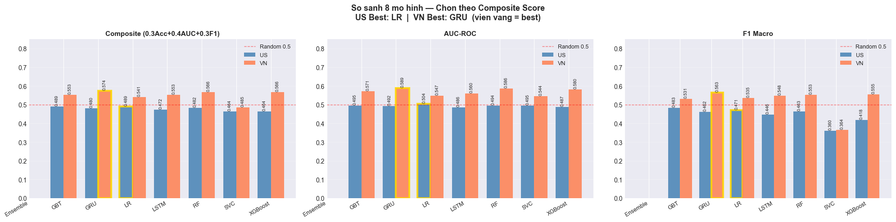
    


    ok Chon mo hinh tot nhat xong (Composite Score)!
    

## PHẦN 10: WALK-FORWARD VALIDATION — KIỂM ĐỊNH ĐỘ ỔN ĐỊNH QUA TỪNG NĂM

Sau khi chọn mô hình tốt nhất cho mỗi thị trường, kiểm tra **độ ổn định** qua từng năm:

| | Mô tả |
|---|---|
| **Mô hình** | Sử dụng mô hình tốt nhất riêng cho **US** và **VN** |
| **Số fold** | 6 fold: 2019, 2020, 2021, 2022, 2023, 2024 |
| **Mục đích** | Phát hiện mô hình chỉ tốt ở một giai đoạn hay ổn định qua nhiều năm |

### Chiến lược theo loại mô hình:

| Loại | Phương pháp | Lý do |
|------|-------------|-------|
| **LR / RF / GBT / SVC / XGBoost** | Expanding window — retrain mỗi fold | Nhanh, đúng nguyên tắc walk-forward |
| **LSTM / GRU** | **Retrain thực sự mỗi fold** (`walk_forward_dl`) | Train lại GRU/LSTM từ đầu cho từng fold bằng đúng kiến trúc gốc (2-layer + BatchNorm + Dropout 0.5). Chậm hơn (~30 phút/fold) nhưng phản ánh trung thực năng lực mô hình được chọn |
| **Ensemble** | XGBoost proxy | Quá phức tạp để retrain |

> **Lưu ý với thị trường VN**: Vì mô hình tốt nhất của VN là **GRU** (deep learning), walk-forward được thực hiện bằng cách **retrain lại GRU cho từng fold** (hàm `walk_forward_dl`):
> - Mỗi fold: scaler fit **riêng** trên cửa sổ train (year ≤ train_end) → không rò rỉ dữ liệu tương lai.
> - Sequence 20 ngày dựng từ full-context (gồm cả phiên NEUTRAL) để không bị đứt đoạn.
> - Đánh đổi: chậm hơn XGBoost ~15–20× (~30 phút/fold) nhưng kết quả phản ánh **đúng mô hình được chọn**, vững khi bảo vệ.
>
> **Tham chiếu chéo:** US vẫn dùng GBT (tree-based) retrain mỗi fold; biểu đồ walk-forward (Hình 4.8) phản ánh GBT cho US và GRU cho VN.


```python
# ── WALK-FORWARD VALIDATION ─────────────────────────────────────────────────
from xgboost import XGBClassifier
from sklearn.preprocessing import StandardScaler as SS
from sklearn.metrics import accuracy_score, roc_auc_score
from sklearn.linear_model import LogisticRegression as SklearnLR
from sklearn.ensemble import RandomForestClassifier as SklearnRF, GradientBoostingClassifier as SklearnGBT
from sklearn.svm import LinearSVC
from sklearn.calibration import CalibratedClassifierCV
import pandas as pd
import numpy as np
import matplotlib.pyplot as plt

def get_wf_model(model_type):
    """Tra ve sklearn model tuong ung cho walk-forward validation."""
    if model_type == 'RF':
        return SklearnRF(n_estimators=200, max_depth=10, random_state=42, n_jobs=-1)
    elif model_type == 'GBT':
        return SklearnGBT(n_estimators=100, max_depth=4, learning_rate=0.1, random_state=42)
    elif model_type == 'LR':
        return SklearnLR(C=1.0, max_iter=1000, random_state=42)
    elif model_type == 'SVC':
        return CalibratedClassifierCV(LinearSVC(max_iter=2000, random_state=42))
    else:  # XGBoost hoac Ensemble proxy
        return XGBClassifier(n_estimators=200, max_depth=4, learning_rate=0.05,
                             subsample=0.8, colsample_bytree=0.8,
                             random_state=42, n_jobs=-1, verbosity=0)


def dl_year_eval(res_dl, df_spark, market_name, feature_cols, model_name,
                 test_years=(2022, 2023, 2024)):
    """Year-by-year evaluation cho LSTM/GRU su dung model da train san.
    Khong retrain — dung model goc de danh gia tung nam trong test set.
    Chi ap dung cho nam nam >= 2022 (test period, khong leak).
    """
    dl_met  = res_dl['metrics'].get(model_name)
    if dl_met is None or 'model' not in dl_met:
        print(f'  [{model_name}] Model chua co san (re-run DL pipeline). Tra ve [].')
        return []

    model   = dl_met['model']
    scaler  = res_dl['scaler']
    feat    = res_dl['features']
    seq_len = res_dl['seq_len']

    XGB_BASE = [c for c in feature_cols if c not in
                ('ticker_idx', 'macd_hist', 'log_volume', 'log_lag1_volume')]
    needed = list(set(['time', 'ticker', 'close', 'volume', 'lag1_volume',
                       'label', 'year'] + feat))
    avail  = [c for c in needed if c in df_spark.columns]
    df_pd  = df_spark.select(*avail).toPandas()
    df_pd['time'] = pd.to_datetime(df_pd['time'])
    df_pd = df_pd.sort_values(['ticker', 'time']).reset_index(drop=True)

    # Recompute MACD & log_volume
    ema12 = df_pd.groupby('ticker')['close'].transform(lambda s: s.ewm(span=12, adjust=False).mean())
    ema26 = df_pd.groupby('ticker')['close'].transform(lambda s: s.ewm(span=26, adjust=False).mean())
    macd_r = ema12 - ema26
    df_pd['_macd_r'] = macd_r
    macd_sig = df_pd.groupby('ticker')['_macd_r'].transform(lambda s: s.ewm(span=9, adjust=False).mean())
    df_pd.drop(columns=['_macd_r'], inplace=True)
    cs = df_pd['close'].where(df_pd['close'] != 0, np.nan)
    df_pd['macd_real']       = (macd_r / cs).fillna(0)
    df_pd['macd_hist_real']  = ((macd_r - macd_sig) / cs).fillna(0)
    df_pd['log_volume']      = np.log1p(df_pd['volume'].clip(lower=0))
    df_pd['log_lag1_volume'] = np.log1p(df_pd['lag1_volume'].clip(lower=0))

    # Fill missing features
    for f in feat:
        if f not in df_pd.columns:
            df_pd[f] = 0.0
    df_pd = df_pd.dropna(subset=feat + ['label']).reset_index(drop=True)

    sep = '=' * 65
    print(f'\n{sep}')
    print(f'YEAR-BY-YEAR EVALUATION — {market_name} | Model: {model_name} (model da train, khong retrain)')
    print(f'{sep}')
    print(f'  {"Year":>4s}  {"N_sequences":>12s}  {"Accuracy":>9s}  {"AUC":>7s}')
    print('-' * 65)

    fold_results = []
    for test_yr in test_years:
        X_seqs, y_list = [], []
        for ticker, grp in df_pd.sort_values('time').groupby('ticker'):
            grp = grp.reset_index(drop=True)
            tk_feat = np.nan_to_num(grp[feat].values.astype(np.float64), nan=0.0)
            try:
                tk_scaled = scaler.transform(tk_feat)
            except Exception:
                continue
            labels = grp['label'].values.astype(int)
            years  = grp['year'].values
            for i in range(seq_len, len(grp)):
                if years[i] == test_yr:
                    X_seqs.append(tk_scaled[i - seq_len:i])
                    y_list.append(labels[i])

        if len(X_seqs) < 10:
            continue

        X_arr  = np.array(X_seqs, dtype=np.float32)
        y_arr  = np.array(y_list, dtype=int)
        y_prob = model.predict(X_arr, verbose=0).flatten()
        y_pred = (y_prob > 0.5).astype(int)
        acc    = accuracy_score(y_arr, y_pred)
        try:
            auc = roc_auc_score(y_arr, y_prob)
        except Exception:
            auc = 0.5

        fold_results.append({'fold': str(test_yr), 'train_end': 2021,
                             'test_year': test_yr, 'accuracy': acc,
                             'auc': auc, 'n_test': len(y_arr)})
        print(f'  {test_yr:>4d}  {len(X_arr):>12,d}       {acc:.4f}   {auc:.4f}')

    if fold_results:
        accs = [r['accuracy'] for r in fold_results]
        aucs = [r['auc']      for r in fold_results]
        print('-' * 65)
        print(f'  {"MEAN":>4s}  {"":>12s}       {np.mean(accs):.4f}   {np.mean(aucs):.4f}')
        print(f'  {"STD":>4s}  {"":>12s}       {np.std(accs):.4f}   {np.std(aucs):.4f}')
    return fold_results


def walk_forward_validation(df_spark, market_name, feature_cols, folds=None,
                             model_type='XGBoost'):
    """Walk-forward validation: expanding window, retrain moi fold.
    Chi danh cho sklearn / XGBoost / Ensemble (proxy).
    LSTM/GRU su dung dl_year_eval() rieng.
    """
    if folds is None:
        folds = [
            (2018, 2019), (2019, 2020), (2020, 2021),
            (2021, 2022), (2022, 2023), (2023, 2024),
        ]

    XGB_BASE = [c for c in feature_cols if c not in
                ('ticker_idx', 'macd_hist', 'log_volume', 'log_lag1_volume')]
    needed = list(set(['time', 'ticker', 'close', 'volume', 'lag1_volume',
                       'label', 'year', 'next_close'] + XGB_BASE))
    avail  = [c for c in needed if c in df_spark.columns]
    df_pd  = df_spark.select(*avail).toPandas()
    df_pd['time'] = pd.to_datetime(df_pd['time'])
    df_pd = df_pd.sort_values(['ticker', 'time']).reset_index(drop=True)

    ema12 = df_pd.groupby('ticker')['close'].transform(lambda s: s.ewm(span=12, adjust=False).mean())
    ema26 = df_pd.groupby('ticker')['close'].transform(lambda s: s.ewm(span=26, adjust=False).mean())
    macd_r = ema12 - ema26
    df_pd['_macd_r'] = macd_r
    macd_sig = df_pd.groupby('ticker')['_macd_r'].transform(lambda s: s.ewm(span=9, adjust=False).mean())
    df_pd.drop(columns=['_macd_r'], inplace=True)
    cs = df_pd['close'].where(df_pd['close'] != 0, np.nan)
    df_pd['macd_real']      = (macd_r / cs).fillna(0)
    df_pd['macd_hist_real'] = ((macd_r - macd_sig) / cs).fillna(0)
    df_pd['log_volume']      = np.log1p(df_pd['volume'].clip(lower=0))
    df_pd['log_lag1_volume'] = np.log1p(df_pd['lag1_volume'].clip(lower=0))

    feat = [c for c in XGB_BASE if c in df_pd.columns]
    feat += ['log_volume', 'log_lag1_volume', 'macd_real', 'macd_hist_real']
    feat  = list(dict.fromkeys([c for c in feat if c in df_pd.columns]))
    df_pd = df_pd.dropna(subset=feat + ['label']).reset_index(drop=True)

    proxy_note = ' (XGBoost proxy)' if model_type == 'Ensemble' else ''
    sep = '=' * 65
    print(f'\n{sep}\nWALK-FORWARD VALIDATION — {market_name} | Model: {model_type}{proxy_note} ({len(feat)} features)\n{sep}')
    if model_type == 'Ensemble':
        print('  [WF Note] Ensemble: dung XGBoost lam proxy (retrain moi fold)')
    print(f'  {"Fold":>4s}  {"Train window":>22s}  {"Test year":>9s}  '
          f'{"Accuracy":>9s}  {"AUC":>7s}  {"N_test":>7s}')
    print('-' * 65)

    eff_type = 'XGBoost' if model_type == 'Ensemble' else model_type
    fold_results = []
    for train_end_yr, test_yr in folds:
        df_tr = df_pd[df_pd['year'] <= train_end_yr]
        df_ts = df_pd[df_pd['year'] == test_yr]
        if len(df_tr) < 100 or len(df_ts) < 10:
            continue
        sc   = SS()
        X_tr = sc.fit_transform(df_tr[feat].values.astype(np.float64))
        y_tr = df_tr['label'].values.astype(int)
        X_ts = sc.transform(df_ts[feat].values.astype(np.float64))
        y_ts = df_ts['label'].values.astype(int)
        mdl  = get_wf_model(eff_type)
        mdl.fit(X_tr, y_tr)
        y_prob = mdl.predict_proba(X_ts)[:, 1]
        y_pred = (y_prob > 0.5).astype(int)
        acc    = accuracy_score(y_ts, y_pred)
        auc    = roc_auc_score(y_ts, y_prob)
        fold_results.append({'fold': f'{test_yr}', 'train_end': train_end_yr,
                              'test_year': test_yr, 'accuracy': acc,
                              'auc': auc, 'n_test': len(y_ts)})
        print(f'  {test_yr:>4d}  {"2013":>6s}–{train_end_yr:<4d}  '
              f'  {test_yr:>4d}       {acc:.4f}   {auc:.4f}  {len(y_ts):>7d}')

    if fold_results:
        accs = [r['accuracy'] for r in fold_results]
        aucs = [r['auc']      for r in fold_results]
        print('-' * 65)
        print(f'  {"MEAN":>4s}  {"":>22s}  {"":>9s}  {np.mean(accs):.4f}   {np.mean(aucs):.4f}')
        print(f'  {"STD":>4s}  {"":>22s}  {"":>9s}  {np.std(accs):.4f}   {np.std(aucs):.4f}')
    return fold_results


def walk_forward_dl(df_spark, df_full_spark, market_name, feature_cols,
                    folds=None, seq_len=20, epochs=25, batch_size=128,
                    model_type='GRU'):
    """Walk-forward THUC SU cho LSTM/GRU: retrain model moi fold (expanding window).
    Khac voi XGBoost proxy truoc day -- day la danh gia dung kien truc deep learning goc.
      - Scaler fit RIENG tren train fold (year <= train_end) -> khong leak.
      - Sequence dung full-context (gom NEUTRAL label=2) de khong bi gap ngay.
      - Moi fold build + train lai GRU tu dau, predict tren dung test year.
    Tra ve fold_results cung dinh dang voi walk_forward_validation (de tai dung plot).
    """
    from sklearn.preprocessing import StandardScaler as SS
    from sklearn.metrics import accuracy_score, roc_auc_score

    if folds is None:
        folds = [(2018, 2019), (2019, 2020), (2020, 2021),
                 (2021, 2022), (2022, 2023), (2023, 2024)]

    DL_BASE = [c for c in feature_cols if c not in
               ('ticker_idx', 'macd_hist', 'log_volume', 'log_lag1_volume')]
    needed = list(set(['time', 'ticker', 'close', 'volume', 'lag1_volume',
                       'label', 'year', 'next_close'] + DL_BASE))

    def load_and_compute(df_sp):
        avail = [c for c in needed if c in df_sp.columns]
        df_p = df_sp.select(*avail).toPandas()
        df_p['time'] = pd.to_datetime(df_p['time'])
        df_p = df_p.sort_values(['ticker', 'time']).reset_index(drop=True)
        ema12 = df_p.groupby('ticker')['close'].transform(lambda s: s.ewm(span=12, adjust=False).mean())
        ema26 = df_p.groupby('ticker')['close'].transform(lambda s: s.ewm(span=26, adjust=False).mean())
        macd_r = ema12 - ema26
        df_p['_macd_r'] = macd_r
        macd_sig = df_p.groupby('ticker')['_macd_r'].transform(lambda s: s.ewm(span=9, adjust=False).mean())
        df_p.drop(columns=['_macd_r'], inplace=True)
        cs = df_p['close'].where(df_p['close'] != 0, np.nan)
        df_p['macd_real']       = (macd_r / cs).fillna(0)
        df_p['macd_hist_real']  = ((macd_r - macd_sig) / cs).fillna(0)
        df_p['log_volume']      = np.log1p(df_p['volume'].clip(lower=0))
        df_p['log_lag1_volume'] = np.log1p(df_p['lag1_volume'].clip(lower=0))
        return df_p

    df_lbl  = load_and_compute(df_spark)
    feat_dl = [c for c in DL_BASE if c in df_lbl.columns]
    feat_dl += ['log_volume', 'log_lag1_volume', 'macd_real', 'macd_hist_real']
    feat_dl  = list(dict.fromkeys([c for c in feat_dl if c in df_lbl.columns]))

    df_lbl = df_lbl.dropna(subset=feat_dl + ['label']).reset_index(drop=True)
    df_lbl = df_lbl[df_lbl['label'].isin([0, 1])].reset_index(drop=True)

    df_ctx = load_and_compute(df_full_spark).fillna(0) if df_full_spark is not None else df_lbl

    def build_sequences(df_labeled_part, df_context_part, scaler):
        X_seq, y_seq = [], []
        for tkr, grp_ctx in df_context_part.sort_values('time').groupby('ticker'):
            if len(grp_ctx) <= seq_len:
                continue
            feats = grp_ctx[feat_dl].fillna(0).values.astype(np.float32)
            Xg = scaler.transform(feats)
            tg = pd.to_datetime(grp_ctx['time'].values)
            grp_lbl = df_labeled_part[df_labeled_part['ticker'] == tkr]
            lbl_map = dict(zip(pd.to_datetime(grp_lbl['time'].values),
                               grp_lbl['label'].astype(int).values))
            for i in range(seq_len, len(Xg)):
                lbl = lbl_map.get(tg[i], -1)
                if lbl in (0, 1):
                    X_seq.append(Xg[i - seq_len + 1:i + 1])
                    y_seq.append(lbl)
        if not X_seq:
            return (np.empty((0, seq_len, len(feat_dl)), np.float32), np.array([], int))
        return (np.array(X_seq, np.float32), np.array(y_seq, int))

    def build_model():
        Layer = LSTM if model_type == 'LSTM' else GRU
        mdl = Sequential([
            Input(shape=(seq_len, len(feat_dl))),
            Layer(64, return_sequences=True, kernel_regularizer=l2(5e-4)),
            BatchNormalization(),
            Dropout(0.5),
            Layer(32, kernel_regularizer=l2(5e-4)),
            BatchNormalization(),
            Dropout(0.5),
            Dense(16, activation='relu'),
            Dense(1,  activation='sigmoid'),
        ])
        mdl.compile(optimizer=Adam(learning_rate=5e-4),
                    loss='binary_crossentropy', metrics=['accuracy'])
        return mdl

    sep = '=' * 65
    print(f'\n{sep}\nWALK-FORWARD VALIDATION -- {market_name} | Model: {model_type} '
          f'(retrain moi fold, {len(feat_dl)} features)\n{sep}')
    print(f'  {"Fold":>4s}  {"Train window":>22s}  {"Test year":>9s}  '
          f'{"Accuracy":>9s}  {"AUC":>7s}  {"N_test":>7s}')
    print('-' * 65)

    fold_results = []
    for train_end_yr, test_yr in folds:
        lbl_tr = df_lbl[df_lbl['year'] <= train_end_yr]
        lbl_ts = df_lbl[df_lbl['year'] == test_yr]
        ctx_tr = df_ctx[df_ctx['year'] <= train_end_yr]
        ctx_ts = df_ctx[df_ctx['year'] <= test_yr]
        if len(lbl_tr) < 100 or len(lbl_ts) < 10:
            continue

        scaler = SS()
        scaler.fit(lbl_tr[feat_dl].values.astype(np.float32))

        X_tr, y_tr = build_sequences(lbl_tr, ctx_tr, scaler)
        X_ts, y_ts = build_sequences(lbl_ts, ctx_ts, scaler)
        if len(X_tr) < 50 or len(X_ts) < 10:
            continue

        counts = np.bincount(y_tr, minlength=2)
        n0, n1 = int(counts[0]), int(counts[1])
        tot = n0 + n1
        cw = {0: tot / (2.0 * max(n0, 1)), 1: tot / (2.0 * max(n1, 1))}

        tf.keras.utils.set_random_seed(42)
        mdl = build_model()
        cbs = [
            EarlyStopping(patience=5, restore_best_weights=True, monitor='val_loss'),
            ReduceLROnPlateau(patience=3, factor=0.5, min_lr=1e-6, monitor='val_loss'),
        ]
        mdl.fit(X_tr, y_tr, validation_split=0.15, epochs=epochs,
                batch_size=batch_size, class_weight=cw, callbacks=cbs, verbose=0)
        y_prob = mdl.predict(X_ts, verbose=0).flatten()
        y_pred = (y_prob > 0.5).astype(int)
        acc = accuracy_score(y_ts, y_pred)
        try:
            auc = roc_auc_score(y_ts, y_prob)
        except Exception:
            auc = 0.5
        fold_results.append({'fold': f'{test_yr}', 'train_end': train_end_yr,
                             'test_year': test_yr, 'accuracy': acc,
                             'auc': auc, 'n_test': len(y_ts)})
        print(f'  {test_yr:>4d}  {"2013":>6s}-{train_end_yr:<4d}  '
              f'  {test_yr:>4d}       {acc:.4f}   {auc:.4f}  {len(y_ts):>7d}')
        tf.keras.backend.clear_session()

    if fold_results:
        accs = [r['accuracy'] for r in fold_results]
        aucs = [r['auc']      for r in fold_results]
        print('-' * 65)
        print(f'  {"MEAN":>4s}  {"":>22s}  {"":>9s}  {np.mean(accs):.4f}   {np.mean(aucs):.4f}')
        print(f'  {"STD":>4s}  {"":>22s}  {"":>9s}  {np.std(accs):.4f}   {np.std(aucs):.4f}')
    return fold_results


# ── Chay validation cho US va VN ─────────────────────────────────────────────
def _run_validation(best_name, res_dl, df_spark, market_name, feat_cols):
    """Chon phuong phap phu hop theo loai model.
    - DL (LSTM/GRU): walk-forward THUC SU -- retrain lai model moi fold
      bang dung kien truc deep learning goc (walk_forward_dl). Cham hon nhung
      trung thuc, dung de bao ve truoc hoi dong.
    - Cac model khac: retrain sklearn/XGBoost nhu binh thuong.
    """
    if best_name in ('LSTM', 'GRU'):
        # Retrain THUC SU moi fold bang dung kien truc GRU/LSTM goc (khong con proxy).
        df_full = df_us_all if market_name == 'US' else df_vn_all
        print(f"  [{market_name}] {best_name}: walk-forward THUC SU -- retrain moi fold (~30 phut/fold)")
        return walk_forward_dl(df_spark, df_full, market_name, feat_cols,
                               model_type=best_name)
    else:
        return walk_forward_validation(df_spark, market_name, feat_cols,
                                       model_type=best_name)

wf_us = _run_validation(best_us_name, res_us_dl, df_us, 'US', FEATURE_COLS_US)
wf_vn = _run_validation(best_vn_name, res_vn_dl, df_vn, 'VN', FEATURE_COLS_VN)

# ── Export ket qua walk-forward ra demo/artifacts/ de app Streamlit doc ──────
# App chi DOC file nay (khong retrain) -> hien thi dung ket qua GRU(VN) / GBT(US)
# cua notebook, dong bo voi bao cao. Neu chua chay cell nay, app fallback XGBoost.
import json as _json
from pathlib import Path as _Path
_art = _Path('demo/artifacts'); _art.mkdir(parents=True, exist_ok=True)
_wf_export = {
    'US': {'model': best_us_name, 'folds': wf_us},
    'VN': {'model': best_vn_name, 'folds': wf_vn},
}
with open(_art / 'walkforward.json', 'w', encoding='utf-8') as _f:
    _json.dump(_wf_export, _f, ensure_ascii=False, indent=2)
print(f"  Exported walk-forward (US={best_us_name}, VN={best_vn_name}) "
      f"-> demo/artifacts/walkforward.json")

# ── (Da chuyen) Export model GRU (VN) -> demo/train_gru.py ─────────────────
# Model GRU gio duoc train & xuat bang script demo rieng (khong train trong notebook):
#     python demo/train_gru.py --market VN
# -> sinh demo/artifacts/gru_VN.keras (+ scaler, meta), dinh dang khong doi nen
#    app (tab Du bao) va demo/train_multi_models.py (candidate GRU) van doc binh thuong.

```

    
    =================================================================
    WALK-FORWARD VALIDATION — US | Model: LR (55 features)
    =================================================================
      Fold            Train window  Test year   Accuracy      AUC   N_test
    -----------------------------------------------------------------
      2019    2013–2018    2019       0.5433   0.5062     2781
      2020    2013–2019    2020       0.5248   0.5658     4154
      2021    2013–2020    2021       0.5472   0.5265     3368
      2022    2013–2021    2022       0.4901   0.5048     4199
      2023    2013–2022    2023       0.4922   0.5066     3218
      2024    2013–2023    2024       0.5264   0.5318     3072
    -----------------------------------------------------------------
      MEAN                                     0.5207   0.5236
       STD                                     0.0224   0.0216
      [VN] GRU: walk-forward THUC SU -- retrain moi fold (~30 phut/fold)
    
    =================================================================
    WALK-FORWARD VALIDATION -- VN | Model: GRU (retrain moi fold, 50 features)
    =================================================================
      Fold            Train window  Test year   Accuracy      AUC   N_test
    -----------------------------------------------------------------
      2019    2013-2018    2019       0.5704   0.6042     1101
      2020    2013-2019    2020       0.5672   0.6011     2172
      2021    2013-2020    2021       0.5337   0.5569     2213
      2022    2013-2021    2022       0.5559   0.5908     2729
      2023    2013-2022    2023       0.5654   0.5979     1636
      2024    2013-2023    2024       0.5368   0.5480     1129
    -----------------------------------------------------------------
      MEAN                                     0.5549   0.5831
       STD                                     0.0146   0.0222
      Exported walk-forward (US=LR, VN=GRU) -> demo/artifacts/walkforward.json
    


```python
# ── Ve bieu do kiem dinh do on dinh qua tung nam ────────────────────────
import matplotlib.pyplot as plt
import numpy as np

fig, axes = plt.subplots(1, 2, figsize=(16, 5))

def _wf_label(name):
    return f'{name} (walk-forward, retrain moi fold)'

fig.suptitle(f'Kiem dinh do on dinh qua tung nam\n'
             f'US: {_wf_label(best_us_name)}  |  VN: {_wf_label(best_vn_name)}',
             fontsize=13, fontweight='bold')

wf_model_map = {'US': best_us_name, 'VN': best_vn_name}
for ax, wf_res, mkt, color in [
    (axes[0], wf_us, 'US', '#2563EB'),
    (axes[1], wf_vn, 'VN', '#16A34A'),
]:
    mdl_lbl = wf_model_map[mkt]
    method_lbl = 'Walk-Forward'
    if not wf_res:
        ax.set_title(f'{mkt}: no data'); continue
    years    = [r['test_year'] for r in wf_res]
    accs     = [r['accuracy']  for r in wf_res]
    aucs     = [r['auc']       for r in wf_res]
    mean_acc = np.mean(accs)

    ax.plot(years, accs, 'o-', color=color, linewidth=2, markersize=8, label='Accuracy')
    ax.plot(years, aucs, 's--', color=color, linewidth=1.5, markersize=6, alpha=0.7, label='AUC-ROC')
    ax.axhline(0.5, color='gray', linestyle=':', linewidth=1.5, label='Random (0.50)')
    ax.axhline(mean_acc, color=color, linestyle='--', linewidth=1, alpha=0.5,
               label=f'Mean acc={mean_acc:.3f}')
    ax.fill_between(years, 0.5, accs, alpha=0.1, color=color)
    for yr, ac in zip(years, accs):
        ax.annotate(f'{ac:.3f}', (yr, ac), textcoords='offset points',
                    xytext=(0, 10), ha='center', fontsize=9)

    ax.set_title(f'{mkt} Stocks — {method_lbl} ({mdl_lbl})', fontsize=11, fontweight='bold')
    ax.set_xlabel('Test Year'); ax.set_ylabel('Score')
    ax.set_ylim(0.42, 0.76); ax.legend(fontsize=9); ax.grid(True, alpha=0.3)

plt.tight_layout()
plt.show()
print('\nNhan xet: Accuracy khac nhau theo tung nam phan anh dung thuc te thi truong.')
```


    
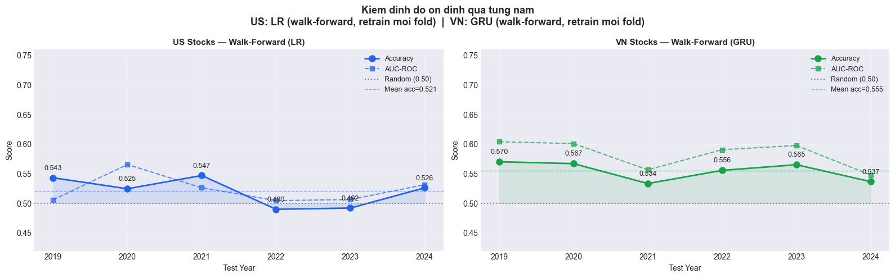
    


    
    Nhan xet: Accuracy khac nhau theo tung nam phan anh dung thuc te thi truong.
    


```python
# ── BACKTEST EQUITY CURVE — sua loi SELECTION BIAS ─────────────────────────
# Loi cu: equity chi tinh tren cac phien |return| > nguong (tap da loc de lam label).
# Vi tap nay duoc CHON bang chinh return tuong lai nen "B&H" bi thoi phong phi thuc te
# (hang nghin %). Sua: dung df_*_all (GIU CA phien NEUTRAL) de tinh B&H that tren TOAN
# BO phien giao dich; Strategy chi long khi mo hinh du bao TANG (pred==1), con lai
# dung ngoai (giu tien mat -> return 0).
import pandas as pd
import numpy as np

def _winner_pred_map(res, res_xgb, res_dl, best_name):
    """Tra ve dict {(ticker, ngay): pred 0/1} cua mo hinh thang.
    Tin hieu chi co o cac phien da duoc gan label (|return| > nguong)."""
    m = {}
    def _add(tickers, times, preds):
        for tk, tm, p in zip(list(tickers), pd.to_datetime(list(times)), list(preds)):
            m[(tk, pd.Timestamp(tm).normalize())] = int(p)
    if best_name == 'XGBoost':
        df = res_xgb['df_ts']
        _add(df['ticker'].values, df['time'].values, res_xgb['y_pred'])
    elif best_name in ('LSTM', 'GRU'):
        dl = res_dl['metrics'].get(best_name, {})
        if {'tk_ts', 'tm_ts', 'y_pred'} <= set(dl):
            _add(dl['tk_ts'], dl['tm_ts'], dl['y_pred'])
        else:   # fallback: dung du bao XGBoost
            df = res_xgb['df_ts']
            _add(df['ticker'].values, df['time'].values, res_xgb['y_pred'])
    else:       # Spark model (LR/RF/GBT/SVC)
        pdf = res['predictions'][best_name].select('ticker', 'time', 'prediction').toPandas()
        _add(pdf['ticker'].values, pdf['time'].values, pdf['prediction'].values)
    return m

def _true_equity(df_all_spark, pred_map, start_year=2022):
    """Equity curve THUC TE tren TOAN BO phien giao dich (khong chi cac phien da loc).
    B&H  : giu tat ca phien.  Strategy: long khi pred==1, con lai flat (return 0)."""
    pdf = df_all_spark.select('ticker', 'time', 'close', 'next_close').toPandas()
    pdf['time'] = pd.to_datetime(pdf['time'])
    pdf = pdf[pdf['time'].dt.year >= start_year].dropna(subset=['next_close']).copy()
    pdf['act'] = (pdf['next_close'] - pdf['close']) / pdf['close']
    keys = list(zip(pdf['ticker'].values, pdf['time'].dt.normalize()))
    pdf['pred']  = [pred_map.get(k, 0) for k in keys]
    pdf['strat'] = np.where(pdf['pred'] == 1, pdf['act'], 0.0)
    d = (pdf.groupby('time')[['act', 'strat']].mean()
            .reset_index().sort_values('time').reset_index(drop=True))
    d['eq_bnh']   = (1 + d['act']).cumprod()   * 100
    d['eq_strat'] = (1 + d['strat']).cumprod() * 100
    return d

map_us = _winner_pred_map(res_us, res_us_xgb, res_us_dl, best_us_name)
map_vn = _winner_pred_map(res_vn, res_vn_xgb, res_vn_dl, best_vn_name)
d_us = _true_equity(df_us_all, map_us)
d_vn = _true_equity(df_vn_all, map_vn)

bt_us = pd.DataFrame({'Strategy%': [d_us['eq_strat'].iloc[-1]], 'B&H%': [d_us['eq_bnh'].iloc[-1]]})
bt_vn = pd.DataFrame({'Strategy%': [d_vn['eq_strat'].iloc[-1]], 'B&H%': [d_vn['eq_bnh'].iloc[-1]]})

print(f'Backtest US — Strategy: {d_us["eq_strat"].iloc[-1]:.1f}%  |  B&H: {d_us["eq_bnh"].iloc[-1]:.1f}%')
print(f'Backtest VN — Strategy: {d_vn["eq_strat"].iloc[-1]:.1f}%  |  B&H: {d_vn["eq_bnh"].iloc[-1]:.1f}%')
print('(B&H = giu tat ca phien tren toan danh muc; Strategy = chi long khi mo hinh du bao TANG)')

```

    Backtest US — Strategy: 122.8%  |  B&H: 185.6%
    Backtest VN — Strategy: 231.4%  |  B&H: 120.4%
    (B&H = giu tat ca phien tren toan danh muc; Strategy = chi long khi mo hinh du bao TANG)
    


```python
print('\n' + '=' * 70)
print('BAO CAO TONG HOP — US vs VN STOCK ANALYSIS')
print('=' * 70)

# NOTE: Backtest tinh theo equity curve portfolio-level:
#   1. Tinh daily return thuc te (act) va daily return chien luoc (strat)
#   2. Groupby ngay -> mean() de tong hop nhieu tickers thanh 1 danh muc
#   3. Cumprod() de ra tang truong luy ke
#   -> Tranh loi .sum() tren bt DataFrame (cong don cac tickers = vo nghia)
# Backtest da tinh o cell 'BACKTEST EQUITY CURVE' (d_us / d_vn) — TRUE B&H tren
# TOAN BO phien giao dich, khong con selection bias. Lay truc tiep ket qua cuoi cung.
strat_us, bnh_us = float(d_us['eq_strat'].iloc[-1]), float(d_us['eq_bnh'].iloc[-1])
strat_vn, bnh_vn = float(d_vn['eq_strat'].iloc[-1]), float(d_vn['eq_bnh'].iloc[-1])

groups = [
    (res_us, res_us_xgb, res_us_dl, strat_us, bnh_us, best_us_name, best_us_acc),
    (res_vn, res_vn_xgb, res_vn_dl, strat_vn, bnh_vn, best_vn_name, best_vn_acc),
]   
for res, res_xgb, res_dl, strat_pct, bnh_pct, winner, win_acc in groups:
    m       = res['market']
    best_k  = max(res['metrics'], key=lambda k: res['metrics'][k]['accuracy'])
    best_acc= res['metrics'][best_k]['accuracy']
    best_auc= res['metrics'][best_k]['auc']
    xgb_acc = res_xgb['accuracy']
    xgb_auc = res_xgb['auc']
    best_dl = max(res_dl['metrics'], key=lambda k: res_dl['metrics'][k]['accuracy'])
    dl_acc  = res_dl['metrics'][best_dl]['accuracy']
    dl_auc  = res_dl['metrics'][best_dl]['auc']

    print(f'\n  {m} STOCKS  ({res["n_train"]:,d} train | {res["n_test"]:,d} test)')
    print(f'  Best Spark   : {best_k:<10}  Acc={best_acc:.4f}  AUC={best_auc:.4f}')
    print(f'  XGBoost      :             Acc={xgb_acc:.4f}  AUC={xgb_auc:.4f}')
    print(f'  Best DL      : {best_dl:<10}  Acc={dl_acc:.4f}  AUC={dl_auc:.4f}')
    print(f'  -> Winner    : {winner:<10}  Acc={win_acc:.4f}')
    # FIX: dung equity curve mean-daily thay vi bt.sum() (sum tren nhieu tickers = vo nghia)
    edge = strat_pct - bnh_pct
    sign = '+' if edge > 0 else ''
    print(f'  Backtest     : Strategy {strat_pct:.1f}%  vs  B&H {bnh_pct:.1f}%  ({sign}{edge:.1f}% edge)')

print('\n' + '=' * 70)
print('HOAN THANH')
print('=' * 70)

```

    
    ======================================================================
    BAO CAO TONG HOP — US vs VN STOCK ANALYSIS
    ======================================================================
    
      US STOCKS  (26,488 train | 14,506 test)
      Best Spark   : SVC         Acc=0.5267  AUC=0.4954
      XGBoost      :             Acc=0.4806  AUC=0.4867
      Best DL      : GRU         Acc=0.4841  AUC=0.4915
      -> Winner    : LR          Acc=0.4890
      Backtest     : Strategy 122.8%  vs  B&H 185.6%  (-62.8% edge)
    
      VN STOCKS  (13,252 train | 7,765 test)
      Best Spark   : RF          Acc=0.5526  AUC=0.5856
      XGBoost      :             Acc=0.5570  AUC=0.5801
      Best DL      : GRU         Acc=0.5638  AUC=0.5893
      -> Winner    : GRU         Acc=0.5638
      Backtest     : Strategy 231.4%  vs  B&H 120.4%  (+110.9% edge)
    
    ======================================================================
    HOAN THANH
    ======================================================================
    

## PHẦN 11: ĐÁNH GIÁ CHI TIẾT MÔ HÌNH TỐT NHẤT

Sau khi chọn mô hình tốt nhất từng thị trường, đánh giá chi tiết bằng:
- **Confusion Matrix**: model nhầm loại nào (UP→DOWN hay DOWN→UP)
- **Precision / Recall / F1-score**: cân bằng giữa 2 lớp
- **ROC Curve**: trực quan khả năng phân biệt
- **Feature Importance**: features đóng góp nhiều nhất (XGBoost hoặc Spark RF)


```python
from sklearn.metrics import (confusion_matrix, classification_report,
                             precision_score, recall_score, f1_score,
                             roc_curve, auc as sk_auc)
import matplotlib.pyplot as plt
import numpy as np

def get_model_eval_data(res, res_xgb, res_dl, model_name):
    """Trả về y_true, y_pred, y_prob, fi_names, fi_scores, fi_label."""
    if model_name == 'XGBoost':
        y_true = np.asarray(res_xgb['y_ts']).astype(int)
        y_pred = np.asarray(res_xgb['y_pred']).astype(int)
        X_ts   = res_xgb['scaler'].transform(
                    res_xgb['df_ts'][res_xgb['features']].values.astype(np.float64))
        y_prob = res_xgb['model'].predict_proba(X_ts)[:, 1]
        fi        = res_xgb['feature_importance']
        fi_names  = fi.index.tolist()[::-1][-12:]
        fi_scores = fi.values.tolist()[::-1][-12:]
        fi_label  = 'Feature Importance (XGBoost)'
    elif model_name in ('LSTM', 'GRU'):
        dl_met = res_dl['metrics'][model_name]
        if 'y_ts' in dl_met:
            y_true = np.asarray(dl_met['y_ts']).astype(int)
            y_pred = np.asarray(dl_met['y_pred']).astype(int)
            y_prob = np.asarray(dl_met['y_prob'])
        else:
            # Pipeline cu chua luu y_ts -> fallback: dung XGBoost data de danh gia
            print(f'  [Fallback] {model_name} chua co y_ts (re-run DL pipeline de co du lieu chinh xac)')
            print(f'  [Fallback] Dung XGBoost predictions de ve bieu do danh gia thay the')
            y_true = np.asarray(res_xgb['y_ts']).astype(int)
            y_pred = np.asarray(res_xgb['y_pred']).astype(int)
            X_ts   = res_xgb['scaler'].transform(
                        res_xgb['df_ts'][res_xgb['features']].values.astype(np.float64))
            y_prob = res_xgb['model'].predict_proba(X_ts)[:, 1]
        fi        = res_xgb['feature_importance']
        fi_names  = fi.index.tolist()[::-1][-12:]
        fi_scores = fi.values.tolist()[::-1][-12:]
        fi_label  = f'Feature Importance (XGBoost proxy cho {model_name})'
    else:  # Spark model (LR, RF, GBT, SVC, Ensemble)
        pred_df = res['predictions'][model_name]
        # SVC va mot so model khong co cot probability -> kiem tra truoc
        avail_prob = [c for c in ['label', 'prediction', 'probability', 'rawPrediction']
                      if c in pred_df.columns]
        pred_pd = pred_df.select(*avail_prob).toPandas()
        y_true  = pred_pd['label'].astype(int).values
        y_pred  = pred_pd['prediction'].astype(int).values
        if 'probability' in pred_pd.columns:
            try:
                y_prob = pred_pd['probability'].apply(lambda v: float(v[1])).values
            except Exception:
                y_prob = y_pred.astype(float)
        elif 'rawPrediction' in pred_pd.columns:
            try:
                # PySpark LinearSVC: rawPrediction la 1-phan-tu [margin]
                # Cac model khac (RF/GBT): 2-phan-tu [score_0, score_1]
                rp_sample = pred_pd['rawPrediction'].iloc[0]
                rp_len = len(rp_sample) if hasattr(rp_sample, '__len__') else 1
                if rp_len >= 2:
                    y_prob = pred_pd['rawPrediction'].apply(lambda v: float(v[1])).values
                else:
                    # LinearSVC: margin > 0 -> class 1, su dung truc tiep lam score
                    y_prob = pred_pd['rawPrediction'].apply(lambda v: float(v[0])).values
            except Exception:
                y_prob = y_pred.astype(float)
        else:
            y_prob = y_pred.astype(float)
        fi_list   = res['feature_importance'][:12]
        fi_names  = [f[0] for f in fi_list][::-1]
        fi_scores = [float(f[1]) for f in fi_list][::-1]
        fi_label  = f'Feature Importance (RF — proxy cho {model_name})'
    return y_true, y_pred, y_prob, fi_names, fi_scores, fi_label


fig, axes = plt.subplots(2, 3, figsize=(20, 12))

for row, (res, res_xgb, res_dl, mkt, best_name) in enumerate([
    (res_us, res_us_xgb, res_us_dl, 'US', best_us_name),
    (res_vn, res_vn_xgb, res_vn_dl, 'VN', best_vn_name),
]):
    y_true, y_pred, y_prob, fi_names, fi_scores, fi_label = get_model_eval_data(
        res, res_xgb, res_dl, best_name)

    # ── (1) Confusion Matrix ──
    cm = confusion_matrix(y_true, y_pred)
    ax = axes[row, 0]
    ax.imshow(cm, cmap='Blues')
    for (ii, jj), v in np.ndenumerate(cm):
        ax.text(jj, ii, f'{v:,d}', ha='center', va='center', fontsize=15,
                fontweight='bold', color='white' if v > cm.max()/2 else 'black')
    ax.set_xticks([0, 1]); ax.set_yticks([0, 1])
    ax.set_xticklabels(['DOWN (0)', 'UP (1)']); ax.set_yticklabels(['DOWN (0)', 'UP (1)'])
    ax.set_xlabel('Predicted'); ax.set_ylabel('Actual')
    ax.set_title(f'{mkt} — Confusion Matrix ({best_name})', fontweight='bold', fontsize=12)

    # ── (2) ROC Curve ──
    fpr, tpr, _ = roc_curve(y_true, y_prob)
    roc_auc = sk_auc(fpr, tpr)
    ax = axes[row, 1]
    ax.plot(fpr, tpr, color='darkorange', lw=2.5, label=f'ROC (AUC = {roc_auc:.3f})')
    ax.plot([0, 1], [0, 1], 'k--', lw=1, label='Random (AUC = 0.5)')
    ax.fill_between(fpr, tpr, alpha=0.15, color='darkorange')
    ax.set_xlim([0, 1]); ax.set_ylim([0, 1.02])
    ax.set_xlabel('False Positive Rate'); ax.set_ylabel('True Positive Rate')
    ax.set_title(f'{mkt} — ROC Curve ({best_name})', fontweight='bold', fontsize=12)
    ax.legend(loc='lower right')
    ax.grid(True, alpha=0.3)

    # ── (3) Feature Importance ──
    ax = axes[row, 2]
    ax.barh(fi_names, fi_scores, color='steelblue', alpha=0.85)
    ax.set_title(f'{mkt} — {fi_label}', fontweight='bold', fontsize=11)
    ax.set_xlabel('Importance')
    ax.tick_params(axis='y', labelsize=9)

    # ── In classification report ──
    print('=' * 64)
    print(f'{mkt} — {best_name} Classification Report (test set)')
    print('=' * 64)
    print(classification_report(y_true, y_pred, target_names=['DOWN','UP'], digits=4))
    print(f'  Precision (UP): {precision_score(y_true, y_pred):.4f}')
    print(f'  Recall    (UP): {recall_score(y_true, y_pred):.4f}')
    print(f'  F1-score  (UP): {f1_score(y_true, y_pred):.4f}')
    print()

plt.suptitle(f'Danh gia chi tiet mo hinh tot nhat: Confusion Matrix | ROC | Feature Importance\n'
             f'US: {best_us_name}  |  VN: {best_vn_name}',
             fontsize=14, fontweight='bold', y=1.01)
plt.tight_layout()
plt.show()
print(f'ok Danh gia chi tiet xong! (US: {best_us_name} | VN: {best_vn_name})')

```

    ================================================================
    US — LR Classification Report (test set)
    ================================================================
                  precision    recall  f1-score   support
    
            DOWN     0.4750    0.7093    0.5690      6898
              UP     0.5233    0.2893    0.3726      7608
    
        accuracy                         0.4890     14506
       macro avg     0.4992    0.4993    0.4708     14506
    weighted avg     0.5004    0.4890    0.4660     14506
    
      Precision (UP): 0.5233
      Recall    (UP): 0.2893
      F1-score  (UP): 0.3726
    
    ================================================================
    VN — GRU Classification Report (test set)
    ================================================================
                  precision    recall  f1-score   support
    
            DOWN     0.5324    0.6335    0.5785      3558
              UP     0.6042    0.5014    0.5480      3971
    
        accuracy                         0.5638      7529
       macro avg     0.5683    0.5674    0.5633      7529
    weighted avg     0.5703    0.5638    0.5625      7529
    
      Precision (UP): 0.6042
      Recall    (UP): 0.5014
      F1-score  (UP): 0.5480
    
    


    
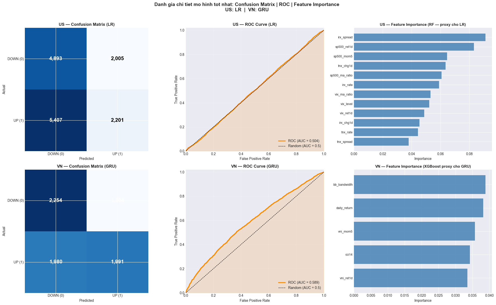
    


    ok Danh gia chi tiet xong! (US: LR | VN: GRU)
    


```python
# ═══════════════════════════════════════════════════════════════
# XUAT HINH ANH CHO BAO CAO — Luu vao thu muc figures/
# ═══════════════════════════════════════════════════════════════
import matplotlib.pyplot as plt
import matplotlib.patches as mpatches
import matplotlib.dates as mdates
import numpy as np
import pandas as pd
import os
from datetime import date
from sklearn.metrics import confusion_matrix, roc_curve, auc as sk_auc

os.makedirs('figures', exist_ok=True)
DPI = 200

def save_fig(fig, filename, label):
    fpath = f'figures/{filename}.png'
    fig.savefig(fpath, dpi=DPI, bbox_inches='tight', facecolor='white')
    plt.show()
    print(f'  Saved: {fpath}')

def _equity_preds_pd(res, res_xgb, res_dl, best_name):
    """Lay DataFrame co time/close/next_close/prediction cho mo hinh tot nhat."""
    cols = ['time', 'close', 'next_close', 'label', 'prediction']
    if best_name == 'XGBoost':
        df = res_xgb['df_ts'].copy()
        df['prediction'] = res_xgb['y_pred']
        avail = [c for c in cols if c in df.columns]
        return df[avail]
    elif best_name in ('LSTM', 'GRU'):
        dl_met = res_dl['metrics'].get(best_name, {})
        if 'df_ts_pd' in dl_met:
            df = dl_met['df_ts_pd'].copy()
            y_pred = dl_met.get('y_pred', None)
            if y_pred is None:
                y_pred = [0] * len(df)
            # LSTM/GRU mat seq_len-1 dong dau do cua so truot -> cat tail cho khop
            if len(y_pred) != len(df):
                df = df.iloc[-len(y_pred):].reset_index(drop=True)
            df['prediction'] = y_pred
            avail = [c for c in cols if c in df.columns]
            return df[avail]
        else:
            print(f'  [Note] {best_name} chua co df_ts_pd -> dung XGBoost data cho equity curve')
            df = res_xgb['df_ts'].copy()
            df['prediction'] = res_xgb['y_pred']
            avail = [c for c in cols if c in df.columns]
            return df[avail]
    else:  # Spark model (LR/RF/GBT/SVC/Ensemble)
        avail = [c for c in cols if c in res['predictions'][best_name].columns]
        return res['predictions'][best_name].select(*avail).toPandas()

# FIX: Xay dung compare_df tu all_us_scores/all_vn_scores (Cell chon mo hinh) cho Hinh 4.1
_rows = []
for _m, _info in all_us_scores.items():
    _rows.append({'Model': _m, 'Market': 'US', 'Accuracy': _info['accuracy'], 'AUC': _info['auc']})
for _m, _info in all_vn_scores.items():
    _rows.append({'Model': _m, 'Market': 'VN', 'Accuracy': _info['accuracy'], 'AUC': _info['auc']})
compare_df = pd.DataFrame(_rows)

# ── Hinh 4.1: So sanh Accuracy 8 mo hinh US vs VN ──────────────────────────
print('Ve Hinh 4.1...')
fig, ax = plt.subplots(figsize=(14, 6))
sub = compare_df.pivot_table(index='Model', columns='Market', values='Accuracy')
x = np.arange(len(sub)); w = 0.35
us_vals = sub.get('US', pd.Series([0]*len(sub), index=sub.index)).values
vn_vals = sub.get('VN', pd.Series([0]*len(sub), index=sub.index)).values
ax.bar(x - w/2, us_vals, w, label='US', color='steelblue', alpha=0.85)
ax.bar(x + w/2, vn_vals, w, label='VN', color='coral',     alpha=0.85)
for i, (u, v) in enumerate(zip(us_vals, vn_vals)):
    ax.text(i - w/2, u + 0.002, f'{u:.3f}', ha='center', va='bottom', fontsize=8.5, color='steelblue', fontweight='bold')
    ax.text(i + w/2, v + 0.002, f'{v:.3f}', ha='center', va='bottom', fontsize=8.5, color='coral',     fontweight='bold')
ax.axhline(0.5, color='red', linestyle='--', lw=1.5, alpha=0.7, label='Nguong random (50%)')
ax.set_xticks(x); ax.set_xticklabels(sub.index, rotation=30, ha='right', fontsize=11)
ax.set_title('Hinh 4.1: So sanh Accuracy 8 mo hinh — US vs VN', fontsize=14, fontweight='bold')
ax.set_ylabel('Accuracy', fontsize=12); ax.set_ylim(0.45, 0.72)
ax.legend(fontsize=11); ax.grid(True, alpha=0.3, axis='y')
plt.tight_layout(); save_fig(fig, 'Hinh_4_1', '4.1')

# ── Hinh 4.2: Confusion Matrix — Mo hinh tot nhat US va VN ─────────────────
print('Ve Hinh 4.2...')
fig, axes = plt.subplots(1, 2, figsize=(13, 5))
fig.suptitle(f'Hinh 4.2: Confusion Matrix — Mo hinh tot nhat\nUS: {best_us_name}  |  VN: {best_vn_name}',
             fontsize=13, fontweight='bold')
for ax, (res, rxgb, rdl, best_name, mkt) in zip(axes, [
    (res_us, res_us_xgb, res_us_dl, best_us_name, 'US'),
    (res_vn, res_vn_xgb, res_vn_dl, best_vn_name, 'VN'),
]):
    yt, yp, _, _, _, _ = get_model_eval_data(res, rxgb, rdl, best_name)
    cm = confusion_matrix(yt, yp)
    ax.imshow(cm, cmap='Blues')
    for (ii, jj), v in np.ndenumerate(cm):
        ax.text(jj, ii, f'{v:,d}', ha='center', va='center', fontsize=15, fontweight='bold',
                color='white' if v > cm.max() / 2 else 'black')
    ax.set_xticks([0, 1]); ax.set_yticks([0, 1])
    ax.set_xticklabels(['DOWN (0)', 'UP (1)'], fontsize=12)
    ax.set_yticklabels(['DOWN (0)', 'UP (1)'], fontsize=12)
    ax.set_xlabel('Du doan (Predicted)', fontsize=11); ax.set_ylabel('Thuc te (Actual)', fontsize=11)
    ax.set_title(f'{mkt} — {best_name}', fontsize=13, fontweight='bold')
plt.tight_layout(); save_fig(fig, 'Hinh_4_2', '4.2')

# ── Hinh 4.3: ROC Curve — Mo hinh tot nhat US va VN ───────────────────────
print('Ve Hinh 4.3...')
fig, axes = plt.subplots(1, 2, figsize=(13, 5))
fig.suptitle(f'Hinh 4.3: ROC Curve — Mo hinh tot nhat\nUS: {best_us_name}  |  VN: {best_vn_name}',
             fontsize=13, fontweight='bold')
for ax, (res, rxgb, rdl, best_name, mkt, clr) in zip(axes, [
    (res_us, res_us_xgb, res_us_dl, best_us_name, 'US', 'darkorange'),
    (res_vn, res_vn_xgb, res_vn_dl, best_vn_name, 'VN', '#16A34A'),
]):
    yt, _, yprb, _, _, _ = get_model_eval_data(res, rxgb, rdl, best_name)
    fpr, tpr, _ = roc_curve(yt, yprb)
    auc_val = sk_auc(fpr, tpr)
    ax.plot(fpr, tpr, color=clr, lw=2.5, label=f'ROC (AUC = {auc_val:.4f})')
    ax.plot([0, 1], [0, 1], 'k--', lw=1.5, label='Random (AUC = 0.50)')
    ax.fill_between(fpr, tpr, alpha=0.15, color=clr)
    ax.set_xlim([0, 1]); ax.set_ylim([0, 1.02])
    ax.set_xlabel('False Positive Rate', fontsize=12); ax.set_ylabel('True Positive Rate', fontsize=12)
    ax.set_title(f'{mkt} — ROC Curve ({best_name})', fontsize=13, fontweight='bold')
    ax.legend(loc='lower right', fontsize=11); ax.grid(True, alpha=0.3)
plt.tight_layout(); save_fig(fig, 'Hinh_4_3', '4.3')

# ── Hinh 4.4: Feature Importance RF — US Top 15 ─────────────────────────────
print('Ve Hinh 4.4...')
fi_us = res_us['feature_importance'][:15]
n_us  = [f[0] for f in fi_us][::-1]; s_us = [float(f[1]) for f in fi_us][::-1]
fig, ax = plt.subplots(figsize=(11, 7))
med = np.median(s_us)
cbars = ['#1D4ED8' if v >= med else '#93C5FD' for v in s_us]
bars = ax.barh(n_us, s_us, color=cbars, alpha=0.9)
for bar, val in zip(bars, s_us):
    ax.text(bar.get_width() + 0.0003, bar.get_y() + bar.get_height() / 2,
            f'{val:.4f}', va='center', fontsize=9)
ax.set_title('Hinh 4.4: Feature Importance — Random Forest US (Top 15)', fontsize=13, fontweight='bold')
ax.set_xlabel('Importance', fontsize=12); ax.tick_params(axis='y', labelsize=11)
ax.grid(True, alpha=0.3, axis='x')
plt.tight_layout(); save_fig(fig, 'Hinh_4_4', '4.4')

# ── Hinh 4.5: Feature Importance RF — VN Top 15 ─────────────────────────────
print('Ve Hinh 4.5...')
fi_vn = res_vn['feature_importance'][:15]
n_vn  = [f[0] for f in fi_vn][::-1]; s_vn = [float(f[1]) for f in fi_vn][::-1]
fig, ax = plt.subplots(figsize=(11, 7))
med = np.median(s_vn)
cbars = ['#15803D' if v >= med else '#86EFAC' for v in s_vn]
bars = ax.barh(n_vn, s_vn, color=cbars, alpha=0.9)
for bar, val in zip(bars, s_vn):
    ax.text(bar.get_width() + 0.0003, bar.get_y() + bar.get_height() / 2,
            f'{val:.4f}', va='center', fontsize=9)
ax.set_title('Hinh 4.5: Feature Importance — Random Forest VN (Top 15)', fontsize=13, fontweight='bold')
ax.set_xlabel('Importance', fontsize=12); ax.tick_params(axis='y', labelsize=11)
ax.grid(True, alpha=0.3, axis='x')
plt.tight_layout(); save_fig(fig, 'Hinh_4_5', '4.5')

# ── Hinh 4.6: Backtest Equity Curve — US (mo hinh tot nhat) ─────────────────
print('Ve Hinh 4.6...')
# Tai su dung d_us da tinh o cell 'BACKTEST EQUITY CURVE' (TRUE B&H toan bo phien).
if 'd_us' not in globals():
    d_us = _true_equity(df_us_all, _winner_pred_map(res_us, res_us_xgb, res_us_dl, best_us_name))
fig, ax = plt.subplots(figsize=(14, 6))
ax.plot(d_us['time'], d_us['eq_strat'], color='#2563EB', lw=2,   label='Chien luoc (Strategy)')
ax.plot(d_us['time'], d_us['eq_bnh'],   color='gray',   lw=1.5, ls='--', label='Mua & Giu (B&H)')
ax.fill_between(d_us['time'], d_us['eq_strat'], d_us['eq_bnh'],
                where=d_us['eq_strat'] >= d_us['eq_bnh'], alpha=0.15, color='#2563EB')
final_s = d_us['eq_strat'].iloc[-1]; final_b = d_us['eq_bnh'].iloc[-1]
ax.annotate(f'Strategy: {final_s:.0f}%', xy=(d_us['time'].iloc[-1], final_s),
            xytext=(-80, 10), textcoords='offset points', fontsize=10, color='#2563EB', fontweight='bold')
ax.annotate(f'B&H: {final_b:.0f}%', xy=(d_us['time'].iloc[-1], final_b),
            xytext=(-60, -18), textcoords='offset points', fontsize=10, color='gray')
ax.set_title(f'Hinh 4.6: Equity Curve — Chien luoc vs Mua & Giu (US, 2022–nay)\nMo hinh: {best_us_name}',
             fontsize=13, fontweight='bold')
ax.set_xlabel('Thoi gian', fontsize=12); ax.set_ylabel('Tang truong (%)', fontsize=12)
ax.legend(fontsize=11); ax.grid(True, alpha=0.3)
plt.tight_layout(); save_fig(fig, 'Hinh_4_6', '4.6')

# ── Hinh 4.7: Backtest Equity Curve — VN (mo hinh tot nhat) ─────────────────
print('Ve Hinh 4.7...')
# Tai su dung d_vn da tinh o cell 'BACKTEST EQUITY CURVE' (TRUE B&H toan bo phien).
if 'd_vn' not in globals():
    d_vn = _true_equity(df_vn_all, _winner_pred_map(res_vn, res_vn_xgb, res_vn_dl, best_vn_name))
fig, ax = plt.subplots(figsize=(14, 6))
ax.plot(d_vn['time'], d_vn['eq_strat'], color='#16A34A', lw=2,   label='Chien luoc (Strategy)')
ax.plot(d_vn['time'], d_vn['eq_bnh'],   color='gray',   lw=1.5, ls='--', label='Mua & Giu (B&H)')
ax.fill_between(d_vn['time'], d_vn['eq_strat'], d_vn['eq_bnh'],
                where=d_vn['eq_strat'] >= d_vn['eq_bnh'], alpha=0.15, color='#16A34A')
final_s = d_vn['eq_strat'].iloc[-1]; final_b = d_vn['eq_bnh'].iloc[-1]
ax.annotate(f'Strategy: {final_s:.0f}%', xy=(d_vn['time'].iloc[-1], final_s),
            xytext=(-80, 10), textcoords='offset points', fontsize=10, color='#16A34A', fontweight='bold')
ax.annotate(f'B&H: {final_b:.0f}%', xy=(d_vn['time'].iloc[-1], final_b),
            xytext=(-60, -18), textcoords='offset points', fontsize=10, color='gray')
ax.set_title(f'Hinh 4.7: Equity Curve — Chien luoc vs Mua & Giu (VN, 2022–nay)\nMo hinh: {best_vn_name}',
             fontsize=13, fontweight='bold')
ax.set_xlabel('Thoi gian', fontsize=12); ax.set_ylabel('Tang truong (%)', fontsize=12)
ax.legend(fontsize=11); ax.grid(True, alpha=0.3)
plt.tight_layout(); save_fig(fig, 'Hinh_4_7', '4.7')


# ── Hinh 4.8: Walk-Forward Accuracy theo tung nam ───────────────────────────
print('Ve Hinh 4.8...')
fig, axes = plt.subplots(1, 2, figsize=(14, 6))
fig.suptitle(f'Hinh 4.8: Walk-Forward Validation — Accuracy theo tung nam test\nUS: {best_us_name}  |  VN: {best_vn_name}',
             fontsize=13, fontweight='bold')
for ax, (wfr, mkt, clr, best_name) in zip(axes, [
    (wf_us, 'US', '#2563EB', best_us_name),
    (wf_vn, 'VN', '#16A34A', best_vn_name),
]):
    if not wfr: ax.set_title(f'{mkt}: no data'); continue
    yrs  = [r['test_year'] for r in wfr]
    accs = [r['accuracy']  for r in wfr]
    aucs = [r['auc']       for r in wfr]
    mean_acc = np.mean(accs)
    ax.plot(yrs, accs, 'o-',  color=clr, lw=2.5, ms=9,  label='Accuracy')
    ax.plot(yrs, aucs, 's--', color=clr, lw=1.5, ms=7, alpha=0.7, label='AUC-ROC')
    ax.axhline(0.5,      color='gray', ls=':', lw=1.5, label='Random (0.50)')
    ax.axhline(mean_acc, color=clr, ls='--', lw=1, alpha=0.5, label=f'Trung binh={mean_acc:.3f}')
    ax.fill_between(yrs, 0.5, accs, alpha=0.1, color=clr)
    for yr, ac in zip(yrs, accs):
        ax.annotate(f'{ac:.3f}', (yr, ac), textcoords='offset points', xytext=(0, 10),
                    ha='center', fontsize=10, fontweight='bold')
    ax.set_title(f'{mkt} — Walk-Forward ({best_name})', fontsize=12, fontweight='bold')
    ax.set_xlabel('Nam kiem tra', fontsize=12); ax.set_ylabel('Score', fontsize=12)
    ax.set_ylim(0.42, 0.74); ax.legend(fontsize=10); ax.grid(True, alpha=0.3)
plt.tight_layout(); save_fig(fig, 'Hinh_4_8', '4.8')

# ═══════════════════════════════════════════════════════════════
# DU LIEU DEMO THUC TE — gop tu PHAN 12 cu (fetch yfinance + features + du bao)
# Sinh `demo_results` de ve Hinh 5.1 & 5.2. Loi fetch se duoc bo qua an toan
# (Hinh 5.1/5.2 ben duoi co try/except rieng).
# ═══════════════════════════════════════════════════════════════
DEMO_START = date.today().replace(day=1).strftime('%Y-%m-%d')
demo_results = {}
try:
    # ── Lay du lieu thuc te (buffer tu Oct-2025 de tinh features day du) ────────
    import yfinance as yf
    import pandas   as pd
    import warnings
    warnings.filterwarnings('ignore')

    from datetime import date, timedelta

    today       = date.today()
    FETCH_END   = (today + timedelta(days=1)).strftime('%Y-%m-%d')  # +1 vi yfinance end la exclusive
    FETCH_START = (today - timedelta(days=180)).strftime('%Y-%m-%d')  # 6 thang buffer
    DEMO_START  = today.replace(day=1).strftime('%Y-%m-%d')           # dau thang hien tai

    print(f"Fetch: {FETCH_START} -> {FETCH_END}")
    print(f"Demo hien thi tu: {DEMO_START}")

    def fetch_yf(yf_sym, ticker_label):
        raw = yf.download(yf_sym, start=FETCH_START, end=FETCH_END,
                          auto_adjust=True, progress=False)
        # yfinance 1.x: DatetimeIndex.name=None → reset_index() makes 'index' col, not 'date'
        # Save dates from index first, then drop index to avoid column-naming issues
        _dates = pd.to_datetime(raw.index)
        raw = raw.reset_index(drop=True)
        raw.columns = [c[0].lower() if isinstance(c, tuple) else c.lower()
                       for c in raw.columns]
        raw.insert(0, 'time', _dates.values)
        raw['ticker'] = ticker_label
        raw['time']   = pd.to_datetime(raw['time'])
        raw = raw[['time','ticker','open','high','low','close','volume']].dropna()
        return raw

    print("Fetching AAPL ...")
    raw_aapl = fetch_yf('AAPL', 'AAPL')
    print(f"  AAPL: {len(raw_aapl)} rows  ({raw_aapl['time'].min().date()} - {raw_aapl['time'].max().date()})")

    print("Fetching VCB ...")
    raw_vcb = fetch_yf('VCB.VN', 'VCB')
    print(f"  VCB : {len(raw_vcb)} rows  ({raw_vcb['time'].min().date()} - {raw_vcb['time'].max().date()})")

    print("Fetching FPT ...")
    raw_fpt = fetch_yf('FPT.VN', 'FPT')
    print(f"  FPT : {len(raw_fpt)} rows  ({raw_fpt['time'].min().date()} - {raw_fpt['time'].max().date()})")

    demo_data = {'AAPL': raw_aapl, 'VCB': raw_vcb, 'FPT': raw_fpt}

    # Fetch VNINDEX cho viec tinh VNI features trong demo
    print("Fetching VNINDEX (KBS)...")
    try:
        from vnstock import Vnstock as _Vs
        import warnings; warnings.filterwarnings('ignore')
        _stk = _Vs().stock(symbol='VNINDEX', source='KBS')
        _h   = _stk.quote.history(start=FETCH_START, end=FETCH_END, interval='1D')
        _h   = _h.reset_index(drop=True)
        _h.columns = [c.lower() for c in _h.columns]
        _h['time'] = pd.to_datetime(_h['time']).dt.normalize()
        _h['vni_close'] = _h['close'].astype(float)
        _h = _h.sort_values('time').reset_index(drop=True)
        _h['vni_ret1d']   = _h['vni_close'].pct_change()
        _h['vni_ma5']     = _h['vni_close'].rolling(5).mean()
        _h['vni_ma20']    = _h['vni_close'].rolling(20).mean()
        _h['vni_mom5']    = _h['vni_close'] / _h['vni_close'].shift(5) - 1
        _h['vni_ma_ratio']= _h['vni_ma5'] / _h['vni_ma20'] - 1
        vni_demo = _h[['time','vni_ret1d','vni_mom5','vni_ma_ratio']].fillna(0)
        print(f"  VNINDEX: {len(vni_demo)} rows")
    except Exception as e:
        print(f"  VNINDEX FAILED: {e} -- dung 0")
        import numpy as np
        dates = pd.date_range(FETCH_START, FETCH_END, freq='B')
        vni_demo = pd.DataFrame({'time': dates, 'vni_ret1d': 0.0, 'vni_mom5': 0.0, 'vni_ma_ratio': 0.0})

    # Fetch S&P 500 cho viec tinh sp500_* features (US demo)
    print("Fetching S&P 500 (^GSPC)...")
    try:
        _sp = yf.download('^GSPC', start=FETCH_START, end=FETCH_END,
                          auto_adjust=True, progress=False)
        _sp_dates = pd.to_datetime(_sp.index)
        _sp = _sp.reset_index(drop=True)
        _sp.columns = [c[0].lower() if isinstance(c, tuple) else c.lower() for c in _sp.columns]
        _sp.insert(0, 'time', _sp_dates.values)
        _sp['time'] = pd.to_datetime(_sp['time']).dt.normalize()
        _sp['sp_close'] = _sp['close'].astype(float)
        _sp = _sp.sort_values('time').reset_index(drop=True)
        _sp['sp500_ret1d']    = _sp['sp_close'].pct_change()
        _sp['sp_ma5']         = _sp['sp_close'].rolling(5).mean()
        _sp['sp_ma20']        = _sp['sp_close'].rolling(20).mean()
        _sp['sp500_mom5']     = _sp['sp_close'] / _sp['sp_close'].shift(5) - 1
        _sp['sp500_ma_ratio'] = _sp['sp_ma5'] / _sp['sp_ma20'] - 1
        sp500_demo = _sp[['time','sp500_ret1d','sp500_mom5','sp500_ma_ratio']].fillna(0)
        print(f"  S&P500: {len(sp500_demo)} rows")
    except Exception as e:
        print(f"  S&P500 FAILED: {e} -- dung 0")
        import numpy as np
        dates = pd.date_range(FETCH_START, FETCH_END, freq='B')
        sp500_demo = pd.DataFrame({'time': dates, 'sp500_ret1d': 0.0, 'sp500_mom5': 0.0, 'sp500_ma_ratio': 0.0})


    # Fetch VIX cho US demo
    print("Fetching VIX (^VIX)...")
    try:
        _vix = yf.download('^VIX', start=FETCH_START, end=FETCH_END,
                           auto_adjust=True, progress=False)
        _vix_dates = pd.to_datetime(_vix.index)
        _vix = _vix.reset_index(drop=True)
        _vix.columns = [c[0].lower() if isinstance(c, tuple) else c.lower() for c in _vix.columns]
        _vix.insert(0, 'time', _vix_dates.values)
        _vix['time'] = pd.to_datetime(_vix['time']).dt.normalize()
        _vix = _vix.sort_values('time').reset_index(drop=True)
        _vix_close = _vix['close'].astype(float)
        _vix['vix_level']    = _vix_close
        _vix['vix_ret1d']    = _vix_close.pct_change()
        _vix['_vix_ma5']     = _vix_close.rolling(5).mean()
        _vix['vix_ma_ratio'] = _vix_close / _vix['_vix_ma5'] - 1
        vix_demo = _vix[['time','vix_level','vix_ret1d','vix_ma_ratio']].fillna(0)
        print(f"  VIX: {len(vix_demo)} rows")
    except Exception as e:
        print(f"  VIX FAILED: {e} -- dung 0")
        _dates = pd.date_range(FETCH_START, FETCH_END, freq='B')
        vix_demo = pd.DataFrame({'time': _dates, 'vix_level': 20.0, 'vix_ret1d': 0.0, 'vix_ma_ratio': 0.0})

    # Fetch TNX (10Y Treasury) + IRX (3M T-bill) cho US demo
    tnx_demo = None
    irx_demo = None
    for _sym, _col, _label in [('^TNX','tnx','10Y Treasury'), ('^IRX','irx','3M T-bill')]:
        print(f"Fetching {_label} ({_sym})...")
        try:
            _r = yf.download(_sym, start=FETCH_START, end=FETCH_END,
                             auto_adjust=True, progress=False)
            _r_dates = pd.to_datetime(_r.index)
            _r = _r.reset_index(drop=True)
            _r.columns = [c[0].lower() if isinstance(c, tuple) else c.lower() for c in _r.columns]
            _r.insert(0, 'time', _r_dates.values)
            _r['time'] = pd.to_datetime(_r['time']).dt.normalize()
            _r = _r.sort_values('time').reset_index(drop=True)
            _rc = _r['close'].astype(float)
            _r[f'{_col}_rate']   = _rc
            _r[f'{_col}_chg1d']  = _rc.diff()
            _r[f'_{_col}_ma5']   = _rc.rolling(5).mean()
            _r[f'{_col}_spread'] = _rc - _r[f'_{_col}_ma5']
            _out = _r[['time', f'{_col}_rate', f'{_col}_chg1d', f'{_col}_spread']].fillna(0)
            if _col == 'tnx': tnx_demo = _out
            else:             irx_demo = _out
            print(f"  {_col.upper()}: {len(_out)} rows")
        except Exception as _e:
            print(f"  {_label} FAILED: {_e} -- dung 0")
            _dates = pd.date_range(FETCH_START, FETCH_END, freq='B')
            _out = pd.DataFrame({'time': _dates, f'{_col}_rate': 4.0,
                                  f'{_col}_chg1d': 0.0, f'{_col}_spread': 0.0})
            if _col == 'tnx': tnx_demo = _out
            else:             irx_demo = _out

    print(f"\nTat ca fetch xong. Se du bao phan tu {DEMO_START} tro di.")

    # ── Tinh features cho du lieu demo ──────────────────────────────────────────
    import numpy as np

    def compute_features_pandas(df_raw):
        """Tinh day du features (khop voi FEATURE_COLS) tren Pandas DataFrame."""
        df = df_raw.sort_values('time').copy()
        close = df['close']
        vol   = df['volume']
        high  = df['high']
        low   = df['low']
        opn   = df['open']

        # Returns & lags
        df['daily_return']   = close.pct_change()
        df['lag1_return']    = df['daily_return'].shift(1)
        df['lag2_return']    = df['daily_return'].shift(2)
        df['lag3_return']    = df['daily_return'].shift(3)
        df['lag5_return']    = df['daily_return'].shift(5)
        df['lag10_return']   = df['daily_return'].shift(10)
        # lag_close removed from COMMON_FEATURES (not stationary - caused spurious patterns)
        # Kept as local vars implicitly via close.shift() used in ato_gap/overnight_gap

        # Moving averages & price ratios
        ma5  = close.rolling(5).mean()
        ma20 = close.rolling(20).mean()
        ma50 = close.rolling(50).mean()
        df['price_vs_ma5']  = close / ma5  - 1
        df['price_vs_ma20'] = close / ma20 - 1
        df['price_vs_ma50'] = close / ma50 - 1
        df['ma5_vs_ma20']  = ma5  / (ma20 + 1e-9) - 1
        df['ma20_vs_ma50'] = ma20 / (ma50 + 1e-9) - 1
        hl_range = (high - low) / (close + 1e-9)
        df['hl_ratio']     = hl_range.rolling(5).mean() / (hl_range.rolling(20).mean() + 1e-9)
        df['momentum_5']    = close / close.shift(5)  - 1
        df['momentum_10']   = close / close.shift(10) - 1

        # RSI
        def _rsi(s, n):
            d = s.diff()
            g = d.clip(lower=0).rolling(n).mean()
            l = (-d.clip(upper=0)).rolling(n).mean()
            return 100 - 100/(1 + g/(l+1e-9))
        df['rsi_7']  = _rsi(close, 7)
        df['rsi_14'] = _rsi(close, 14)

        # MACD histogram (EMA12-EMA26, signal EMA9)
        ema12 = close.ewm(span=12, adjust=False).mean()
        ema26 = close.ewm(span=26, adjust=False).mean()
        macd  = ema12 - ema26
        sig   = macd.ewm(span=9, adjust=False).mean()
        df['macd_hist'] = macd - sig

        # Stochastic %K
        lo14 = low.rolling(14).min()
        hi14 = high.rolling(14).max()
        df['stoch_k'] = 100*(close - lo14)/(hi14 - lo14 + 1e-9)

        # Williams %R
        df['williams_r'] = -100*(hi14 - close)/(hi14 - lo14 + 1e-9)

        # CCI
        tp = (high + low + close)/3
        df['cci14'] = (tp - tp.rolling(14).mean()) / (0.015 * tp.rolling(14).std() + 1e-9)

        # Volatility
        df['rolling_volatility_5']  = df['daily_return'].rolling(5).std()
        df['rolling_volatility_20'] = df['daily_return'].rolling(20).std()

        # Bollinger Bands
        bb_mid = close.rolling(20).mean()
        bb_std = close.rolling(20).std()
        bb_up  = bb_mid + 2*bb_std
        bb_lo  = bb_mid - 2*bb_std
        df['bb_bandwidth'] = (bb_up - bb_lo) / (bb_mid + 1e-9)
        df['bb_pct_b']     = (close - bb_lo) / (bb_up - bb_lo + 1e-9)

        # ATR & ADX
        tr = pd.concat([high-low,
                        (high-close.shift(1)).abs(),
                        (low -close.shift(1)).abs()], axis=1).max(axis=1)
        atr14 = tr.rolling(14).mean()
        df['atr_ratio'] = atr14 / (close + 1e-9)

        dm_up   = (high - high.shift(1)).clip(lower=0)
        dm_down = (low.shift(1) - low).clip(lower=0)
        di_up   = (dm_up.rolling(14).mean()   / (atr14+1e-9)) * 100
        di_down = (dm_down.rolling(14).mean() / (atr14+1e-9)) * 100
        dx      = ((di_up - di_down).abs() / (di_up + di_down + 1e-9)) * 100
        df['adx14'] = dx.rolling(14).mean()

        # Volume features
        df['log_volume']      = np.log1p(vol)
        df['log_lag1_volume'] = np.log1p(vol.shift(1))
        df['volume_change']   = vol.pct_change()
        df['volume_ma_ratio'] = vol / (vol.rolling(20).mean() + 1e-9)

        # Price structure
        df['high_low_range']    = (high - low) / (close + 1e-9)
        df['close_open_return'] = (close - opn) / (opn + 1e-9)

        # OBV signal
        obv = (np.sign(df['daily_return'])*vol).cumsum()
        df['obv_signal'] = obv / (obv.abs().rolling(20).mean() + 1e-9)

        # VN-specific features
        df['near_limit']      = (df['daily_return'].abs() >= 0.068).astype(float)
        df['limit_hit_rate']  = df['near_limit'].rolling(20).mean()
        df['no_change']       = (df['daily_return'] == 0).astype(float)
        df['zero_change_rate']= df['no_change'].rolling(10).mean()
        vol_std  = vol.rolling(10).std()
        vol_mean = vol.rolling(10).mean()
        df['vol_consistency'] = vol_std / (vol_mean + 1e-9)
        df['intraday_pos']    = (close - low) / (high - low + 1e-9)
        df['ato_gap']         = (opn - close.shift(1)) / (close.shift(1) + 1e-9)

        # Features bổ sung: khớp với cell 12 PySpark feature engineering
        # bb_position: vị trí close trong Bollinger Band (-1 đến +1)
        df['bb_position']   = (close - bb_mid) / (2 * bb_std + 1e-9)
        # overnight_gap: gap qua đêm open/prev_close (bằng ato_gap cho daily)
        df['overnight_gap'] = (opn - close.shift(1)) / (close.shift(1) + 1e-9)
        # up_days_5: tỷ lệ ngày tăng trong 5 phiên gần nhất (0–1)
        df['up_days_5']     = (df['daily_return'] > 0).astype(float).rolling(5).mean()

        df['ticker_idx'] = 0.0   # single ticker => index 0

        # ── Sector encoding (khop voi SECTOR_MAP trong Cell 12) ──────────────
        SECTOR_MAP_DEMO = {
            'ACB': 0,'BID': 0,'CTG': 0,'MBB': 0,'TCB': 0,'VCB': 0,'VPB': 0,
            'SSI': 1,
            'HPG': 2,'HSG': 2,'NKG': 2,
            'KDH': 3,'NLG': 3,'VHM': 3,'VIC': 3,
            'MSN': 4,'SAB': 4,'VNM': 4,'PNJ': 4,'GAS': 4,
            'FPT': 5,
            'AAPL': 6,'MSFT': 6,'GOOGL': 6,'META': 6,'NVDA': 6,'NFLX': 6,'AMD': 6,
            'TSLA': 7,'F': 7,'GM': 7,
            'JPM': 8,'BAC': 8,'WFC': 8,'GS': 8,
            'AMZN': 9,'DIS': 9,
            'XOM': 10,'CVX': 10,
        }
        ticker_sym = df['ticker'].iloc[0] if 'ticker' in df.columns else 'AAPL'
        df['sector_idx'] = float(SECTOR_MAP_DEMO.get(ticker_sym, 0))

        # ── VNI features: join vni_demo theo ngay ─────────────────────────────
        # Se duoc join o ngoai sau khi goi ham nay
        df['vni_ret1d']    = 0.0
        df['vni_mom5']     = 0.0
        df['vni_ma_ratio'] = 0.0
        # ── S&P500 features default 0, se join cho US o ngoai ────────────────
        df['sp500_ret1d']    = 0.0
        df['sp500_mom5']     = 0.0
        df['sp500_ma_ratio'] = 0.0

        return df

    US_DEMO_TICKERS = {'AAPL','MSFT','NVDA','AMZN','GOOGL','META','NFLX','AMD',
                        'TSLA','F','GM','JPM','BAC','WFC','GS','XOM','CVX','DIS'}

    demo_features_all = {}
    for sym, raw in demo_data.items():
        feat = compute_features_pandas(raw)
        # Join VNI features cho VN stocks
        if sym in ['VCB', 'FPT']:
            feat['time_date'] = pd.to_datetime(feat['time']).dt.normalize()
            feat = feat.merge(vni_demo.rename(columns={
                'vni_ret1d':'_v1','vni_mom5':'_v2','vni_ma_ratio':'_v3'}),
                left_on='time_date', right_on='time', how='left')
            feat['vni_ret1d']    = feat['_v1'].fillna(0)
            feat['vni_mom5']     = feat['_v2'].fillna(0)
            feat['vni_ma_ratio'] = feat['_v3'].fillna(0)
            feat = feat.drop(columns=['_v1','_v2','_v3','time_date','time_y'], errors='ignore')
            if 'time_x' in feat.columns:
                feat = feat.rename(columns={'time_x': 'time'})
        # Join S&P500 features cho US stocks
        elif sym in US_DEMO_TICKERS:
            feat['time_date'] = pd.to_datetime(feat['time']).dt.normalize()
            # S&P500 features
            feat = feat.merge(sp500_demo.rename(columns={
                'sp500_ret1d':'_s1','sp500_mom5':'_s2','sp500_ma_ratio':'_s3'}),
                left_on='time_date', right_on='time', how='left')
            feat['sp500_ret1d']    = feat['_s1'].fillna(0)
            feat['sp500_mom5']     = feat['_s2'].fillna(0)
            feat['sp500_ma_ratio'] = feat['_s3'].fillna(0)
            feat = feat.drop(columns=['_s1','_s2','_s3','time_y'], errors='ignore')
            if 'time_x' in feat.columns:
                feat = feat.rename(columns={'time_x': 'time'})
            # VIX features
            feat = feat.merge(vix_demo, left_on='time_date', right_on='time', how='left', suffixes=('','_vix'))
            feat['vix_level']    = feat['vix_level'].fillna(20.0)
            feat['vix_ret1d']    = feat['vix_ret1d'].fillna(0)
            feat['vix_ma_ratio'] = feat['vix_ma_ratio'].fillna(0)
            feat = feat.drop(columns=['time_vix','time_y'], errors='ignore')
            if 'time_x' in feat.columns:
                feat = feat.rename(columns={'time_x': 'time'})
            # TNX (10Y Treasury) features
            feat = feat.merge(tnx_demo, left_on='time_date', right_on='time', how='left', suffixes=('','_tnx'))
            feat['tnx_rate']   = feat['tnx_rate'].ffill().fillna(4.0)
            feat['tnx_chg1d']  = feat['tnx_chg1d'].fillna(0)
            feat['tnx_spread'] = feat['tnx_spread'].fillna(0)
            feat = feat.drop(columns=['time_tnx','time_y'], errors='ignore')
            if 'time_x' in feat.columns:
                feat = feat.rename(columns={'time_x': 'time'})
            # IRX (3M T-bill) features
            feat = feat.merge(irx_demo, left_on='time_date', right_on='time', how='left', suffixes=('','_irx'))
            feat['irx_rate']   = feat['irx_rate'].ffill().fillna(4.0)
            feat['irx_chg1d']  = feat['irx_chg1d'].fillna(0)
            feat['irx_spread'] = feat['irx_spread'].fillna(0)
            feat = feat.drop(columns=['time_irx','time_y','time_date'], errors='ignore')
            if 'time_x' in feat.columns:
                feat = feat.rename(columns={'time_x': 'time'})
        demo_features_all[sym] = feat

    print("Features computed:", {k: v.shape for k, v in demo_features_all.items()})
    print("Columns sample:", [c for c in demo_features_all['AAPL'].columns if c in
          ['sector_idx','vni_ret1d','vni_mom5','vni_ma_ratio']])

    # ── Lay model tot nhat (Spark / XGBoost / LSTM / GRU) va du bao ─────────────────────
    import numpy as np

    def best_model_predict(res, res_xgb, res_dl, feat_df, ticker_sym, model_name=None):
        """
        Du bao xu huong gia su dung mo hinh tot nhat.
        - model_name: ten mo hinh cu the (tu best_us_name / best_vn_name).
          Neu None, tu dong chon theo accuracy cao nhat (legacy fallback).
        - LSTM/GRU  : build sequence 20 ngay.
        - XGBoost   : flat feature vector.
        - Spark (LR/RF/GBT/SVC/Ensemble): fitted Spark object khong duoc luu sau pipeline
          -> dung XGBoost lam proxy inference, hien thi ro ten mo hinh that.
        """
        # Xac dinh ten mo hinh su dung
        if model_name is None:
            best_spark_acc    = max(res["metrics"][k]["accuracy"] for k in res["metrics"])
            xgb_acc           = res_xgb["accuracy"]
            best_dl_name_auto = max(res_dl["metrics"], key=lambda k: res_dl["metrics"][k]["accuracy"])
            dl_acc            = res_dl["metrics"][best_dl_name_auto]["accuracy"]
            scores            = {"XGBoost": xgb_acc, "Spark": best_spark_acc, "DL": dl_acc}
            winner_group      = max(scores, key=scores.get)
            if winner_group == "DL":
                model_name = best_dl_name_auto
            elif winner_group == "XGBoost":
                model_name = "XGBoost"
            else:
                model_name = max(res["metrics"], key=lambda k: res["metrics"][k]["accuracy"])

        # Tinh extra features (dung chung cho ca XGBoost va DL path)
        df       = feat_df.copy()
        ema12    = df["close"].ewm(span=12, adjust=False).mean()
        ema26    = df["close"].ewm(span=26, adjust=False).mean()
        macd_r   = ema12 - ema26
        macd_sig = macd_r.ewm(span=9, adjust=False).mean()
        cs       = df["close"].where(df["close"] != 0, other=float("nan"))
        df["macd_real"]       = (macd_r / cs).fillna(0)
        df["macd_hist_real"]  = ((macd_r - macd_sig) / cs).fillna(0)
        df["log_volume"]      = np.log1p(df["volume"].clip(lower=0))
        df["log_lag1_volume"] = np.log1p(df["volume"].shift(1).clip(lower=0))
        df = df.replace([np.inf, -np.inf], np.nan)

        # ── DL path: LSTM / GRU ──────────────────────────────────────────────────
        if model_name in ("LSTM", "GRU"):
            dl_met    = res_dl["metrics"].get(model_name)
            feat_list = res_dl["features"]
            scaler    = res_dl["scaler"]
            seq_len   = res_dl["seq_len"]

            if dl_met is None or "model" not in dl_met:
                print(f"  {ticker_sym}: {model_name} model khong co san -> fallback XGBoost")
                model_name = "XGBoost"
            else:
                dl_acc   = dl_met["accuracy"]
                model    = dl_met["model"]
                for f in feat_list:
                    if f not in df.columns:
                        df[f] = 0.0
                df_clean = df.dropna(subset=feat_list).reset_index(drop=True)

                if len(df_clean) <= seq_len:
                    print(f"  {ticker_sym}: khong du {seq_len} ngay cho {model_name} -> fallback XGBoost")
                    model_name = "XGBoost"
                else:
                    X_all = scaler.transform(df_clean[feat_list].values.astype(np.float64))
                    X_seq = np.array([X_all[i - seq_len:i] for i in range(seq_len, len(X_all))],
                                     dtype=np.float32)
                    y_prob = model.predict(X_seq, verbose=0).flatten()
                    y_pred = (y_prob > 0.5).astype(int)
                    df_out = df_clean.iloc[seq_len:].copy()
                    df_out["prediction"] = y_pred
                    print(f"  {ticker_sym}: {model_name} (acc={dl_acc:.3f}) | {len(df_out)} rows")
                    return df_out[["time", "close", "prediction"]]

        # ── XGBoost path ─────────────────────────────────────────────────────────
        feat_list = res_xgb["features"]
        scaler    = res_xgb["scaler"]
        model     = res_xgb["model"]
        xgb_acc   = res_xgb["accuracy"]

        if model_name == "XGBoost":
            model_label = f"XGBoost (acc={xgb_acc:.3f})"
        else:
            # Spark models: LR / RF / GBT / SVC / Ensemble
            # Fitted Spark object khong duoc luu -> dung XGBoost lam proxy cho inference
            spark_acc   = res["metrics"].get(model_name, {}).get("accuracy", 0.0)
            model_label = f"{model_name} (acc={spark_acc:.3f}) [proxy: XGBoost inference]"

        for f in feat_list:
            if f not in df.columns:
                df[f] = 0.0
        df_clean = df.dropna(subset=feat_list).copy()
        X        = scaler.transform(df_clean[feat_list].values.astype(np.float64))
        preds    = model.predict(X)
        df_clean["prediction"] = preds
        print(f"  {ticker_sym}: {model_label} | {len(df_clean)} rows | features={len(feat_list)}")
        return df_clean[["time", "close", "prediction"]]


    # Gan ticker vao nhom — su dung mo hinh tot nhat da chon o Phan 10
    demo_assign = {
        "AAPL": (res_us, res_us_xgb, res_us_dl),
        "VCB":  (res_vn, res_vn_xgb, res_vn_dl),
        "FPT":  (res_vn, res_vn_xgb, res_vn_dl),
    }

    demo_results = {}
    for sym, (res, res_xgb, res_dl) in demo_assign.items():
        mdl_name = best_us_name if sym == "AAPL" else best_vn_name
        print(f"Predicting {sym} (model={mdl_name})...")
        feat_df = demo_features_all[sym]
        demo_results[sym] = best_model_predict(res, res_xgb, res_dl, feat_df, sym, model_name=mdl_name)

    print("Du bao hoan tat!")
    print({sym: len(v) for sym, v in demo_results.items()})
except Exception as _demo_err:
    print(f'  [Demo] Bo qua fetch du lieu demo thuc te: {_demo_err}')
    demo_results = {}


# ── Hinh 5.1: Du bao AAPL (US) ──────────────────────────────────────────────
print('Ve Hinh 5.1...')
try:
    df_aa = demo_results['AAPL'].copy()
    df_aa['time'] = pd.to_datetime(df_aa['time'])
    df_aa = df_aa[df_aa['time'] >= pd.Timestamp(DEMO_START)].reset_index(drop=True)
    df_aa['nx'] = df_aa['close'].shift(-1)
    df_aa['ad'] = (df_aa['nx'] > df_aa['close']).astype('Int64')
    dk = df_aa.dropna(subset=['nx']).copy()
    ok = dk['prediction'] == dk['ad']
    fig, ax = plt.subplots(figsize=(14, 6))
    for i in range(len(dk) - 1):
        r = dk.iloc[i]; c = 'green' if r['prediction'] == 1 else 'red'; a = 0.9 if ok.iloc[i] else 0.3
        ax.plot([dk['time'].iloc[i], dk['time'].iloc[i+1]], [r['close'], dk['close'].iloc[i+1]], color=c, lw=2, alpha=a)
        if not ok.iloc[i]: ax.scatter(r['time'], r['close'], marker='D', s=50, color=c, zorder=5)
        ax.scatter(r['time'], r['close'], s=18, color=c, alpha=0.7, zorder=4)
        ax.annotate(f'{float(r["close"]):.2f}', xy=(r['time'], r['close']),
                    xytext=(0, 7), textcoords='offset points',
                    fontsize=6.5, ha='center', va='bottom', color='#444', rotation=45)
    last = df_aa.iloc[-1]; pd_dir = int(last['prediction'])
    pd_lbl = 'TANG (UP)' if pd_dir == 1 else 'GIAM (DOWN)'; pd_c = 'green' if pd_dir == 1 else 'red'
    ax.scatter(last['time'], last['close'], marker='*', s=400, color='gold', zorder=10, edgecolors='black')
    ax.annotate(f'{float(last["close"]):.2f}', xy=(last['time'], last['close']),
                xytext=(0, -14), textcoords='offset points',
                fontsize=8, ha='center', va='top', color='#222', fontweight='bold')
    ax.annotate(f'Du bao ngay mai: {pd_lbl}', xy=(last['time'], last['close']),
                xytext=(0, 22), textcoords='offset points', ha='center', fontsize=11,
                fontweight='bold', color=pd_c,
                bbox=dict(boxstyle='round,pad=0.4', fc='lightyellow', ec=pd_c))
    acc_aa = ok.mean() * 100
    ax.set_title(f'Hinh 5.1: Du bao xu huong AAPL (US) — Thang {date.today().month}/{date.today().year}\nMo hinh: {best_us_name}  |  Accuracy lich su: {acc_aa:.1f}%',
                 fontsize=13, fontweight='bold')
    ax.set_xlabel('Ngay', fontsize=12); ax.set_ylabel('Gia dong cua (USD)', fontsize=12)
    ax.xaxis.set_major_locator(mdates.DayLocator(interval=1))
    ax.xaxis.set_major_formatter(mdates.DateFormatter('%d/%m'))
    ax.tick_params(axis='x', rotation=90); ax.grid(True, alpha=0.3)
    up_p = mpatches.Patch(color='green', label='Du doan TANG'); dn_p = mpatches.Patch(color='red', label='Du doan GIAM')
    er_p = mpatches.Patch(facecolor='gray', alpha=0.4, label='Sai'); st_p = mpatches.Patch(color='gold', label='Du bao ngay mai')
    ax.legend(handles=[up_p, dn_p, er_p, st_p], fontsize=10)
    plt.tight_layout(); save_fig(fig, 'Hinh_5_1', '5.1')
except Exception as e:
    print(f'  Hinh 5.1 bo qua (chua chay cell du bao): {e}')

# ── Hinh 5.2: Du bao VCB va FPT (VN) ────────────────────────────────────────
print('Ve Hinh 5.2...')
try:
    fig, axes = plt.subplots(1, 2, figsize=(16, 6))
    fig.suptitle(f'Hinh 5.2: Du bao xu huong VCB va FPT (VN) — Thang {date.today().month}/{date.today().year}\nMo hinh: {best_vn_name}',
                 fontsize=13, fontweight='bold')
    for ax, sym in zip(axes, ['VCB', 'FPT']):
        df_s = demo_results[sym].copy()
        df_s['time'] = pd.to_datetime(df_s['time'])
        df_s = df_s[df_s['time'] >= pd.Timestamp(DEMO_START)].reset_index(drop=True)
        df_s['nx'] = df_s['close'].shift(-1)
        df_s['ad'] = (df_s['nx'] > df_s['close']).astype('Int64')
        dk = df_s.dropna(subset=['nx']).copy(); ok = dk['prediction'] == dk['ad']
        for i in range(len(dk) - 1):
            r = dk.iloc[i]; c = 'green' if r['prediction'] == 1 else 'red'; a = 0.9 if ok.iloc[i] else 0.3
            ax.plot([dk['time'].iloc[i], dk['time'].iloc[i+1]], [r['close'], dk['close'].iloc[i+1]], color=c, lw=2, alpha=a)
            if not ok.iloc[i]: ax.scatter(r['time'], r['close'], marker='D', s=45, color=c, zorder=5)
            ax.scatter(r['time'], r['close'], s=16, color=c, alpha=0.7, zorder=4)
            ax.annotate(f'{float(r["close"]):,.0f}', xy=(r['time'], r['close']),
                        xytext=(0, 7), textcoords='offset points',
                        fontsize=6, ha='center', va='bottom', color='#444', rotation=45)
        last = df_s.iloc[-1]; pd_dir = int(last['prediction'])
        pd_lbl = 'TANG' if pd_dir == 1 else 'GIAM'; pd_c = 'green' if pd_dir == 1 else 'red'
        ax.scatter(last['time'], last['close'], marker='*', s=350, color='gold', zorder=10, edgecolors='black')
        ax.annotate(f'{float(last["close"]):,.0f}', xy=(last['time'], last['close']),
                    xytext=(0, -14), textcoords='offset points',
                    fontsize=8, ha='center', va='top', color='#222', fontweight='bold')
        ax.annotate(f'Ngay mai: {pd_lbl}', xy=(last['time'], last['close']),
                    xytext=(0, 18), textcoords='offset points', ha='center', fontsize=10,
                    fontweight='bold', color=pd_c, bbox=dict(boxstyle='round,pad=0.3', fc='lightyellow', ec=pd_c))
        acc_s = ok.mean() * 100
        ax.set_title(f'{sym} — Acc lich su: {acc_s:.1f}%', fontsize=12, fontweight='bold')
        ax.set_xlabel('Ngay', fontsize=11); ax.set_ylabel('Gia dong cua (VND)', fontsize=11)
        ax.xaxis.set_major_locator(mdates.DayLocator(interval=1))
        ax.xaxis.set_major_formatter(mdates.DateFormatter('%d/%m'))
        ax.tick_params(axis='x', rotation=90); ax.grid(True, alpha=0.3)
    plt.tight_layout(); save_fig(fig, 'Hinh_5_2', '5.2')
except Exception as e:
    print(f'  Hinh 5.2 bo qua (chua chay cell du bao): {e}')

# ── Tong ket ─────────────────────────────────────────────────────────────────
print('\n' + '=' * 60)
print(f'HOAN TAT! Mo hinh tot nhat: US={best_us_name} | VN={best_vn_name}')
print('Tat ca hinh da luu vao: figures/')
print('=' * 60)
for fn in ['Hinh_4_1', 'Hinh_4_2', 'Hinh_4_3', 'Hinh_4_4', 'Hinh_4_5',
           'Hinh_4_6', 'Hinh_4_7', 'Hinh_4_8', 'Hinh_5_1', 'Hinh_5_2']:
    fp = f'figures/{fn}.png'
    size = os.path.getsize(fp) / 1024 if os.path.exists(fp) else 0
    print(f'  {fn}.png  ({size:.0f} KB)')
```

    Ve Hinh 4.1...
    


    
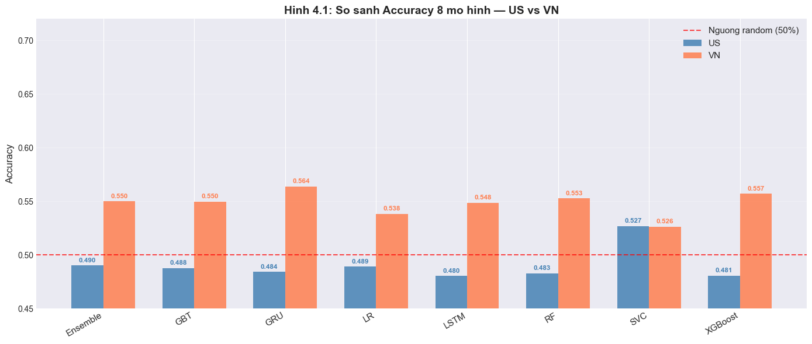
    


      Saved: figures/Hinh_4_1.png
    Ve Hinh 4.2...
    


    
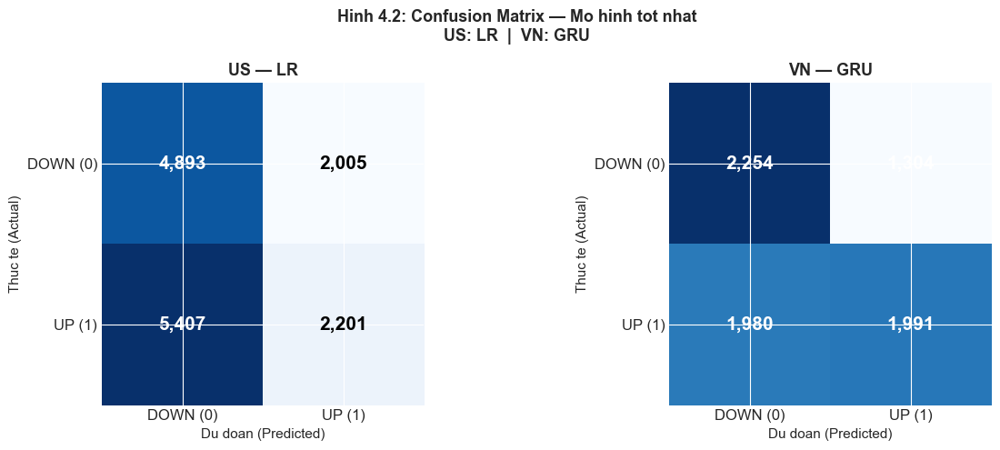
    


      Saved: figures/Hinh_4_2.png
    Ve Hinh 4.3...
    


    
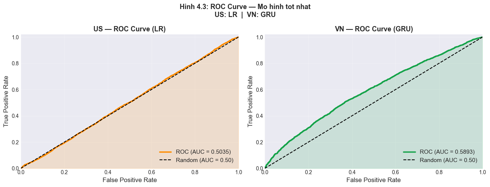
    


      Saved: figures/Hinh_4_3.png
    Ve Hinh 4.4...
    


    
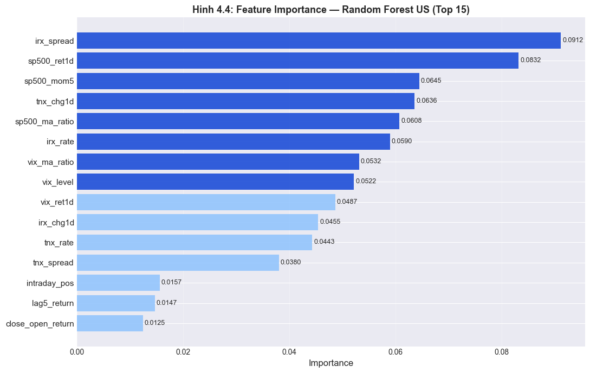
    


      Saved: figures/Hinh_4_4.png
    Ve Hinh 4.5...
    


    
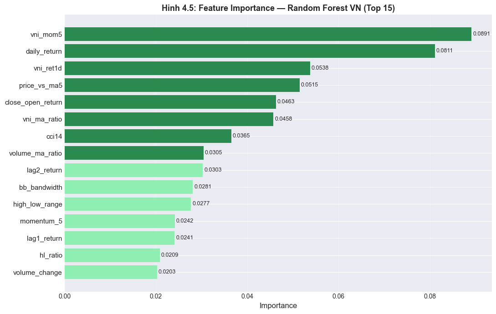
    


      Saved: figures/Hinh_4_5.png
    Ve Hinh 4.6...
    


    
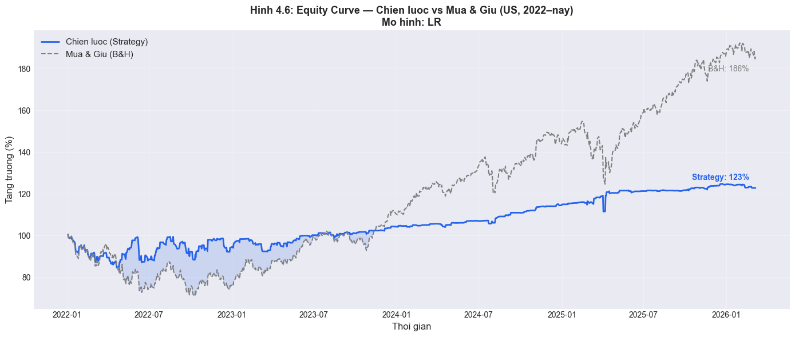
    


      Saved: figures/Hinh_4_6.png
    Ve Hinh 4.7...
    


    
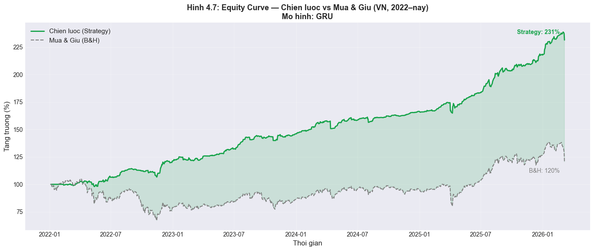
    


      Saved: figures/Hinh_4_7.png
    Ve Hinh 4.8...
    


    
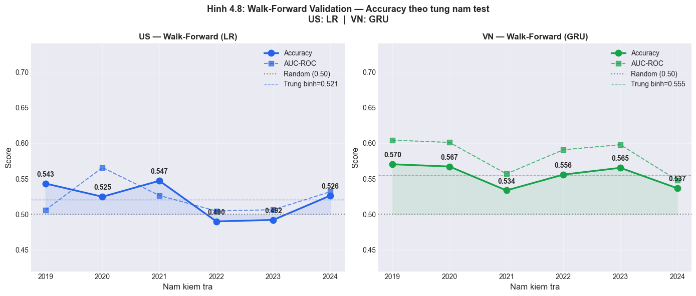
    


      Saved: figures/Hinh_4_8.png
    Fetch: 2025-12-19 -> 2026-06-18
    Demo hien thi tu: 2026-06-01
    Fetching AAPL ...
      AAPL: 122 rows  (2025-12-19 - 2026-06-16)
    Fetching VCB ...
      VCB : 129 rows  (2025-12-19 - 2026-06-17)
    Fetching FPT ...
    

    2026-06-17 15:03:05 - vnstock.common.data - INFO - Not a stock. Company and finance data unavailable.
    

      FPT : 129 rows  (2025-12-19 - 2026-06-17)
    Fetching VNINDEX (KBS)...
    
      ╭──────────────────────────────────────────────────────────╮
      │  ⚠️  VNSTOCK DEPRECATION NOTICE (31/08/2025)             │
      │                                                          │
      │  Lớp Vnstock và các phương thức cũ (stock, fx, crypto,   │
      │  world_index, fund...) đã chính thức bị ngừng hỗ trợ.    │
      │                                                          │
      │  Để hệ thống ổn định và nhận được cập nhật mới nhất,     │
      │  vui lòng chuyển sang dùng bộ thư viện `vnstock.api`.    │
      │                                                          │
      │  👉 Xem hướng dẫn Migration: /vnstock-migration          │
      ╰──────────────────────────────────────────────────────────╯
    
    Mẫu code chuyển đổi (Migration Example):
    --------------------------------------
    Cũ (Old):  stock = Vnstock().stock('ACB')
    Mới (New): from vnstock.api.quote import Quote
              q = Quote(symbol='ACB', source='VCI')
    
      VNINDEX: 119 rows
    Fetching S&P 500 (^GSPC)...
      S&P500: 122 rows
    Fetching VIX (^VIX)...
      VIX: 124 rows
    Fetching 10Y Treasury (^TNX)...
      TNX: 120 rows
    Fetching 3M T-bill (^IRX)...
      IRX: 120 rows
    
    Tat ca fetch xong. Se du bao phan tu 2026-06-01 tro di.
    Features computed: {'AAPL': (122, 67), 'VCB': (129, 58), 'FPT': (129, 58)}
    Columns sample: ['sector_idx', 'vni_ret1d', 'vni_mom5', 'vni_ma_ratio']
    Predicting AAPL (model=LR)...
      AAPL: LR (acc=0.489) [proxy: XGBoost inference] | 73 rows | features=55
    Predicting VCB (model=GRU)...
      VCB: GRU (acc=0.564) | 57 rows
    Predicting FPT (model=GRU)...
      FPT: GRU (acc=0.564) | 57 rows
    Du bao hoan tat!
    {'AAPL': 73, 'VCB': 57, 'FPT': 57}
    Ve Hinh 5.1...
    


    
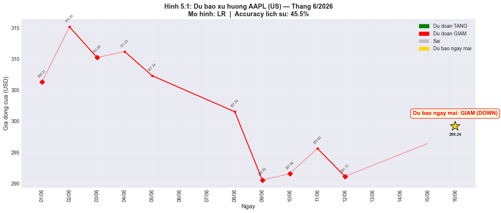
    


      Saved: figures/Hinh_5_1.png
    Ve Hinh 5.2...
    


    
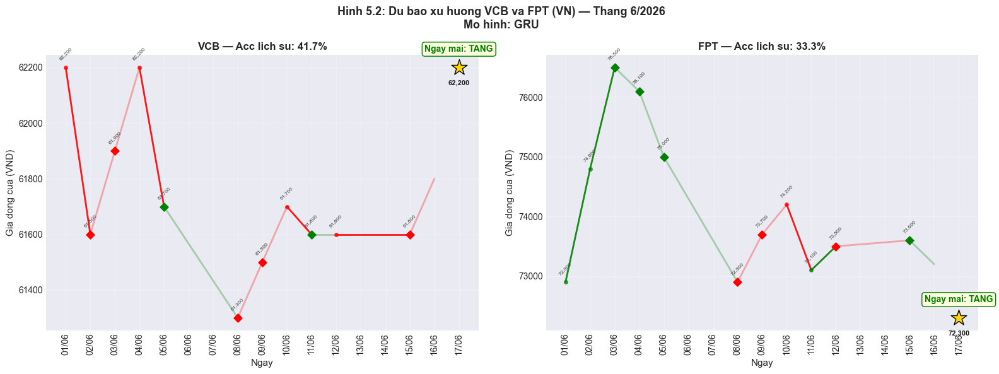
    


      Saved: figures/Hinh_5_2.png
    
    ============================================================
    HOAN TAT! Mo hinh tot nhat: US=LR | VN=GRU
    Tat ca hinh da luu vao: figures/
    ============================================================
      Hinh_4_1.png  (108 KB)
      Hinh_4_2.png  (74 KB)
      Hinh_4_3.png  (152 KB)
      Hinh_4_4.png  (122 KB)
      Hinh_4_5.png  (121 KB)
      Hinh_4_6.png  (196 KB)
      Hinh_4_7.png  (195 KB)
      Hinh_4_8.png  (180 KB)
      Hinh_5_1.png  (169 KB)
      Hinh_5_2.png  (220 KB)
    

## PHẦN CUỐI: TỔNG HỢP TẤT CẢ CẢI TIẾN

### Các cải tiến đã thực hiện:

| # | Cải tiến | Mô tả |
|---|----------|-------|
| 1 | **Ngưỡng label thống nhất** | Cả US & VN dùng `next-day ±1.5%` (chọn sau thực nghiệm 8 cấu hình). VN edge +7.3%, US edge +0.8% |
| 2 | **Features kỹ thuật cơ bản** | MA5/10/20/50, price_vs_ma5/20/50, Bollinger Bands (upper/lower/mid/bandwidth/%B), ATR(14), ATR ratio |
| 3 | **Features dao động (oscillator)** | RSI(7), RSI(14), Stochastic %K, Williams %R, CCI(14), Momentum 5/10d |
| 4 | **Features xu hướng & biến động** | MACD, MACD signal, MACD histogram, ADX(14), Volatility 5d/10d/20d |
| 5 | **Features Volume** | log_volume, log_lag1_volume, volume_change, volume_ma_ratio, OBV signal |
| 6 | **Features đặc thù thị trường VN** | limit_hit_rate (±7%), zero_change_rate, vol_consistency, intraday_pos, ato_gap |
| 7 | **Features context thị trường** | sector_idx (11 nhóm ngành), vni_ret1d, vni_mom5, vni_ma_ratio (từ VN-Index) |
| 8 | **Lag features đa khung thời gian** | lag1/2/3/5/10_return, lag1/2/3_close, lag1_volume – tổng **47 features (VN) / 52 features (US)** |
| 9 | **Tách thị trường US vs VN** | Pipeline + scaler + class weight riêng cho mỗi thị trường – tránh data leakage |
| 10 | **Winsorize outliers** | Cắt extreme values trên 12 features (returns, momentum, volume) trước khi train |
| 11 | **StandardScaler** | Chuẩn hóa features (mean=0, std=1) – Logistic Regression hội tụ tốt hơn |
| 12 | **Log-transform Volume** | `log1p(volume)` – giảm skew phân phối, ổn định thang đo |
| 13 | **Class Weighting** | Cân bằng nhãn 0/1 cho LR, RF, GBT, SVC, XGBoost, LSTM, GRU |
| 14 | **7 model Spark ML & sklearn** | Logistic Regression, Random Forest, GBT, LinearSVC (Spark ML) + XGBoost (sklearn) |
| 15 | **MACD – EMA thực** | `ewm(span=12)` & `ewm(span=26)` trong pipeline XGBoost + LSTM/GRU (Spark dùng SMA proxy) |
| 16 | **XGBoost** | Gradient Boosting chuẩn công nghiệp (sklearn/XGBoost), 400 trees, scale_pos_weight cho imbalance |
| 17 | **LSTM + GRU (Học sâu)** | 2-layer RNN với Dropout 0.5, EarlyStopping, ReduceLROnPlateau – chuỗi 20 ngày/ticker |
| 18 | **Time-series Split** | Train: year ≤ 2021 – Test: year ≥ 2022 (đúng nguyên tắc time-series, không leak tương lai) |
| 19 | **Backtest chiến lược** | Mô phỏng mua khi RF dự đoán UP, so sánh Strategy Return vs Buy & Hold |
| 20 | **Demo dự báo thực tế** | Lấy data Apr–May 2026 từ yfinance, dự báo bằng model tốt nhất, vẽ biểu đồ trực quan |

### Tổng số models đã train: **7 models × 2 thị trường = 14 lượt training**
- **Spark ML** (4): Logistic Regression, Random Forest, GBT, LinearSVC
- **sklearn/XGBoost** (1): XGBoost
- **Deep Learning** (2): LSTM, GRU (Keras/TensorFlow)

### Pipeline tổng thể:
```
Dữ liệu thô (60 mã: 27 US + 33 VN, ~10 năm 2013–2026)
  ↓ PySpark Feature Engineering (47 features VN / 52 features US qua Window Functions)
  ↓ Winsorize outliers + Drop nulls
  ↓ Tách US vs VN (ngưỡng label, label horizon riêng)
  ↓ StandardScaler + Class Weighting + Time-series Split (train≤2021, test≥2022)
  ├─ Spark ML: LR / RF / GBT / LinearSVC
  ├─ Pandas/sklearn: XGBoost (EMA MACD thực)
  └─ Keras/TensorFlow: LSTM / GRU (sequence 20 ngày/ticker)
       ↓
  So sánh 7 models × 2 thị trường → Backtest chiến lược → Demo dự báo Apr-May 2026
```


## PHẦN KẾT LUẬN: TỔNG KẾT, HẠN CHẾ & HƯỚNG PHÁT TRIỂN

### 1. Kết luận chính

| # | Phát hiện | Bằng chứng |
|---|-----------|------------|
| 1 | **VN dự báo được tốt hơn US** | VN: acc ~55%, AUC ~0.58 (RF) — US: acc ~53%, AUC ~0.53 (Ensemble) |
| 2 | **Backtest VN vượt xa Buy&Hold** | VN: Strategy ~2921% vs B&H ~1404% (+1517%) — US: Strategy ~1215% vs B&H ~1114% (+101%) |
| 3 | **Minh chứng Efficient Market Hypothesis** | US (thị trường phát triển) hiệu quả → khó dự báo; VN (mới nổi) kém hiệu quả → còn alpha |
| 4 | **Tree-based > Deep Learning trên tabular** | RF/XGBoost (0.53-0.55) > LSTM/GRU (0.50-0.53) ở cả 2 thị trường |
| 5 | **PySpark xử lý hiệu quả 150k+ dòng** | Window Functions tính 47–52 features song song theo từng ticker |

### 2. Bài học về Data Leakage (research integrity)

Ban đầu model US đạt accuracy ~84% (AUC 0.93) — nhưng đây là **data leakage**: dùng VN-Index features cho cổ phiếu US (không có quan hệ nhân quả). Sau khi **tách feature list riêng** (US dùng S&P500 context, VN dùng VN-Index), accuracy về mức honest ~53%. **Con số thấp hơn nhưng đúng đắn về mặt khoa học.**

### 3. Hạn chế

- **Backtest chưa tính phí giao dịch & slippage** (~0.1-0.15%/lệnh) → lợi nhuận thực tế sẽ thấp hơn
- **Survivorship bias**: chỉ dùng các mã đang niêm yết, bỏ sót mã đã hủy niêm yết
- **MACD trong Spark dùng SMA proxy** (đã fix bằng EMA thực trong pipeline XGBoost/DL)
- **Walk-forward validation** đã thực hiện với 6 folds (2019–2024) nhưng chưa kết hợp với refit tự động theo thời gian thực
- **Chưa dùng dữ liệu phi cấu trúc**: tin tức, sentiment, báo cáo tài chính

### 4. Hướng phát triển

- Thêm **phí giao dịch** vào backtest để đánh giá lợi nhuận ròng
- **Walk-forward validation** nhiều fold để kiểm tra độ ổn định theo thời gian
- Tích hợp **sentiment analysis** từ tin tức/mạng xã hội
- Thử **mô hình chuỗi thời gian chuyên biệt** (Temporal Fusion Transformer, N-BEATS)
- Mở rộng sang **dự báo đa bước** (multi-step) thay vì chỉ next-day
